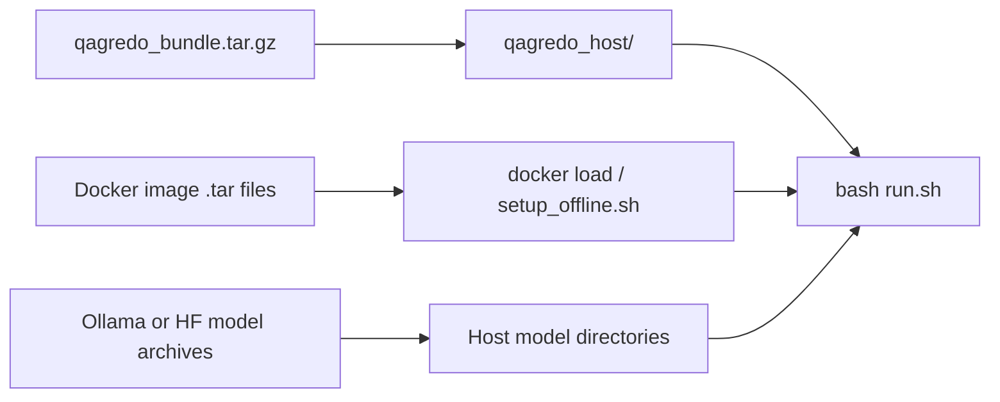
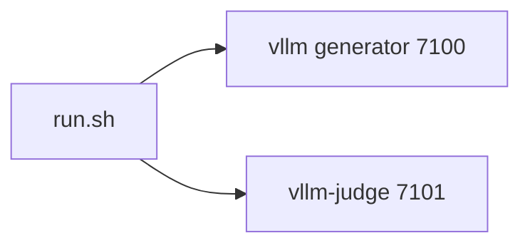

# Legacy Pointer

The canonical offline documentation has moved to:

- `docs/OFFLINE_SETUP_GUIDE.md`

Please update bookmarks and scripts to use the `docs/` path.
# Legacy Pointer

The canonical offline documentation has moved to:

- `docs/OFFLINE_SETUP_GUIDE.md`

Please update bookmarks and scripts to use the `docs/` path.
# QAGRedo Offline Guide

This is the main practical guide for running QAGRedo on an offline server. Maintainer index: **`docs/HANDOVER.md`**.



---

## Quick Start (3 steps)

1) Pick profile in `.env`:

```bash
QAGREDO_PROFILE=ollama     # host Ollama
# QAGREDO_PROFILE=kubeflow # in-container Ollama
# QAGREDO_PROFILE=vllm     # dual vLLM services
```

2) Set paths in `.env`:

```bash
QAGREDO_SHARED_DATA_ROOT=/data/local/tyewhong/Data
QAGREDO_OFFLINE_INPUT=txt
QAGREDO_MODELS_DIR=/data/models/models_ollama      # kubeflow only (Ollama store)
QAGREDO_MODELS_LLM_HOST=/data/models               # vllm only (HF folders)
```

3) Run:

```bash
bash run.sh --status
bash run.sh --num-documents 2
```

---

## What to edit (and where)

| You want to change | File |
|---|---|
| Profile, host paths, UID/GID | `.env` |
| Question model, judge model, num docs/questions | `config/config.<profile>.yaml` |
| vLLM GPU IDs (2-GPU default) | `docker-compose.vllm-stack.yml` |
| 4-GPU vLLM split (optional) | `QAGREDO_VLLM_COMPOSE_EXTRA=docker-compose.vllm-siteserver.yml` (see `docs/SERVER_MODEL_PROFILES.md`) |

Do not edit `config/config.yaml` for daily use; use profile files instead.

---

## Profile behavior

### `ollama`

- Uses host Ollama at `127.0.0.1:11434`.
- Requires `ollama` binary on offline host.
- Model tags come from `config/config.ollama.yaml`.

### `kubeflow`

- Uses in-container Ollama.
- Requires `qagredo-kubeflow.tar`.
- `QAGREDO_MODELS_DIR` must point to Ollama store with:
  - `blobs/`
  - `manifests/`
- Model tags come from `config/config.kubeflow.yaml`.

### `vllm`

- Uses `vllm` and `vllm-judge` services.
- Requires HF directories plus vLLM image tar.
- `config/config.vllm.yaml` must use:
  - `http://vllm:7100/v1`
  - `http://vllm-judge:7101/v1`

---

## Offline transfer checklist

### A) `ollama` profile

- `qagredo_bundle.tar.gz`
- `qagredo-v1.tar`
- `models_ollama.tar.gz` (or split `models_ollama_<tag>.tar.gz`)

### B) `kubeflow` profile

- `qagredo_bundle.tar.gz`
- `qagredo-kubeflow.tar`
- `models_ollama.tar.gz` (or split `models_ollama_<tag>.tar.gz`)

### C) `vllm` profile

- `qagredo_bundle.tar.gz`
- `qagredo-v1.tar`
- `vllm-qwen35-localcuda.rootfs.tar` (preferred; from `scripts/save_vllm_qwen35_image.sh`) or `qwen35-localcuda.rootfs.tar` / legacy `vllm-openai_*.rootfs.tar`
- `models_vllm.tar.gz`

---

## Build tarballs (online machine)

```bash
# all outputs
bash scripts/make_offline_tarballs.sh --all

# ollama (--image-dev = runner image for ollama profile)
bash scripts/make_offline_tarballs.sh --bundle --image-dev --models-ollama

# kubeflow
bash scripts/make_offline_tarballs.sh --bundle --image-kubeflow --models-ollama

# vllm
bash scripts/make_offline_tarballs.sh --bundle --image-dev --image-vllm --models-vllm
```

Split Ollama archives for size-limited transfer:

```bash
bash scripts/make_offline_tarballs.sh \
  --models-ollama-split=qwen3.5:9b,llama3.1:8b-instruct-fp16
```

---

## Setup on offline host

```bash
# 1) extract bundle
tar xzf qagredo_bundle.tar.gz
cd qagredo_host

# 2) one-time setup
bash setup_offline.sh --profile <ollama|kubeflow|vllm>

# 3) run
bash run.sh --show-config
# ollama/kubeflow:
bash run.sh --num-documents 2
# vllm (split — see "vllm profile — split startup" below):
# bash run.sh --vllm-up generator && bash run.sh --vllm-up judge
# bash run.sh --pipeline-only --num-documents 2
```

Use `--skip-images` if image tars are already loaded.
Use `--force` to overwrite existing model links/directories.

---

## Correct model extraction paths

### Ollama split tar files

If your tar contains top-level `models/`, use `--strip-components=1`:

```bash
mkdir -p /data/models/models_ollama
tar xzf models_ollama_qwen3.5_9b.tar.gz -C /data/models/models_ollama --strip-components=1
tar xzf models_ollama_llama3.1_8b-instruct-fp16.tar.gz -C /data/models/models_ollama --strip-components=1
```

Verify:

```bash
ls -ld /data/models/models_ollama/blobs /data/models/models_ollama/manifests
```

### vLLM model archive

Extract HF directories under `/data/models` (or your chosen root), then set:

```bash
QAGREDO_MODELS_LLM_HOST=/data/models
```

---

## Switching between vLLM and Ollama later

1) Change `.env` `QAGREDO_PROFILE`.
2) Make sure corresponding image tar was loaded.
3) Make sure corresponding model format exists:
   - Ollama store for `ollama`/`kubeflow`
   - HF folders for `vllm`
4) Edit the matching config file only.
5) Run:

```bash
bash run.sh --status
# ollama/kubeflow: bash run.sh
# vllm: split startup (see "vllm profile — split startup" above) or bash run.sh
```

---

## Resume / skip already-processed documents

Skip inputs that already have `*_analysis.json` in a prior run folder. Use **`--resume`** to append to the latest run folder (or `run.resume_run_dir` / `--resume-run-dir`).

| Goal | Example |
|------|---------|
| Resume (skip + same run folder) | `bash run.sh --pipeline-only -- --resume` |
| Skip only (new run folder) | `bash run.sh -- --skip-existing-outputs` |
| Pin run folder | `bash run.sh -- --resume --resume-run-dir 2026-05-26_093000` |

Config (`config/config.<profile>.yaml` → `run:`): `skip_existing_outputs`, `resume`, `resume_run_dir`.

---

## Common errors

### `which ollama` is empty

You cannot run `ollama` profile. Use `kubeflow` or install Ollama.

### `Ollama not reachable on port 11434`

`ollama` profile selected, but host Ollama API is unavailable.

### vLLM connection errors from runner

Check `config/config.vllm.yaml` base URLs. Must be Docker service names, not localhost.

### `model type qwen3_5 not recognized` in vLLM

You are on an old vLLM image (`v0.5.3.post1` or similar). Fix:

- set `VLLM_IMAGE=qagredo-vllm:qwen35-localcuda` and load/build that image (`scripts/docker_build_vllm_qwen35_compat.sh`), or
- use Ollama profiles for Qwen3.5 GGUF, or
- use Qwen2.5-7B with `vllm/vllm-openai:v0.5.3.post1` for a faster legacy stack.

---

## What QAGRedo does

QAGRedo is an automated pipeline that:

1. **Reads** your input documents in supported formats (`json/txt/pdf/doc/docx/xlsx/csv`) and normalizes them to JSONL
2. **Generates complex questions** using 10 question types (analysis,
   aggregation, comparison, inference, causal, temporal, multi-hop,
   synthesis, evaluation, counterfactual). Every question is individually
   checked for **comprehensiveness** — trivial single-sentence-lookup
   questions are automatically regenerated with targeted feedback.
3. **Generates grounded answers** with supporting evidence, using a
   structured format and low temperature (0.3) for factual accuracy
4. **Verifies grounding** with a **strict LLM judge**: a separate judge
   model (different Ollama tag or vLLM endpoint) evaluates every answer
   against the source document. Any invalid or missing judge response
   fails the run — there is no silent semantic fallback.
5. **Grades** each document (A/B/C/D/F) based on answer grounding confidence
6. **Saves** results to timestamped folders with detailed reasons for any
   ungrounded content
7. **Optionally uses frameworks**: LangChain for prompt templating/structured
   parsing and LangGraph for per-document orchestration and dynamic routing.

For full algorithm details and design rationale, see `docs/ALGORITHM_REPORT.md`.

---

## Directory map

```
qagredo_host/                          <-- YOU ARE HERE
|
|-- OFFLINE_GUIDE.md                   * This file
|-- run.sh                             * Run the pipeline
|-- setup_offline.sh                     First-time setup only
|-- verify_offline_deployment.sh         * Verify Docker image matches requirements.txt
|
|-- config/
|   |-- config.ollama.yaml             * Ollama profile (host Ollama) — edit this
|   |-- config.kubeflow.yaml           * Kubeflow profile (in-container Ollama)
|   |-- config.vllm.yaml               * vLLM profile (dual GPU)
|   +-- config.yaml                      Legacy default (mirrors ollama)
|
|-- data/
|   +-- *.jsonl                        * Your input documents (put files here)
|
|-- output/                            * Results appear here (auto-created)
|   +-- ollama/<model>/YYYY-MM-DD_HHMMSS/   (or vllm/... if profile=vllm)
|       +-- *_analysis.json
|
|-- utils/                               Python modules (edit to customise)
|   |-- question_generator.py            10 question types, few-shot examples, comprehensiveness check
|   |-- answer_generator.py              Structured answers, grounding retries, coverage rewrite
|   |-- hallucination_checker.py         Hybrid grading (semantic + LLM)
|   |-- langchain_components.py          LangChain prompt + parsing helpers
|   |-- langgraph_pipeline.py            LangGraph document workflow graph
|   |-- output_manager.py                Timestamped output folders
|   +-- ...
|
|-- run_qa_pipeline.py                   Main pipeline script
|-- requirements.txt                     Python deps (must match qagredo-v1.tar)
|-- docker-compose.yml                   Ollama profile: runner + host Ollama
|-- docker-compose.kubeflow.yml          Kubeflow: single image with in-container Ollama
|-- docker-compose.vllm-stack.yml        vLLM: vllm + vllm-judge + runner
|-- Dockerfile, Dockerfile.kubeflow      Source Dockerfiles (for on-site rebuilds)
|-- scripts/
|   |-- conversion/
|   |   +-- convert_to_qagredo_jsonl.py  Convert JSON/PDF/TXT/XLSX -> JSONL
|   +-- utils/
|       +-- summarize_run.sh             Summarise results with reasons
|       +-- export_analysis_minimal.py   Full *_analysis.json → *_analysis_minimal.json (no LLM rerun)
|
|-- docs/                                Detailed documentation
|   |-- ALGORITHM_REPORT.md              Algorithm details & design rationale
|   |-- OFFLINE_SETUP_GUIDE.md            6-file offline deployment guide
|   +-- architecture/
|
|-- README.md                            Project overview
|-- .env                                 Host-side settings (edit: profile, data paths)
|-- hf_cache/, hf_cache_judge/           HF cache (used by vLLM profile)
|-- models/                              Ollama GGUF store (ollama / kubeflow — created by setup)
+-- models_llm/                          HuggingFace model dirs (vllm profile — created by setup)
```

Files marked with * are the ones you interact with most often.

---

## Dual vLLM GPU layouts (required for vLLM stack)

**Skip this section if you use Ollama only.** The vLLM stack is always **two services**: `vllm` (question + answer) and `vllm-judge` (separate model). There is no single-vLLM or shared-judge mode in this repo.



1. **Default 2-GPU host:** `docker-compose.vllm-stack.yml` maps the generator to GPU `0` and the judge to GPU `1`. Use `VLLM_TP_SIZE=1` and `VLLM_JUDGE_TP_SIZE=1` unless you edit `device_ids`.
2. **4-GPU host (2+2):** set `QAGREDO_VLLM_COMPOSE_EXTRA=docker-compose.vllm-siteserver.yml`, with `VLLM_TP_SIZE=2` and `VLLM_JUDGE_TP_SIZE=2` in `.env` (see also `docs/SERVER_MODEL_PROFILES.md`).
3. If `VLLM_TP_SIZE>1` for the generator, you **must** expose that many GPUs on the `vllm` service. Otherwise you get Ray / “required GPUs > available”. `run.sh` blocks TP>1 unless a matching compose override is selected or `QAGREDO_ALLOW_TP2_WITHOUT_SINGLE=1` is set after editing `device_ids`.

**Failure path:** vLLM / Ray “required GPUs > available” means `device_ids` for that service does not match `VLLM_TP_SIZE` or `VLLM_JUDGE_TP_SIZE`.

## Quick command reference

All commands are run from inside `qagredo_host/`:

```bash
cd /path/to/qagredo_host
```

### Verify Docker image vs requirements (recommended)

After loading or updating `qagredo-v1.tar`:

```bash
bash verify_offline_deployment.sh   # pip check + every line in requirements.txt
```

See `docs/OFFLINE_SETUP_GUIDE.md` — keep `qagredo_bundle.tar.gz` and `qagredo-v1.tar` in sync when `requirements.txt` changes.

### Run the pipeline

```bash
bash run.sh                         # Start containers for the active profile and run the pipeline
bash run.sh --down                  # Stop all containers
bash run.sh --status                # Show container status + backend health
bash run.sh --logs                  # Tail container logs (Ctrl+C to stop)
bash run.sh --show-config           # Display active profile YAML + env vars
bash run.sh --help                  # Show all options
```

### vllm profile — split startup (dual GPU)

When `QAGREDO_PROFILE=vllm`, start each vLLM container separately, then run the pipeline:

```bash
bash run.sh --vllm-up generator     # Qwen3.5 on GPU 0, port 7100
bash run.sh --vllm-up judge         # Llama 3.1 judge on GPU 1, port 7101
bash run.sh --pipeline-only --num-documents 1
```

One-shot (same as before): `bash run.sh` starts both vLLM services, waits for health, then runs the pipeline.

Align `.env` (`VLLM_MODEL`, `VLLM_JUDGE_MODEL`, served names) and `config/config.vllm.yaml` (`llm.model`, `judge.model`).
Qwen3.5 may require `VLLM_IMAGE=qagredo-vllm:qwen35-localcuda` — see `scripts/docker_build_vllm_qwen35_compat.sh`.

### Summarise results

```bash
bash run.sh --summarize --latest              # Summarise latest run
bash run.sh --summarize --latest --json       # Save summary as JSON
bash run.sh --summarize --all                 # Summarise all runs
```

### Minimal JSON (no pipeline / vLLM rerun)

After a run, strip full `*_analysis.json` to `*_analysis_minimal.json` (content + Q/A only):

```bash
bash run.sh --minimise
# or a specific run folder:
bash run.sh --minimise "output/vllm/qwen-qwen3.5-9b/2026-05-21_171511"
```

Does not start containers or call the LLM. Same script as `scripts/utils/export_analysis_minimal.py`.

### Convert input files

```bash
# Convert JSON / JSONL / PDF / TXT / DOC / DOCX / XLSX / CSV to JSONL
python3 scripts/conversion/convert_to_qagredo_jsonl.py \
  --input data/my_input.json \
  --output data/my_input.jsonl

# Or via run.sh:
bash run.sh --convert --input data/my_input.json --output data/my_input.jsonl
```

The **main pipeline** (`bash run.sh`) reads **`run.input_file`** (`.json` / `.jsonl`)
and ignores **`run.input_type`**. Prepare PDF/TXT/etc. with
`convert_to_qagredo_jsonl.py` or `bash run.sh --convert`, then set
`input_file` to the JSONL. Optional semantic enrichment during conversion: add **`--semantic-normalize`**
to **`convert_to_qagredo_jsonl.py`** (raw `content` stays unchanged). The
**`run.semantic_normalization`** block in YAML is **not** read by that script.

### Port configuration

Use **`.env`** for host port overrides. For the `ollama` / `kubeflow` profiles,
Ollama listens on `OLLAMA_HOST_PORT` (default `11434`). For the `vllm`
profile, `VLLM_HOST_PORT` (default `7100`) and `VLLM_JUDGE_HOST_PORT`
(default `7101`) control where the generator and judge services are
reachable on the host.

---

## Day-to-day workflow

### 1. Put your data in `data/` (or point to any folder)

Copy your input files (JSON/JSONL/TXT/PDF/DOC/DOCX/XLSX/CSV) into `data/` or another folder:

```bash
cp /path/to/my_documents.jsonl data/
```

Optional manual conversion:
```bash
python3 scripts/conversion/convert_to_qagredo_jsonl.py \
    --input data/my_input.json \
    --output data/my_input.jsonl
```

### 2. Edit the profile config (e.g. `config/config.ollama.yaml`)

Open the active profile file and set input selection + run parameters:

```bash
vi config/config.ollama.yaml
# or: config/config.kubeflow.yaml / config/config.vllm.yaml — must match QAGREDO_PROFILE
```

Key settings to change:

```yaml
run:
  input_folder: ""
  input_file: data/your-run.jsonl   # or .json — extension selects parser (input_type not used)
  input_type: auto                  # not wired to converter; use CLI --input-type
  max_files: 10                     # not read by current scripts
  num_documents: 5                  # how many records to process (0 = all loaded)
  min_content_words: 500            # skip documents below this word count (0 = off)
  min_content_chars: 0
  semantic_normalization:          # not read — use converter --semantic-normalize
    enable: false
    max_content_chars: 5000

question_generation:
  num_questions: 3                  # <-- questions per document
  complexity: "advanced"            # <-- basic, moderate, or advanced

answer_generation:
  temperature: 0.3                  # <-- lower = more factual

hallucination:
  method: "llm"                     # strict default in shipped profiles
```

### 3. Run the pipeline

```bash
bash run.sh
```

This will:
1. Start vLLM (GPU) and wait for it to be ready
2. Run the QAGRedo pipeline
3. Save results in `output/<provider>/<model>/YYYY-MM-DD_HHMMSS/` (default `provider` is `ollama`)

Optional one-off override without editing config:
```bash
bash run.sh -- --input-file data/run.jsonl --num-documents 5
```

Each run creates a **unique timestamped folder** (date + time), so multiple
runs per day do not overwrite each other.

### 4. View results

```bash
# Quick summary (text output)
bash scripts/utils/summarize_run.sh --latest

# Save summary as JSON (for detailed analysis)
bash scripts/utils/summarize_run.sh --latest --json

# List output files
ls -lt output/ollama/*/ 2>/dev/null || ls -lt output/*/*/
```

The terminal summary shows Generator, Judge, and Provider. The **run_summary.json** includes:
- `generator_model` and `judge_model` (separate fields)
- Per-document statistics (grade, confidence, grounded/ungrounded counts)
- Per-QA details with grounding method and confidence
- Run-level timing metrics (question/answer/grading totals + averages)
- Quality counters (question retries, answer retries, coverage rewrites)
- **For ungrounded answers**: specific reasons, ungrounded sentences, and
  Qwen judge verdict
- **Ungrounded highlights**: flat list of all failed QA pairs across documents
  for quick scanning

### 5. Re-run with different settings

Just edit the same profile YAML and run again:

```bash
vi config/config.ollama.yaml
bash run.sh
```

No need to restart Docker or rebuild anything. Changes are picked up
automatically. Each run goes to a new timestamped folder.

---

## Pipeline details

### Question generation (10 types)

| Type | What it tests |
|------|---------------|
| Analysis | Break down information into parts |
| Aggregation | Count/sum across document |
| Comparison | Compare/contrast entities |
| Inference | Draw conclusions from facts |
| Causal | Cause-and-effect relationships |
| Temporal | Timeline and sequence |
| Multi-hop | Connect multiple separate facts |
| Synthesis | Combine 3+ facts into analysis |
| Evaluation | Assess strength of claims/evidence |
| Counterfactual | Reason about hypothetical changes |

The `advanced` preset (default) uses all 10 types. Each question must require
reasoning across at least 2 different parts of the document.

**Comprehensiveness check:** After generation, every question is individually
evaluated by the LLM for depth, self-containment, and reasoning complexity.
Questions that score below the configured threshold are regenerated with
targeted feedback (up to 2 attempts by default). This two-stage validation
(grounding + comprehensiveness) ensures that only high-quality, non-trivial
questions survive.

### Answer generation (structured + retries + coverage rewrite)

- **Structured format**: Answer + Supporting Evidence
- **"List then count"**: improves aggregation accuracy by ~30%
- **Low temperature** (0.3): suppresses creative hallucination
- **3 answer trials per question**: each slot gets up to 3 total answer
  attempts (`max_answer_attempts`)
- **Question regeneration rounds**: if a slot fails all answer trials, that
  slot gets a replacement question (default max 3 replacement rounds)
- **Final output size**: exactly `num_questions` final QA pairs per document
  (default `3`)
- **Coverage validation**: checks whether the answer addresses all parts of the question
- **One rewrite pass**: low-coverage answers get one targeted rewrite, accepted only if grounded

### Hallucination grading (hybrid)

1. **Pass 1 (legacy config)**: Keyword overlap — if ``hallucination.method`` was ``semantic``, it maps to keyword (embeddings removed).
   - Compares each answer sentence against 1/2/3-sentence document chunks
   - If all grounded: done (no LLM call needed)
2. **Pass 2 (accurate)**: LLM-as-judge (Qwen, only if Pass 1 found ungrounded sentences)
   - Uses a **separate judge model** (e.g. Llama vs Qwen generator) to avoid self-evaluation bias
   - Handles counting, aggregation, inference, multi-hop reasoning
   - Can override or confirm the semantic verdict

### Grading scale

| Grade | Confidence | Meaning |
|-------|-----------|---------|
| A | >= 90% | Excellent -- answers well-grounded in document |
| B | >= 80% | Good -- mostly grounded |
| C | >= 70% | Fair -- some ungrounded claims |
| D | >= 60% | Poor -- significant grounding issues |
| F | < 60% | Fail -- mostly ungrounded |

---

## Configuration reference

### Profile YAML (`config/config.<profile>.yaml`) — key blocks

```yaml
# What to process
run:
  input_folder: ""
  input_file: dev-data.jsonl        # .json / .jsonl — pipeline uses extension only
  input_type: auto                  # not wired to converter; use CLI --input-type
  max_files: 10                     # not read by current scripts
  num_documents: 2                  # 0 = all loaded records
  min_content_words: 500            # skip documents below this word count (0 = off)
  min_content_chars: 0
  semantic_normalization:          # not read — use converter --semantic-normalize
    enable: false
    max_content_chars: 5000

# LLM connection (Ollama default — tags from `ollama list`)
llm:
  provider: "ollama"
  model: "qwen3.5:9b"
  temperature: 0.7                  # for question generation
  max_tokens: 500
  api_key: "ollama-local"
  base_url: "http://localhost:11434/v1"

judge:
  provider: "ollama"
  model: "llama3.1:8b"
  base_url: "http://localhost:11434/v1"
  api_key: "ollama-local"
  temperature: 0.0
  max_tokens: 200
  timeout: 60
  max_retries: 3
  retry_delay: 1.0

# Answer generation
answer_generation:
  temperature: 0.3                  # lower = more deterministic/factual
  multi_turn:
    enable_rejection: true
    min_confidence_threshold: 0.7
    max_answer_attempts: 3           # total trials per question (initial + regens)
    max_regeneration_attempts: 2     # legacy fallback key
    max_question_regeneration_rounds: 3  # max replacement rounds per slot
  coverage_validation:
    enable: true
    min_score_threshold: 0.7
    max_doc_chars: 5000

# Question generation
question_generation:
  num_questions: 3
  complexity: "advanced"            # basic | moderate | advanced
  duplicate_similarity_threshold: 0.85
  deduplication_method: "semantic"
  validation:
    enable_rejection: true
    min_confidence_threshold: 0.7
    max_regeneration_attempts: 2
    method: "semantic"
    enable_comprehensiveness_check: true   # evaluate each question for depth/complexity
    comprehensiveness_min_score: 0.6       # 0.0-1.0, higher = stricter
    comprehensiveness_max_attempts: 2      # regeneration attempts for weak questions
    comprehensiveness_strict: true       # reject failed slots (no answer for that slot)

# Hallucination checking
hallucination:
  method: "hybrid"                  # semantic | keyword | llm | hybrid
```

### What you actually edit

All non-host settings (provider, model, temperature, retries, …) are in the
**profile YAML**, not `.env`. Open the file for the profile you're running:

- `config/config.ollama.yaml` — ollama profile (host Ollama)
- `config/config.kubeflow.yaml` — kubeflow profile (in-container Ollama)
- `config/config.vllm.yaml` — vllm profile (dual GPU)

The only env vars that still matter live in `.env`:

| Variable | What it does |
|---|---|
| `QAGREDO_PROFILE` | Which profile to run (`ollama` / `kubeflow` / `vllm`) |
| `QAGREDO_DATA_DIR` (or `QAGREDO_OFFLINE_HOST` + `QAGREDO_OFFLINE_INPUT`) | Where your input documents live |
| `QAGREDO_MODELS_DIR` | (kubeflow) host path for the Ollama GGUF store |
| `QAGREDO_MODELS_LLM_HOST` | (vllm) host path for the HuggingFace model dirs |
| `HOST_UID`, `HOST_GID` | Owner of files written by the container |
| `VLLM_*` | (vllm) generator/judge model paths and TP size — see `.env` |

In **`config/config.<profile>.yaml`** under `run:` (not `.env`):

| Key | What it does |
|-----|----------------|
| `skip_existing_outputs` | Skip documents that already have `*_analysis.json` in the check folder |
| `resume` | Reuse latest (or `resume_run_dir`) run folder instead of a new timestamp |
| `resume_run_dir` | Run folder name under `output/<provider>/<model>/`, path, or `latest` |

CLI equivalents: `bash run.sh -- --resume`, `--skip-existing-outputs`, `--resume-run-dir`.

### Swapping to a bigger vLLM model (e.g. 70B)

1. Put the HuggingFace model dir under `$QAGREDO_MODELS_LLM_HOST`
   (default: `./models_llm/`), e.g. `models_llm/Meta-Llama-3.3-70B-Instruct/`.
2. Edit `.env`:

   ```bash
   VLLM_MODEL=/models/Meta-Llama-3.3-70B-Instruct
   VLLM_SERVED_MODEL_NAME=meta-llama/Meta-Llama-3.3-70B-Instruct
   VLLM_TP_SIZE=2
   QAGREDO_VLLM_COMPOSE_EXTRA=docker-compose.vllm-siteserver.yml
   ```

3. Edit `config/config.vllm.yaml` — set `llm.model` to match
   `VLLM_SERVED_MODEL_NAME` (and `judge.model` similarly).
4. Confirm the compose override maps the `vllm` service's `device_ids` to a
   list with `VLLM_TP_SIZE` entries, e.g. `["0","1"]`.
5. `bash run.sh --down && bash run.sh`.

`--tensor-parallel-size` must equal the number of `device_ids`. Running
generator=2 GPUs and judge=2 GPUs at the same time requires 4 host GPUs.

---

## Changing models / Pointing to a remote LLM server

If your LLMs (Llama, Qwen, or any other models) are already running on a
**different machine** (e.g. "Server A"), you do not need to start vLLM locally.
You only need to tell QAGRedo where to find those models.

Edit the **active profile file** — `config/config.ollama.yaml`, `config/config.kubeflow.yaml`, or `config/config.vllm.yaml` — matching **`QAGREDO_PROFILE`** in `.env`. The same `llm:` / `judge:` keys apply as in the examples below.

### What you need to know before editing

You need **three pieces of information** for each model:

| Info | How to get it | Example |
|------|---------------|---------|
| **IP address** (or hostname) of Server A | Ask your admin, or run `hostname -I` on Server A | `${SERVER_A_HOST}` |
| **Port** the model is running on | Check Server A's vLLM startup command or ask your admin | `${SERVER_A_GEN_PORT}` (generator), `${SERVER_A_JUDGE_PORT}` (judge) |
| **Served model name** | Run the curl command below against Server A | `meta-llama/Meta-Llama-3.1-8B-Instruct` |

Copy/paste this variable block once in your shell, then reuse all commands below as-is:

```bash
export SERVER_A_HOST=192.168.1.50
export SERVER_A_GEN_PORT=7100
export SERVER_A_JUDGE_PORT=7101
```

To find the exact model name that Server A is serving:

```bash
# Generator model
curl "http://${SERVER_A_HOST}:${SERVER_A_GEN_PORT}/v1/models"

# Judge model
curl "http://${SERVER_A_HOST}:${SERVER_A_JUDGE_PORT}/v1/models"
```

The response will look like:

```json
{
  "data": [
    {
      "id": "meta-llama/Meta-Llama-3.1-8B-Instruct",
      "object": "model"
    }
  ]
}
```

The `"id"` value is what you put in the `model:` field.

### Step-by-step: Point QAGRedo at Server A

**1. Open the profile config** (example for `ollama`):

```bash
vi config/config.ollama.yaml
# or: config/config.kubeflow.yaml / config/config.vllm.yaml — must match QAGREDO_PROFILE
```

**2. Edit the `llm:` section** (generator -- produces questions and answers):

Change `base_url` to Server A's IP and port, and `model` to match what
Server A is serving:

```yaml
llm:
  provider: "ollama"                                 # or "vllm" if Server A is vLLM
  model: "qwen3.5:9b"                                # Ollama tag or vLLM served name
  base_url: "http://<SERVER_A_HOST>:<SERVER_A_GEN_PORT>/v1"
  api_key: "ollama-local"                            # Ollama often ignores; vLLM: match --api-key
  temperature: 0.7
  max_tokens: 500
  max_retries: 3
  retry_delay: 1.0
  timeout: 60
```

**3. Edit the `judge:` section** (judge -- checks for hallucinations):

```yaml
judge:
  provider: "ollama"
  model: "llama3.1:8b"
  base_url: "http://<SERVER_A_HOST>:<SERVER_A_JUDGE_PORT>/v1"
  api_key: "ollama-local"
  temperature: 0.0
  max_tokens: 200
  timeout: 60
  max_retries: 3
  retry_delay: 1.0
```

**4. Save and run:**

```bash
bash run.sh
```

> **Note:** If Server A's **Ollama or vLLM** is already running, you do not need
> local GPU LLM containers. Run just the pipeline container, or run on the host:
>
> ```bash
> .venv/bin/python run_qa_pipeline.py --config config/config.ollama.yaml
> ```

### Verify connectivity before running

Always check that you can reach Server A's models before starting the pipeline:

```bash
# Check generator health
curl -i "http://${SERVER_A_HOST}:${SERVER_A_GEN_PORT}/health"

# Check judge health
curl -i "http://${SERVER_A_HOST}:${SERVER_A_JUDGE_PORT}/health"

# List available generator models
curl -s "http://${SERVER_A_HOST}:${SERVER_A_GEN_PORT}/v1/models" | python3 -m json.tool

# List available judge models
curl -s "http://${SERVER_A_HOST}:${SERVER_A_JUDGE_PORT}/v1/models" | python3 -m json.tool
```

All four should succeed before you run the pipeline. If any fail, check:
- Is Server A's vLLM actually running? (`bash run.sh --status` on Server A)
- Is there a firewall blocking the port? (`telnet ${SERVER_A_HOST} ${SERVER_A_GEN_PORT}`)
- Is the IP correct? (`ping ${SERVER_A_HOST}`)

### Swapping to completely different models (Model B and Model C)

If Server A is running different models (not Llama and Qwen), the process is
the same -- you only need to change the `model` and possibly `base_url` fields.

**Example:** Server A runs "Model-B" on port 9000 and "Model-C" on port 9001:

**Step 1.** Find the exact served model names:

```bash
export SERVER_A_MODEL_B_PORT=9000
export SERVER_A_MODEL_C_PORT=9001

curl -s "http://${SERVER_A_HOST}:${SERVER_A_MODEL_B_PORT}/v1/models" | python3 -m json.tool
# Returns:  "id": "org/Model-B-70B-Instruct"

curl -s "http://${SERVER_A_HOST}:${SERVER_A_MODEL_C_PORT}/v1/models" | python3 -m json.tool
# Returns:  "id": "org/Model-C-32B-Instruct"
```

**Step 2.** Edit the active profile config (example paths as above):

```yaml
llm:
  provider: "ollama"                                 # or vllm for OpenAI-compatible servers
  model: "org/Model-B-70B-Instruct"                 # <-- from /v1/models
  base_url: "http://<SERVER_A_HOST>:<SERVER_A_MODEL_B_PORT>/v1"
  api_key: "server-a-api-key"                        # <-- whatever Server A expects
  temperature: 0.7
  max_tokens: 500
  max_retries: 3
  retry_delay: 1.0
  timeout: 60

judge:
  provider: "ollama"
  model: "org/Model-C-32B-Instruct"                  # <-- from /v1/models
  base_url: "http://<SERVER_A_HOST>:<SERVER_A_MODEL_C_PORT>/v1"
  api_key: "server-a-api-key"                         # <-- whatever Server A expects
  temperature: 0.0
  max_tokens: 200
  timeout: 60
  max_retries: 3
  retry_delay: 1.0
```

**Step 3.** Save and run:

```bash
bash run.sh
```

Output will be saved to `output/<provider>/org-model-b-70b-instruct/YYYY-MM-DD_HHMMSS/`
(folder name is derived from the generator model name; `provider` is usually `ollama`).

### What each field means

| Field | Section | Purpose | How to decide the value |
|-------|---------|---------|------------------------|
| `provider` | `llm` / `judge` | Which API protocol to use | `"ollama"` (default) or `"vllm"` for OpenAI-compatible servers |
| `model` | `llm` / `judge` | Model name sent in API requests | Ollama **tag** or vLLM **served name** — must match server |
| `base_url` | `llm` / `judge` | OpenAI-compatible base URL | `http://<IP>:<PORT>/v1` (Ollama exposes this) |
| `api_key` | `llm` / `judge` | Authentication token | vLLM: match `--api-key`; Ollama: often placeholder |
| `temperature` | `llm` | Randomness for generation | `0.7` for questions (diverse), `0.3` for answers (factual) |
| `temperature` | `judge` | Randomness for grading | Always `0.0` (deterministic, reproducible verdicts) |
| `max_tokens` | `llm` / `judge` | Max output length per request | `500` for generation, `200` for judge |
| `timeout` | `llm` / `judge` | Seconds before request times out | Increase if models are slow (e.g. large models, busy server) |
| `max_retries` | `llm` / `judge` | Retry count on API failure | `3` is a safe default |
| `retry_delay` | `llm` / `judge` | Seconds between retries | `1.0` is a safe default |

### Common scenarios

| Scenario | What to change |
|----------|----------------|
| Models on Server A, same ports as your defaults | Change `base_url` host only (keep ports) |
| Models on Server A, different ports | Change `base_url` IP and ports |
| Different model names | Change `model` to match `/v1/models` output |
| Different API key on Server A | Change `api_key` to match Server A's key |
| Both models on the same port (single server) | Set both `llm.base_url` and `judge.base_url` to the same URL, but use different `model` names |
| Model is slow / times out | Increase `timeout` (e.g. `120` or `300`) |
| Want to use the same model for generation and judging | Set `judge.model` and `judge.base_url` to match `llm` (not recommended -- loses self-evaluation bias protection) |

### Troubleshooting model changes

| Problem | Cause | Fix |
|---------|-------|-----|
| `Connection refused` | Server A's vLLM not running, or wrong IP/port | Verify with `curl http://<IP>:<PORT>/health` |
| `404 Not Found` on `/v1/chat/completions` | Wrong `base_url` (missing `/v1` suffix) | Ensure `base_url` ends with `/v1` |
| `Model not found` | `model` in config doesn't match served name | Run `curl http://<IP>:<PORT>/v1/models` and copy the exact `id` |
| `401 Unauthorized` | `api_key` doesn't match Server A's key | Ask admin for the correct key, or check Server A's `--api-key` flag |
| `timeout` errors | Model is overloaded or very large | Increase `timeout` to `120` or `300` |
| Grading always uses semantic (never LLM judge) | Judge `base_url` is unreachable | Check `judge.base_url` separately from `llm.base_url` |
| Output folder has wrong model name | Config was not saved before running | Re-check `config/config.<profile>.yaml` and re-run |

---

## Output mode quick guide

Set under `run:` in `config/config.<profile>.yaml`:

```yaml
# Full output (default)
save_grounded_qa_pairs_only: false
minimal_qa_output: false
```

```yaml
# Full schema, grounded rows only
save_grounded_qa_pairs_only: true
minimal_qa_output: false
```

```yaml
# Minimal export (document content + QA only)
save_grounded_qa_pairs_only: false   # or true
minimal_qa_output: true
```

Minimal output shape:

```json
{
  "document": {"content": "..."},
  "qa_pairs": [{"question": "...", "answer": "..."}]
}
```

### Post-hoc minimal files (no pipeline rerun)

Use **`bash run.sh --minimise`** (latest run under `output/`) or **`scripts/utils/export_analysis_minimal.py`** when full `*_analysis.json` files already exist and you want **minimal** JSON next to them **without** re-running the pipeline or the LLM/vLLM stack. Each `foo_analysis.json` produces **`foo_analysis_minimal.json`** in the same directory.

From the bundle root on the host (Python 3 with the repo on the path, same as running other `scripts/utils` tools):

```bash
python3 scripts/utils/export_analysis_minimal.py output/ollama/qwen3.5-9b/2026-02-13_143025/
python3 scripts/utils/export_analysis_minimal.py path/to/one_doc_analysis.json
python3 scripts/utils/export_analysis_minimal.py --dry-run output/ollama/qwen3.5-9b/2026-02-13_143025/
python3 scripts/utils/export_analysis_minimal.py --force output/ollama/qwen3.5-9b/2026-02-13_143025/
```

**Recommended on the offline host** (uses the same image and `/workspace` mounts as the pipeline):

```bash
docker compose run --rm qagredo python /workspace/scripts/utils/export_analysis_minimal.py /workspace/output/ollama/qwen3.5-9b/2026-02-13_143025/
```

Replace `ollama/qwen3.5-9b/…` with your actual `output/<provider>/<model>/<timestamp>/` path.

---

## Understanding the output

### Output folder structure

Each run creates a unique timestamped folder:

```
output/ollama/qwen3.5-9b/2026-02-13_143025/
|-- 20260213_143025_doc_abc_1_doc1_analysis.json
|-- 20260213_143210_doc_abc_2_doc2_analysis.json
+-- ...
```

### Per-document analysis JSON

Each file contains:

| Section | Content |
|---------|---------|
| `document` | Source document snapshot (`id`, `title`, `source`, `type`, `content`) |
| `qa_pairs` | Generated questions + answers with per-pair grounding and comprehensiveness metadata |
| `qa_pairs[].grading` | `is_grounded`, `confidence`, `method`, `issues`, `ungrounded_sentences` |
| `qa_pairs[].grading.llm_verdict` | Qwen judge verdict and reason (if hybrid/LLM was used) |
| `supporting_evidence` | Quotes from the document supporting each answer |
| `grading_summary` | Overall grade (A-F), confidence, method, `judge_model`; if the batch judge step does not produce a summary, values are averaged from each saved QA pair (`grading_method` `average_of_each_qa_pair`) |
| `question_generation` | Model, timestamp, generation metadata |
| `answer_generation` | Model, timestamp, generation metadata |
| `run_metrics` | Per-document timings + quality counters (retries/rewrites) |

### Run summary (for analysts)

```bash
# Text summary to terminal
bash scripts/utils/summarize_run.sh --latest

# Save as JSON for detailed analysis
bash scripts/utils/summarize_run.sh --latest --json
```

Minimal per-document JSON only (no LLM rerun) — see **Post-hoc minimal files** under *Output mode quick guide* above: `scripts/utils/export_analysis_minimal.py`.

The JSON summary includes:
- **`generator_model` and `judge_model`** (separate fields)
- **Per-document statistics** and per-QA details
- **Run-level metrics**: timing totals/averages for question, answer, grading
- **Quality counters**: question retries, answer retries, coverage rewrites
- **Ungrounded reasons**: for each ungrounded answer, the specific issues,
  ungrounded sentences, and Qwen verdict with explanation
- **Ungrounded highlights**: quick-scan list of all problems across all documents

---

## Troubleshooting

### "Permission denied" when copying files or saving summaries

The pipeline container runs as **your user** (not root) -- output files are
owned by you automatically. The entrypoint and post-run scripts use
`--privileged --userns=host` to fix any root-owned files created by Docker.

If you encounter permission issues with old files:

```bash
# Re-run setup (fixes permissions automatically)
bash setup_offline.sh --force
```

If you cannot delete `hf_cache` or `hf_cache_judge` files (created by vLLM as root):

```bash
# Fix vLLM generator cache
# Use the same tag as VLLM_IMAGE in .env (default: qagredo-vllm:qwen35-localcuda)
VLLM_IMG="${VLLM_IMAGE:-qagredo-vllm:qwen35-localcuda}"
docker run --rm --privileged --userns=host -u 0 --entrypoint bash \
  -v "$(pwd)/hf_cache:/hf" "$VLLM_IMG" \
  -c "rm -rf /hf/modules /hf/hub"

# Fix vLLM-judge cache
docker run --rm --privileged --userns=host -u 0 --entrypoint bash \
  -v "$(pwd)/hf_cache_judge:/hf" "$VLLM_IMG" \
  -c "rm -rf /hf/modules /hf/hub"
```

### "Context length exceeded" error

Increase the max model length:
```bash
export VLLM_MAX_MODEL_LEN=16384
bash run.sh
```

### vLLM not starting or GPU errors

```bash
# Check vLLM logs
bash run.sh --logs

# Check GPU status
nvidia-smi

# Restart everything
bash run.sh --down
bash run.sh
```

**`pynvml.NVMLError_InvalidArgument`**: Do **not** set `CUDA_VISIBLE_DEVICES` in
docker-compose. GPU assignment is handled entirely by Docker's
`deploy.resources.reservations.devices.device_ids`. Docker maps the reserved GPU
as device 0 inside the container, so `CUDA_VISIBLE_DEVICES: "1"` would try to
find a non-existent second GPU.

**`nvidia-container-cli: mount error: ... nvidia-persistenced/socket: no such device or address`**:
often **not** a broken daemon — Docker Compose can **merge** two GPU reservation
blocks for the same service (e.g. base `device_ids: ["0"]` plus an overlay
`["0","1"]`), which breaks the hook. This repo keeps **one** `vllm` GPU stanza
directly inside `docker-compose.vllm-stack.yml` (generator `vllm` GPU list only);
use `docker compose config` and confirm `vllm.deploy...devices` has a **single**
list.

If the merged model is already correct, treat it as a toolkit/driver issue on
the host: ensure the stack is healthy (`nvidia-smi`), **`nvidia-persistenced`**
is running, restart Docker, then smoke-test:

```bash
sudo systemctl status nvidia-persistenced
docker run --rm --gpus all nvidia/cuda:12.0.0-base-ubuntu22.04 nvidia-smi
```

If that `docker run` fails with the same error, upgrade or reinstall
`nvidia-container-toolkit` and reboot once; this is a **host** issue, not
`docker-compose.yml`.

### Wrong model or 404 errors

Make sure `VLLM_SERVED_MODEL_NAME` matches `llm.model` in `config/config.vllm.yaml`:

```bash
# Check current values
grep "model:" config/config.vllm.yaml
echo $VLLM_SERVED_MODEL_NAME
```

### Pipeline seems stuck

```bash
# Check container status
bash run.sh --status

# Check if vLLM is healthy
source .env
curl "http://localhost:${VLLM_HOST_PORT}/health"
```

---

## Updating code from the dev machine

When you receive a new `qagredo_bundle.tar.gz` (recommended archive location: `/data/tyewhong/qagredo/`):

```bash
# Go to the parent directory (staging area)
cd /home/tyewhong/qagredo_staging

# Back up your current config and data (profile YAMLs + .env)
mkdir -p ./config_backup
cp qagredo_host/config/config.*.yaml ./config_backup/ 2>/dev/null || true
cp qagredo_host/.env ./config_backup/.env 2>/dev/null || true
cp -r qagredo_host/data ./data_backup

# Stop running containers
cd qagredo_host && bash run.sh --down && cd ..

# Extract new bundle (overwrites qagredo_host/)
tar xzf /data/tyewhong/qagredo/qagredo_bundle.tar.gz

# Restore your config and data
cp ./config_backup/config.*.yaml qagredo_host/config/ 2>/dev/null || true
cp ./config_backup/.env qagredo_host/.env 2>/dev/null || true
cp ./data_backup/* qagredo_host/data/

# Re-run setup (skip image loading if images haven't changed)
cd qagredo_host
bash setup_offline.sh --skip-images

# Run
bash run.sh
```

---

## Further reading

| Document | Description |
|----------|-------------|
| `docs/HANDOVER.md` | Maintainer onboarding: doc map, code map, profiles, artifacts. |
| `docs/SERVER_MODEL_PROFILES.md` | greenserver / Opserver / siteserver → profile mapping. |
| `docs/ONLINE_SETUP_GUIDE.md` | Build machine: bundles, checksums, tarball workflow. |
| `docs/OFFLINE_SETUP_GUIDE.md` | Offline host setup steps and checklist. |
| `docs/ALGORITHM_REPORT.md` | Algorithm details: question types, answers, grading. |
| `docs/architecture/NETWORK_DIAGRAM.md` | Ports, URLs, Docker networking. |
| `README.md` | Quick start and profile summary. |
