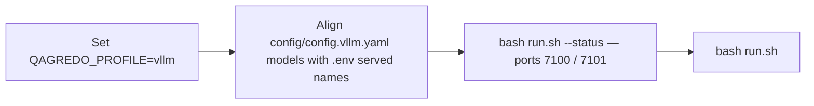

# QAGRedo

Question–answer generation with **strict LLM judge** verification: documents in → questions and grounded answers out → separate judge model grades each answer against the source text.

**New maintainer?** Start with [`docs/HANDOVER.md`](docs/HANDOVER.md) (documentation map, code layout, profiles).
**Looking for docs navigation?** Use [`docs/README.md`](docs/README.md).

## Quick start

1. Set **`QAGREDO_PROFILE`** and paths in **`.env`** (`dev` | `kubeflow` | `vllm`).
2. Edit **`config/config.<profile>.yaml`** for model tags and run counts (lines marked `CHANGE ME`).
3. Run:

```bash
bash run.sh --status
bash run.sh --num-documents 2
```

Use **`config/config.dev.yaml`**, **`config/config.kubeflow.yaml`**, or **`config/config.vllm.yaml`** for daily runs — not **`config/config.yaml`** alone.

## Minimal output (content + question + answer)

Run minimal output directly:

```bash
bash run.sh -- --minimal-qa-output
```

Convert an existing run folder after the fact (no re-run):

```bash
python3 scripts/utils/export_analysis_minimal.py "/path/to/output/<provider>/<model>/<run_timestamp>"
```

## Profiles

| Profile | When to use |
|---------|-------------|
| **`dev`** | Host has `ollama`; API at `127.0.0.1:11434`. |
| **`kubeflow`** | No host Ollama binary — Ollama runs **inside** the `qagredo-kubeflow` container; set **`QAGREDO_MODELS_DIR`** to an Ollama store (`blobs/`, `manifests/`). |
| **`vllm`** | Two containers: **`vllm`** (generator) and **`vllm-judge`**; HF models + vLLM image. Use **`docker-compose.vllm-redserver.yml`** via **`QAGREDO_VLLM_COMPOSE_EXTRA`** for a 4-GPU (2+2) host. |

Server-specific guidance (greenserver, Opserver, redserver): **`docs/SERVER_MODEL_PROFILES.md`**.

## Offline packaging

```bash
bash scripts/make_offline_tarballs.sh --all
```

Split Ollama archives (e.g. transfer size limits):

```bash
bash scripts/make_offline_tarballs.sh \
  --models-ollama-split=qwen3.5:9b,llama3.1:8b-instruct-fp16
```

- **`models_ollama*.tar.gz`** → Ollama store for **`dev`** / **`kubeflow`**.
- **`models_vllm.tar.gz`** → HuggingFace trees for **`vllm`**.

These formats are **not** interchangeable.

## Documentation index

Prefer the central docs hub first: **`docs/README.md`**.

| Doc | Content |
|-----|---------|
| **`docs/README.md`** | Documentation hub (what to read by role). |
| **`docs/HANDOVER.md`** | Maintainer onboarding and repo map. |
| **`docs/OFFLINE_SETUP_GUIDE.md`** | Offline operations and troubleshooting. |
| **`docs/OFFLINE_SETUP_GUIDE.md`** | Offline setup steps. |
| **`docs/ONLINE_SETUP_GUIDE.md`** | Build machine and tarball workflow. |
| **`docs/SERVER_MODEL_PROFILES.md`** | Server → profile mapping. |
| **`docs/ALGORITHM_REPORT.md`** | Algorithm and design detail. |
| **`docs/architecture/NETWORK_DIAGRAM.md`** | Ports and Docker networking. |
| **`docs/KUBEFLOW_DEPLOY.md`** | Kubeflow / single-image layout. |

## Common issues

| Symptom | Typical fix |
|---------|-------------|
| `ollama: command not found` | Cannot use **`dev`**; use **`kubeflow`** or install host Ollama. |
| `Ollama not reachable on port 11434` | Start **`ollama serve`** or switch profile. |
| vLLM connection errors | In **`config/config.vllm.yaml`**, use service names **`http://vllm:7100/v1`** and **`http://vllm-judge:7101/v1`**, not `localhost`. |
| Qwen3 errors on old vLLM | Use Qwen2.5 in **`vllm`**, or use Ollama profiles for newer GGUF. |

---

## Switching to dual vLLM (profile `vllm`)



```bash
QAGREDO_PROFILE=vllm
VLLM_TP_SIZE=1
VLLM_JUDGE_TP_SIZE=1
```

See **`docs/OFFLINE_SETUP_GUIDE.md`** and **`docs/architecture/NETWORK_DIAGRAM.md`** for GPU mapping and URLs.
