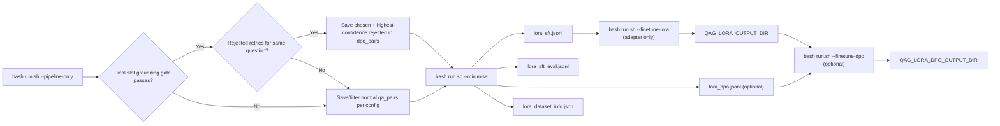
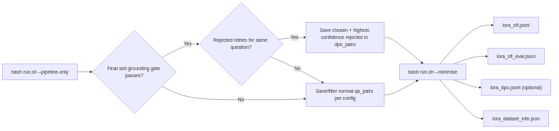
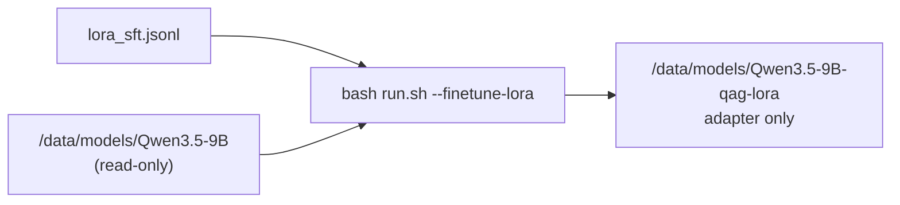
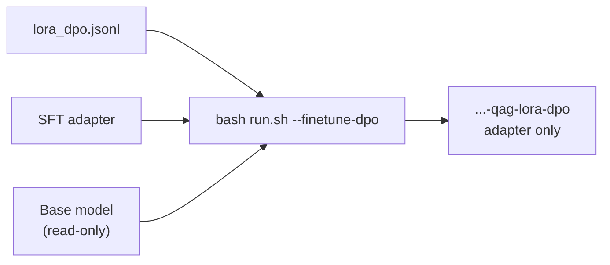
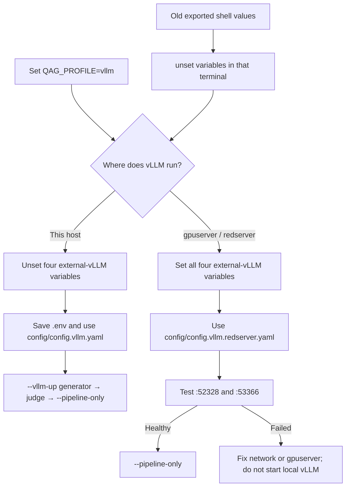

# QAG

Question–answer generation with **strict LLM judge** verification: documents in → questions and grounded answers out → separate judge model grades each answer against the source text.

**Technical lead / architecture review?** Start with [`docs/ARCHITECTURE.md`](docs/ARCHITECTURE.md).
**New maintainer?** [`docs/HANDOVER.md`](docs/HANDOVER.md) (documentation map, code layout, profiles).
**Docs navigation:** [`docs/README.md`](docs/README.md).

## Quick start

1. Set **`QAG_PROFILE`** and paths in **`.env`** (`ollama` | `kubeflow` | `vllm`).
2. Run **`bash run.sh --show-config`**, then edit the active YAML it prints.
   Redserver sets the config override, both external base URLs, and redserver
   compose extra; local dual-vLLM leaves those redserver values off.
3. Run:

```bash
bash run.sh --status
bash run.sh -- --num-documents 2    # ollama / kubeflow
bash run.sh --pipeline-only --num-documents 2    # vllm (after --vllm-up generator/judge)
```

For **local `vllm`**, prefer split startup: `--vllm-up generator` →
`--vllm-up judge` → `--pipeline-only` (see
[dual vLLM](#switching-to-dual-vllm-profile-vllm) below). On **redserver**,
vLLM is external on gpuserver: set `QAG_VLLM_CONFIG_FILE` and use
both `VLLM_*_BASE_URL` values plus `QAG_VLLM_COMPOSE_EXTRA`, then use
`--pipeline-only` without `--vllm-up`.

Set **`QAG_PROFILE`** in `.env`, then use `bash run.sh --show-config` to
confirm the active YAML before editing it.

## Minimal output (content + question + answer)

Run minimal output directly:

```bash
bash run.sh -- --minimal-qa-output
```

Convert an existing run folder after the fact (no re-run):

```bash
bash run.sh --minimise
# or target a specific folder:
bash run.sh --minimise "/path/to/output/<provider>/<model>/<run_timestamp>"

# LoRA JSONL only (sharegpt + optional DPO):
bash run.sh --export-lora "/path/to/output/<provider>/<model>/<run_timestamp>"

# Host LoRA finetune (adapter only; stop vLLM first):
bash run.sh --finetune-lora "/path/to/output/<provider>/<model>/<run_timestamp>"

# Optional DPO stage (needs lora_dpo.jsonl + SFT adapter):
bash run.sh --finetune-dpo "/path/to/output/<provider>/<model>/<run_timestamp>"
```

`--minimise` writes per-document minimal JSON, good/bad pair files, and
**LoRA-ready** `lora_sft.jsonl` (+ `lora_dpo.jsonl` when a gate-passing answer
has a rejected retry for the same question).
See `lora_dataset_info.json` for LLaMA-Factory dataset registration.

`--minimise-good` / `--minimise-bad` remain when you only want one split.

## LoRA-ready output

Use this when you want the QAG run output in a format that a LoRA trainer can
consume directly.





### 1) Run the pipeline

```bash
# vllm example
bash run.sh --pipeline-only --resume --num-documents 100
```

### 2) Export LoRA JSONL from that run

```bash
# latest run folder
bash run.sh --minimise

# or target a specific run folder
bash run.sh --minimise "output/<provider>/<model>/<run_timestamp>"

# LoRA JSONL only (skip the per-document minimal exports)
bash run.sh --export-lora "output/<provider>/<model>/<run_timestamp>"
```

### 3) Files written into the run folder

| File | Purpose |
|------|---------|
| `lora_sft.jsonl` | Main LoRA SFT dataset in sharegpt `messages` format |
| `lora_sft_eval.jsonl` | Hold-out eval split (10% by default) |
| `lora_dpo.jsonl` | Optional gate-passing chosen + highest-confidence rejected retry |
| `lora_dataset_info.json` | Dataset registration snippet for LLaMA-Factory |
| `*_analysis_minimal_good_pairs.json` | Per-document grounded pairs |
| `*_analysis_minimal_bad_pairs.json` | Per-document failed pairs |

### 4) What the LoRA export looks like

`lora_sft.jsonl` uses one JSON object per line:

```json
{
  "messages": [
    {
      "role": "system",
      "content": "Answer using only the document below. Do not use outside knowledge."
    },
    {
      "role": "user",
      "content": "Document:\n<document text>\n\nQuestion: <question>"
    },
    {
      "role": "assistant",
      "content": "<grounded answer>"
    }
  ]
}
```

### 5) Notes for redserver / negative-pair export

- `config/config.vllm.redserver.yaml` currently ships with
  `parallel_documents: 2`.
- To keep final failed pairs for `--minimise-bad`, keep
  `question_generation.validation.answerability_strict: false`.
- `lora_dpo.jsonl` is written only when the final grounding gate passes and a
  rejected retry exists for the same question. Existing runs created before
  this capture was added must be rerun; discarded attempts cannot be
  reconstructed from their saved files.
- The exporter retains backward compatibility with manually prepared legacy
  good/bad files when both contain the exact same question.

### 6) LLaMA-Factory handoff

Copy these files from the run folder to the training host:

```bash
lora_sft.jsonl
lora_sft_eval.jsonl
lora_dpo.jsonl  # only when DPO pairs were captured
lora_dataset_info.json
```

Then register `qag_lora_sft` from `lora_dataset_info.json` in your
LLaMA-Factory `dataset_info.json`, and train with:

- `stage: sft`
- `finetuning_type: lora`
- `dataset: qag_lora_sft`

If you also want preference tuning later, use `lora_dpo.jsonl` as the input
for a DPO stage.

### 7) Finetune LoRA on this host (Option A, 2 GPUs)

Train a **LoRA adapter only**. The base model at `QAG_MODELS_LLM_HOST/Qwen3.5-9B`
is read-only; the adapter is written to a separate folder.



```bash
# 1) Stop vLLM so GPUs are free
bash run.sh --down

# 2) Optional .env overrides:
#   QAG_LORA_BASE_MODEL=/data/models/Qwen3.5-9B
#   QAG_LORA_OUTPUT_DIR=/data/models/Qwen3.5-9B-qag-lora
#   QAG_LORA_GPUS=0,1
#   QAG_LORA_QUANTIZATION_BIT=0   # fp16 (default); use 4 if OOM

# 3) Train (latest run or explicit folder)
bash run.sh --finetune-lora
bash run.sh --finetune-lora output/vllm/qwen-qwen3.5-9b/2026-07-17_095536/
```

| Setting | Default | Notes |
|---------|---------|-------|
| Precision | fp16 (`QAG_LORA_QUANTIZATION_BIT=0`) | Higher fidelity; shards across GPUs |
| LoRA rank | 32 | Set via `--lora-rank` on the trainer |
| GPUs | `0,1` | `device_map="auto"` — not DDP |
| OOM fallback | `QAG_LORA_QUANTIZATION_BIT=4` | 4-bit QLoRA |

First run creates `.venv-lora` and installs `scripts/lora/requirements-lora.txt`.
Output contains `adapter_config.json`, `adapter_model.safetensors`, and
`qag_lora_manifest.json`. Serve with base + adapter, or merge later into a new
full-model folder.

Dry-run validation:

```bash
bash scripts/lora/train_qwen_lora.sh output/vllm/.../ --dry-run
```

### 8) DPO preference tuning (optional, after SFT)

Run only when `lora_dpo.jsonl` exists and SFT finetuning has finished.



```bash
# 1) SFT first (if not done)
bash run.sh --finetune-lora output/vllm/qwen-qwen3.5-9b/2026-07-17_095536/

# 2) DPO second (needs lora_dpo.jsonl)
bash run.sh --finetune-dpo output/vllm/qwen-qwen3.5-9b/2026-07-17_095536/
```

| Setting | Default | Notes |
|---------|---------|-------|
| SFT input | `QAG_LORA_OUTPUT_DIR` | Must contain `adapter_config.json` |
| DPO output | `${QAG_LORA_OUTPUT_DIR}-dpo` | Override with `QAG_LORA_DPO_OUTPUT_DIR` |
| Data | `lora_dpo.jsonl` | Chosen vs rejected same-question pairs |

With only a few DPO rows (e.g. 8), treat results as experimental.

Dry-run:

```bash
bash scripts/lora/train_qwen_dpo.sh output/vllm/.../ --dry-run
```

## Profiles

| Profile | When to use |
|---------|-------------|
| **`ollama`** | Host has `ollama`; API at `127.0.0.1:11434`. |
| **`kubeflow`** | No host Ollama binary — Ollama runs **inside** the `qag-kubeflow` container; set **`QAG_MODELS_DIR`** to an Ollama store (`blobs/`, `manifests/`). `run.sh` reuses the loaded image (no default rebuild), keeps Ollama warm across runs, and releases on `bash run.sh --down`. |
| **`vllm`** | Local: two vLLM containers and `config.vllm.yaml`. Redserver: external gpuserver endpoints and `config.vllm.redserver.yaml` selected by `QAG_VLLM_CONFIG_FILE`. |

Server-specific guidance (greenserver, Opserver, redserver, siteserver):
**`docs/SERVER_MODEL_PROFILES.md`**. For redserver execution, use
**`docs/REDSERVER_ONSITE_SETUP.md`**.
JSON/JSONL -> TXT conversion commands for Opserver/siteserver are documented in
that same file under **"Input conversion on Opserver/siteserver"**.

## Offline packaging

Archives default to **`/data/tyewhong/qag/`** (`QAG_ARCHIVE_DIR` in `.env`).
Active profile bundles stay in that directory root; retired archives may live
in `zz_old_qag/`. See `docs/OFFLINE_SETUP_GUIDE.md`.

```bash
bash scripts/make_offline_tarballs.sh --all
```

Redserver needs only the code bundle plus the runner image when missing or
old—no local vLLM rootfs or model archive for **inference** (gpuserver serves
vLLM):

```bash
bash scripts/make_offline_tarballs.sh --bundle --image-dev
```

**Redserver finetune:** the bundle includes `scripts/lora/`. Also copy
`models_vllm_Qwen3_5-9B.tar.gz` and pre-built `lora_venv.tar.gz` — see
`docs/REDSERVER_ONSITE_SETUP.md` §1.4 and §8.5.

Split Ollama archives (e.g. transfer size limits):

```bash
bash scripts/make_offline_tarballs.sh \
  --models-ollama-split=qwen3.5:9b,llama3.1:8b-instruct-fp16
```

- **`models_ollama*.tar.gz`** → Ollama store for **`ollama`** / **`kubeflow`**.
- **`models_vllm.tar.gz`** → HuggingFace trees for **`vllm`**.

These formats are **not** interchangeable.

## Documentation index

Prefer the central docs hub first: **`docs/README.md`**.

| Doc | Content |
|-----|---------|
| **`docs/README.md`** | Documentation hub (what to read by role). |
| **`docs/HANDOVER.md`** | Maintainer onboarding and repo map. |
| **`docs/OFFLINE_SETUP_GUIDE.md`** | Offline setup steps. |
| **`docs/REDSERVER_ONSITE_SETUP.md`** | Redserver external-vLLM checklist. |
| **`docs/REDSERVER_CODE_ONLY_UPDATE.md`** | Redserver code-only update and rollback. |
| **`docs/REDSERVER_FILE_REPLACE.md`** | Redserver four-file fast sync. |
| **`docs/ONLINE_SETUP_GUIDE.md`** | Build machine and tarball workflow. |
| **`docs/SERVER_MODEL_PROFILES.md`** | Server → profile mapping. |
| **`docs/ALGORITHM_REPORT.md`** | Algorithm and design detail. |
| **`docs/algorithm-baselines/README.md`** | Code-verified doc snapshots (`baseline now` in Cursor). |
| **`docs/architecture/NETWORK_DIAGRAM.md`** | Ports and Docker networking. |
| **`docs/KUBEFLOW_DEPLOY.md`** | Kubeflow / single-image layout. |
| **`docs/Siteserver_vLLM_Change_Guide.md`** | Siteserver vLLM upgrade (Qwen3.5 image, split startup). |

## Common issues

| Symptom | Typical fix |
|---------|-------------|
| `ollama: command not found` | Cannot use **`ollama`** profile; use **`kubeflow`** or install host Ollama. |
| `Ollama not reachable on port 11434` | Start **`ollama serve`** or switch profile. |
| Local vLLM connection errors | In **`config/config.vllm.yaml`**, use service names **`http://vllm:7100/v1`** and **`http://vllm-judge:7101/v1`**, not `localhost`. |
| Redserver vLLM connection errors | Confirm `QAG_VLLM_CONFIG_FILE=config/config.vllm.redserver.yaml`, then test gpuserver ports `52328` and `53366`; do not use `--vllm-up`. |
| Local run still checks `gpuserver:52328` | Save `.env`, then unset `QAG_VLLM_CONFIG_FILE`, both `VLLM_*_BASE_URL` variables, and `QAG_VLLM_COMPOSE_EXTRA` in the current shell. |
| Generator not healthy on local :7100 | Run `bash run.sh --vllm-up generator` (and judge on :7101) before `--pipeline-only` |
| Resume run processes zero new docs | Raise `--num-documents`; skipped short/duplicate records still count toward the limit |

## Summarise and export

```bash
bash run.sh --summarize --latest --json
bash run.sh --minimise "output/<provider>/<model>/<run_timestamp>"
```

---

## Switching to dual vLLM (profile `vllm`)




```bash
QAG_PROFILE=vllm
VLLM_TP_SIZE=1
VLLM_JUDGE_TP_SIZE=1

# Local vLLM only: remove any external redserver selection.
QAG_VLLM_CONFIG_FILE=
VLLM_BASE_URL=
VLLM_JUDGE_BASE_URL=
QAG_VLLM_COMPOSE_EXTRA=
```

Save `.env`, then use `bash run.sh --show-config`. It must report
`config/config.vllm.yaml` before local startup. If the shell previously
exported redserver values, unset those four names because shell values take
priority over `.env`.

**Split startup** (GPU 0 = Qwen generator, GPU 1 = Llama judge — recommended on siteserver):

```bash
bash run.sh --vllm-up generator
bash run.sh --vllm-up judge
bash run.sh --pipeline-only --num-documents 2
```

**All-in-one:** `bash run.sh` or `bash run.sh -- --num-documents 2` (starts both vLLM containers, then the pipeline).

See **`docs/OFFLINE_SETUP_GUIDE.md`**,
**`docs/REDSERVER_ONSITE_SETUP.md`** (external gpuserver),
**`docs/Siteserver_vLLM_Change_Guide.md`** (local Part D), and
**`docs/architecture/NETWORK_DIAGRAM.md`**.

## Resume / skip already-processed documents

Skip inputs that already have `*_analysis.json` in a prior run folder; optionally **reuse** that folder instead of creating a new timestamp directory.

| Goal | Command or config |
|------|-------------------|
| Resume (skip + append to latest run) | `bash run.sh -- --resume` or `run.resume: true` in profile YAML |
| Skip only (new run folder for new docs) | `bash run.sh -- --skip-existing-outputs` or `run.skip_existing_outputs: true` |
| Pin which run folder to check | `run.resume_run_dir: "2026-05-26_093000"` or `--resume-run-dir` |

**vLLM example** (generator/judge already up):

```bash
bash run.sh --pipeline-only --resume --num-documents 100
```

(`--` before `--resume` is optional after `--pipeline-only`.)

Config keys in the active YAML under `run:` are `skip_existing_outputs`,
`resume`, and `resume_run_dir`. Use `bash run.sh --show-config` to distinguish
local `config.vllm.yaml` from redserver `config.vllm.redserver.yaml`.
