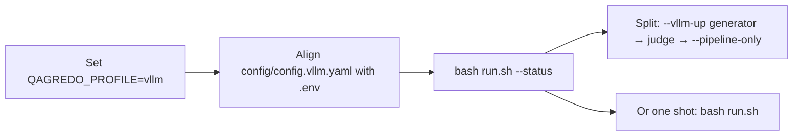

# QAGRedo

Question–answer generation with **strict LLM judge** verification: documents in → questions and grounded answers out → separate judge model grades each answer against the source text.

**New maintainer?** Start with [`docs/HANDOVER.md`](docs/HANDOVER.md) (documentation map, code layout, profiles).
**Looking for docs navigation?** Use [`docs/README.md`](docs/README.md).

## Quick start

1. Set **`QAGREDO_PROFILE`** and paths in **`.env`** (`ollama` | `kubeflow` | `vllm`).
2. Edit **`config/config.<profile>.yaml`** for model tags and run counts (lines marked `CHANGE ME`).
3. Run:

```bash
bash run.sh --status
bash run.sh -- --num-documents 2    # ollama / kubeflow
bash run.sh --pipeline-only --num-documents 2    # vllm (after --vllm-up generator/judge)
```

For **`vllm`**, prefer split startup: `--vllm-up generator` → `--vllm-up judge` → `--pipeline-only` (see [dual vLLM](#switching-to-dual-vllm-profile-vllm) below).

Set **`QAGREDO_PROFILE`** in `.env`, then edit **`config/config.<profile>.yaml`** for model tags and run counts (lines marked `CHANGE ME`).

## Minimal output (content + question + answer)

Run minimal output directly:

```bash
bash run.sh -- --minimal-qa-output
```

Convert an existing run folder after the fact (no re-run). Strips model reasoning (Thinking Process sections, Qwen think blocks, Answer:/evidence wrappers) so only plain question and answer text remain:

```bash
bash run.sh --minimise
# or target a specific folder:
bash run.sh --minimise "/path/to/output/<provider>/<model>/<run_timestamp>"

# --minimise now also exports per-document good/bad pair files
# (use --minimise-good / --minimise-bad only when you want one side explicitly)
bash run.sh --minimise-good "/path/to/output/<provider>/<model>/<run_timestamp>"
bash run.sh --minimise-bad  "/path/to/output/<provider>/<model>/<run_timestamp>"
```

`--minimise` writes all three per-document outputs (`*_analysis_minimal.json`,
`*_analysis_minimal_good_pairs.json`, `*_analysis_minimal_bad_pairs.json`).
`--minimise-good` and `--minimise-bad` remain available when you only want one split:
- `*_analysis_minimal_good_pairs.json`
- `*_analysis_minimal_bad_pairs.json`

## Profiles

| Profile | When to use |
|---------|-------------|
| **`ollama`** | Host has `ollama`; API at `127.0.0.1:11434`. |
| **`kubeflow`** | No host Ollama binary — Ollama runs **inside** the `qagredo-kubeflow` container; set **`QAGREDO_MODELS_DIR`** to an Ollama store (`blobs/`, `manifests/`). `run.sh` reuses the loaded image (no default rebuild), keeps Ollama warm across runs, and releases on `bash run.sh --down`. |
| **`vllm`** | Two containers: **`vllm`** (generator) and **`vllm-judge`**; HF models + vLLM image. Use **`docker-compose.vllm-siteserver.yml`** via **`QAGREDO_VLLM_COMPOSE_EXTRA`** for a 4-GPU (2+2) host. |

Server-specific guidance (greenserver, Opserver, siteserver): **`docs/SERVER_MODEL_PROFILES.md`**.
JSON/JSONL -> TXT conversion commands for Opserver/siteserver are documented in
that same file under **"Input conversion on Opserver/siteserver"**.

## Offline packaging

```bash
bash scripts/make_offline_tarballs.sh --all
```

Split Ollama archives (e.g. transfer size limits):

```bash
bash scripts/make_offline_tarballs.sh \
  --models-ollama-split=qwen3.5:9b,llama3.1:8b-instruct-fp16
```

- **`models_ollama*.tar.gz`** → Ollama store for **`ollama`** / **`kubeflow`**.
- **`models_vllm.tar.gz`** → HuggingFace trees for **`vllm`**.

These formats are **not** interchangeable.

## Documentation index

Prefer the central docs hub first: **`docs/README.md`**.

| Doc | Content |
|-----|---------|
| **`docs/README.md`** | Documentation hub (what to read by role). |
| **`docs/HANDOVER.md`** | Maintainer onboarding and repo map. |
| **`docs/OFFLINE_SETUP_GUIDE.md`** | Offline setup steps. |
| **`docs/ONLINE_SETUP_GUIDE.md`** | Build machine and tarball workflow. |
| **`docs/SERVER_MODEL_PROFILES.md`** | Server → profile mapping. |
| **`docs/ALGORITHM_REPORT.md`** | Algorithm and design detail. |
| **`docs/architecture/NETWORK_DIAGRAM.md`** | Ports and Docker networking. |
| **`docs/KUBEFLOW_DEPLOY.md`** | Kubeflow / single-image layout. |
| **`docs/Siteserver_vLLM_Change_Guide.md`** | Siteserver vLLM upgrade (Qwen3.5 image, split startup). |

## Common issues

| Symptom | Typical fix |
|---------|-------------|
| `ollama: command not found` | Cannot use **`ollama`** profile; use **`kubeflow`** or install host Ollama. |
| `Ollama not reachable on port 11434` | Start **`ollama serve`** or switch profile. |
| vLLM connection errors | In **`config/config.vllm.yaml`**, use service names **`http://vllm:7100/v1`** and **`http://vllm-judge:7101/v1`**, not `localhost`. |
| Generator not healthy on :7100 | Run `bash run.sh --vllm-up generator` (and judge on :7101) before `--pipeline-only` |
| Resume run processes zero new docs | Raise `--num-documents`; skipped short/duplicate records still count toward the limit |

## Summarise and export

```bash
bash run.sh --summarize --latest --json
bash run.sh --minimise "output/<provider>/<model>/<run_timestamp>"
```

---

## Switching to dual vLLM (profile `vllm`)



```bash
QAGREDO_PROFILE=vllm
VLLM_TP_SIZE=1
VLLM_JUDGE_TP_SIZE=1
```

**Split startup** (GPU 0 = Qwen generator, GPU 1 = Llama judge — recommended on siteserver):

```bash
bash run.sh --vllm-up generator
bash run.sh --vllm-up judge
bash run.sh --pipeline-only --num-documents 2
```

**All-in-one:** `bash run.sh` or `bash run.sh -- --num-documents 2` (starts both vLLM containers, then the pipeline).

See **`docs/OFFLINE_SETUP_GUIDE.md`**, **`docs/Siteserver_vLLM_Change_Guide.md`** (Part D), and **`docs/architecture/NETWORK_DIAGRAM.md`**.

## Resume / skip already-processed documents

Skip inputs that already have `*_analysis.json` in a prior run folder; optionally **reuse** that folder instead of creating a new timestamp directory.

| Goal | Command or config |
|------|-------------------|
| Resume (skip + append to latest run) | `bash run.sh -- --resume` or `run.resume: true` in profile YAML |
| Skip only (new run folder for new docs) | `bash run.sh -- --skip-existing-outputs` or `run.skip_existing_outputs: true` |
| Pin which run folder to check | `run.resume_run_dir: "2026-05-26_093000"` or `--resume-run-dir` |

**vLLM example** (generator/judge already up):

```bash
bash run.sh --pipeline-only --resume --num-documents 100
```

(`--` before `--resume` is optional after `--pipeline-only`.)

Config keys in **`config/config.<profile>.yaml`** under `run:`: `skip_existing_outputs`, `resume`, `resume_run_dir` (see **`config/config.vllm.yaml`** for defaults).
