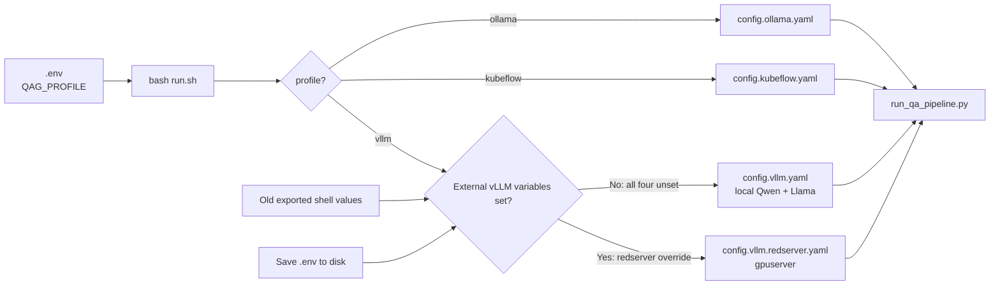

# QAG configuration — which file do I edit?

You only need **one active YAML** per deployment. Set **`QAG_PROFILE`** in
`.env` to pick the backend (`ollama` | `kubeflow` | `vllm`). System design:
**`docs/ARCHITECTURE.md`**. Redserver sets
the four external-vLLM variables listed below so the `vllm` backend uses
gpuserver endpoints instead of local containers.

If `QAG_PROFILE` is missing, the stack **defaults to `ollama`** and prints a warning. The old name `dev` means the same as `ollama` (also warned).




## Quick answer (handover)

| Step | What to do |
|------|------------|
| 1 | Set `QAG_PROFILE=ollama` \| `kubeflow` \| `vllm` in **`.env`** (defaults to `ollama` if unset) |
| 2 | Local vLLM: unset the four external-vLLM variables; redserver: set all four |
| 3 | Edit **only** the file printed by `bash run.sh --show-config` |
| 4 | Run `bash run.sh --show-config` to confirm the active file and data path |
| 5 | Optional: `bash run.sh --edit-config` opens that file in `$EDITOR` |

`bash run.sh` always passes the profile YAML to the pipeline. There is no
fourth “default” config file.

For local `config.vllm.yaml`, these must be absent or empty in the saved
`.env`:

```bash
QAG_VLLM_CONFIG_FILE=
VLLM_BASE_URL=
VLLM_JUDGE_BASE_URL=
QAG_VLLM_COMPOSE_EXTRA=
```

Redserver sets all four to its config, generator URL, judge URL, and compose
extra. Shell-exported values override `.env`; if a commented setting still
takes effect, run `unset` for all four in that terminal. Save `.env` before
running—unsaved editor changes are not visible to `run.sh`.

## Files in this folder

| File | Purpose |
|------|---------|
| `config.ollama.yaml` | Ollama on the host (`QAG_PROFILE=ollama`) |
| `config.kubeflow.yaml` | Ollama inside the Kubeflow container |
| `config.vllm.yaml` | Dual vLLM GPU stack on **same host** (generator + judge) |
| `config.vllm.redserver.yaml` | External vLLM on **gpuserver**; activate with `QAG_VLLM_CONFIG_FILE` |
| `README.md` | This guide |

Each config file is **self-contained** — not layered on another YAML.
That keeps each deployment copy-pasteable and avoids “which file actually
won?” surprises.

## What to change in the profile YAML

Each profile file has a **LAYMAN CHEAT SHEET** at the top. In practice
operators change:

1. `run.num_documents` — how many documents per run
2. `run.parallel_documents` — concurrent documents (`1` = serial; redserver default `2`)
3. `question_generation.num_questions` — slots per document
4. `llm.model` — generator model tag (must match server / `.env`)
5. `judge.model` — judge model tag (must match server / `.env`)

Host paths, GPU layout, and compose files stay in **`.env`** — not in YAML.

### LoRA finetuning (optional, host-side)

After `bash run.sh --minimise` or `--export-lora`, train an adapter with
`bash run.sh --finetune-lora [RUN_DIR]`. Optional `.env` keys:

| Key | Default |
|-----|---------|
| `QAG_LORA_BASE_MODEL` | `$QAG_MODELS_LLM_HOST/Qwen3.5-9B` |
| `QAG_LORA_OUTPUT_DIR` | `.../Qwen3.5-9B-qag-lora` |
| `QAG_LORA_GPUS` | `0,1` |
| `QAG_LORA_QUANTIZATION_BIT` | `0` (fp16; use `4` if OOM) |

Stop local containers (`bash run.sh --down`) before training. Scripts ship in
`qag_bundle.tar.gz` under `scripts/lora/`. Redserver offline guide:
[`docs/REDSERVER_ONSITE_SETUP.md`](../docs/REDSERVER_ONSITE_SETUP.md) §8.5.
See root `README.md` §7–8.

## Why separate config files?

Profiles differ in **LLM backend URLs and model wiring** (Ollama tags vs
vLLM served names, one container vs two). A single mega-YAML with nested
`profiles:` blocks is possible but harder to read on an offline server.
The redserver variant also keeps external gpuserver URLs separate from local
vLLM service names. The current layout trades a little duplication for clarity
at handover.
