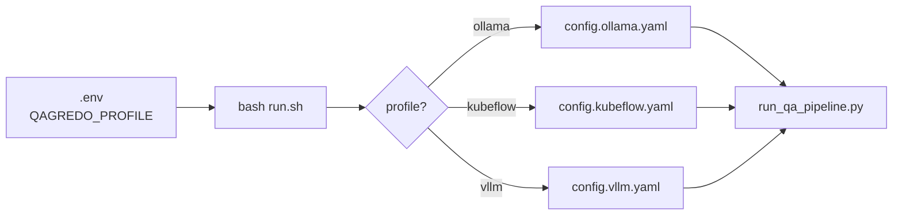

# QAGRedo configuration — which file do I edit?

You only need **one active YAML** per deployment. Set **`QAGREDO_PROFILE`** in `.env` to pick it (`ollama` | `kubeflow` | `vllm`).

If `QAGREDO_PROFILE` is missing, the stack **defaults to `ollama`** and prints a warning. The old name `dev` means the same as `ollama` (also warned).

## Quick answer (handover)

| Step | What to do |
|------|------------|
| 1 | Set `QAGREDO_PROFILE=ollama` \| `kubeflow` \| `vllm` in **`.env`** (defaults to `ollama` if unset) |
| 2 | Edit **only** `config/config.<that-profile>.yaml` |
| 3 | Run `bash run.sh --show-config` to confirm the active file |
| 4 | Optional: `bash run.sh --edit-config` opens that file in `$EDITOR` |

`bash run.sh` always passes the profile YAML to the pipeline. There is no
fourth “default” config file.

## Files in this folder

| File | Purpose |
|------|---------|
| `config.ollama.yaml` | Ollama on the host (`QAGREDO_PROFILE=ollama`) |
| `config.kubeflow.yaml` | Ollama inside the Kubeflow container |
| `config.vllm.yaml` | Dual vLLM GPU stack (generator + judge) |
| `README.md` | This guide |

Each profile file is **self-contained** — not layered on another YAML.
That keeps each deployment copy-pasteable and avoids “which file actually
won?” surprises.

## What to change in the profile YAML

Each profile file has a **LAYMAN CHEAT SHEET** at the top. In practice
operators change:

1. `run.num_documents` — how many documents per run
2. `question_generation.num_questions` — slots per document
3. `llm.model` — generator model tag (must match server / `.env`)
4. `judge.model` — judge model tag (must match server / `.env`)

Host paths, GPU layout, and compose files stay in **`.env`** — not in YAML.

## Why three profiles instead of one file?

Profiles differ in **LLM backend URLs and model wiring** (Ollama tags vs
vLLM served names, one container vs two). A single mega-YAML with nested
`profiles:` blocks is possible but harder to read on an offline server.
The current layout trades a little duplication for clarity at handover.
