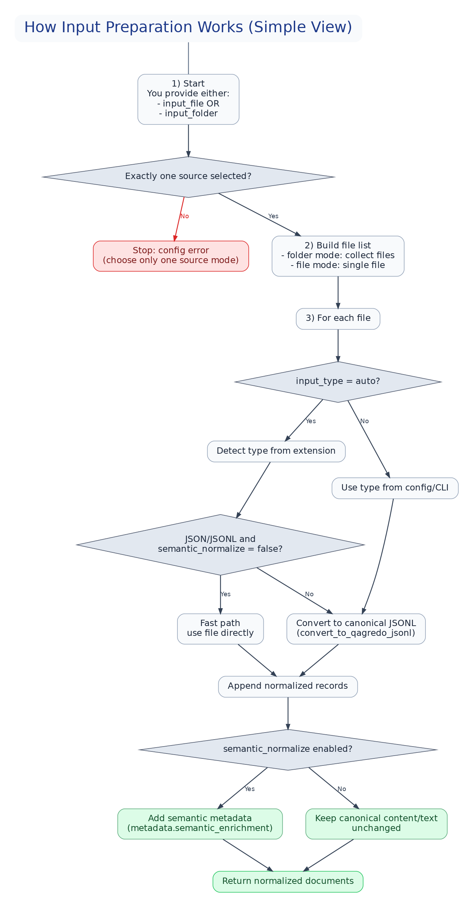
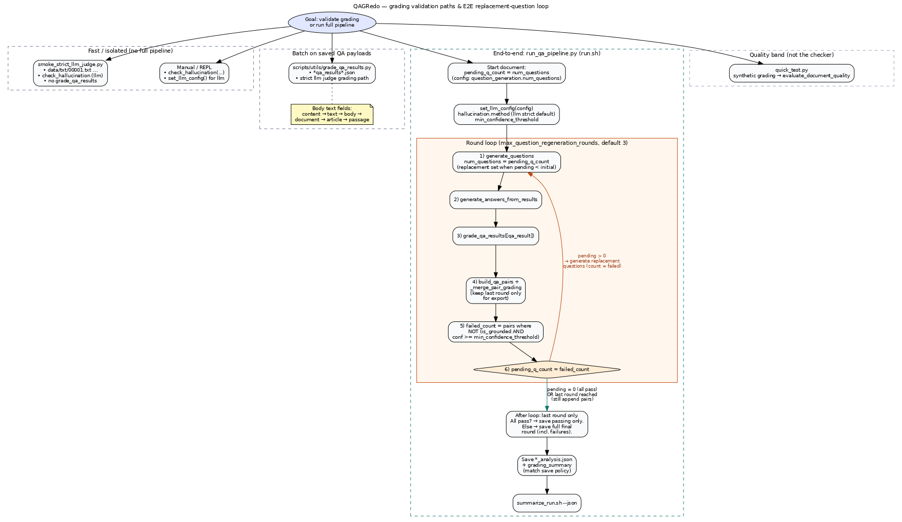
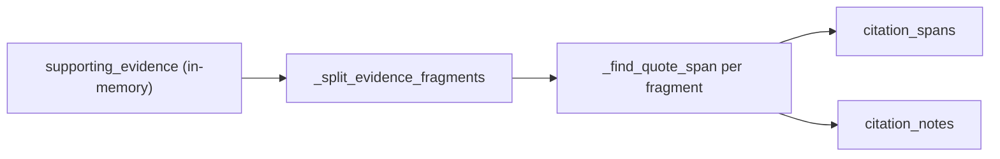

# QAGRedo Algorithm Report

Maintainer documentation index: **`docs/HANDOVER.md`**.

This document provides a comprehensive description of the algorithms, design
rationale, and architectural decisions in the QAGRedo pipeline. It covers
question generation, answer generation, hallucination grading, output
management, and the Docker permission model.

> **Current default policy (final):** strict `llm` judge mode.
> Any references to `semantic` or `hybrid` in this report describe legacy or compatibility-only paths and are **not** the production default.

---

## 1. Pipeline Overview

Input conversion from `pdf/txt/doc/docx/xlsx/csv/json/jsonl` to canonical JSONL is parser-based via `scripts/conversion/convert_to_qagredo_jsonl.py` (not an LLM reasoning step). The **main pipeline** (`run_qa_pipeline.py`, invoked by `bash run.sh`) ingests **one** path: `run.input_file`, and chooses **JSON vs JSONL** from the **file extension** only — it does **not** read `run.input_type`. Use the converter CLI (or `bash run.sh --convert`, which forwards to the same script) to build JSONL from PDF/TXT/etc. YAML keys such as `run.input_type`, `run.input_folder`, and `run.max_files` are **not** passed into the converter; use **`--input-type`** on the converter when you need to override detection. With `--input-type auto` (default), type is inferred from each **`--input`** file’s extension. Optional **`--semantic-normalize`** can populate `metadata.semantic_enrichment` while preserving canonical `content`.

### 1.1 Implementation sketch (runtime auto input preparation)

Picture-first explanation:



Plain-language summary:
- **Pipeline run**: set `run.input_file` to `.json` or `.jsonl` (and `run.input_folder: ""`). Extension selects the loader.
- **Converter** (separate step): one **`--input`** file per run; use **`--input-type`** when you must override extension-based detection (YAML `run.input_type` is not wired to this script).
- Process each source file; determine its type (`auto` detect or forced type) in the converter.
- If it is already JSON/JSONL and semantic enrichment is off, use fast path.
- Otherwise, convert to canonical JSONL.
- Optionally add semantic metadata, then feed the JSONL path to `run.input_file`.

Detailed decision flow is shown in the image above.

You do not need Mermaid software to read this report.
Mermaid is only needed if you want to edit/render Mermaid source diagrams locally.

```
Document (JSONL)
     |
     v
 +-------------------------------+
|  0. LangGraph Orchestrator    |  <-- required state graph per document
 |     - stage routing            |
 |     - dynamic fallback         |
 +---------------+---------------+
                |
                v
+-------------------------------+
|  1. Question Generator         |  <-- LLM (vLLM / OpenAI), temperature=0.7
|     - LangChain prompt template|
|     - Multi-type prompt         |
|     - Few-shot examples         |
|     - Deduplication (LLM default) |
|     - Grounding validation      |
|     - Comprehensiveness check   |
+---------------+---------------+
                |  questions (validated, deduplicated, comprehensive)
                v
+-------------------------------+
|  2. Answer Generator           |  <-- LLM (vLLM / OpenAI), temperature=0.3
|     - LangChain structured parse|
|     - Structured format         |
|     - "List then count"         |
|     - Supporting evidence       |
|     - Validation + retry (x3)   |
+---------------+---------------+
                |  answers + evidence
                v
+-------------------------------+
|  3. Hallucination Grader       |  <-- strict LLM judge (required)
|     - LLM verdict required      |
|     - Fail-fast on invalid      |
|       judge response            |
+---------------+---------------+
                |  graded results + reasons
                v
+-------------------------------+
|  4. Output Manager             |
|     - Per-run timestamped       |
|       folders (YYYY-MM-DD_      |
|       HHMMSS)                   |
|     - run_summary.json with     |
|       ungrounded highlights     |
+-------------------------------+
```

**Source files:**

| File | Responsibility |
|------|---------------|
| `run_qa_pipeline.py` | Pipeline orchestration |
| `utils/question_generator.py` | Question generation |
| `utils/answer_generator.py` | Answer generation |
| `utils/hallucination_checker.py` | Grounding verification & grading |
| `utils/duplicate_detector.py` | Question deduplication |
| `utils/output_manager.py` | Output path management & timestamping |
| `utils/config_manager.py` | Configuration loading & validation |
| `utils/langchain_components.py` | LangChain prompt/parsing adapters |
| `utils/langgraph_pipeline.py` | LangGraph state graph orchestration |
| `scripts/utils/summarize_run.sh` | Run summary with ungrounded reasons |

### 1.2 Structural causal assumptions (for diagnosis)

QAGRedo behaves as a staged causal system:

1. Input normalization quality affects question quality.
2. Question quality affects answer quality.
3. Answer quality affects grounding/grading outcomes.
4. Grading does not change generated answers; it only evaluates and labels them.

Practical implication:

- If grading quality is poor while answers are also poor, fix generation stages first.
- If answers look strong but grades are unstable, inspect hallucination method/routing and judge configuration.
- Avoid changing many stages at once; otherwise causal attribution is lost.

---

## 2. Question Generation

**File:** `utils/question_generator.py`

### 2.1 Design goal

Generate complex, multi-step questions that require **reasoning across multiple
parts** of the document -- not simple fact-lookup questions that can be answered
by copying a single sentence.

**Why complex questions matter:**
- Simple factual questions (e.g., "What is X?") test only retrieval, not
  comprehension. Any LLM can answer these by copying text.
- Complex questions (e.g., "How does X relate to Y given Z?") test whether
  the LLM truly understands the document's content and can synthesise
  information.
- For quality assessment purposes, complex questions are more discriminating --
  they reveal gaps in the LLM's understanding that simple questions miss.

### 2.2 Question types (Bloom's Taxonomy inspired)

The system supports **10 question types**, grouped by the cognitive skill they test:

| Type | Cognitive level | What it tests | Example pattern |
|------|----------------|---------------|-----------------|
| **Analysis** | Analyse | Break down information into parts | "What are the separate factors that contributed to [event]?" |
| **Aggregation** | Apply | Count/sum across document | "How many [people/items] are mentioned in total?" |
| **Comparison** | Analyse | Compare/contrast entities | "How does [A]'s role differ from [B]'s?" |
| **Inference** | Evaluate | Draw conclusions from facts | "Based on the information, what can be inferred about [topic]?" |
| **Causal** | Analyse | Cause-and-effect relationships | "What was the consequence of [action] on [outcome]?" |
| **Temporal** | Understand | Timeline and sequence | "What is the sequence of events that led to [outcome]?" |
| **Multi-hop** | Evaluate | Connect multiple separate facts | "Given [fact A] and [fact B], what does this imply?" |
| **Synthesis** | Create | Combine 3+ facts into analysis | "Drawing from X, Y, and Z, what overall picture emerges?" |
| **Evaluation** | Evaluate | Assess strength of claims/evidence | "How well-supported is the claim that [assertion]?" |
| **Counterfactual** | Create | Reason about hypothetical changes | "What would have changed if [condition] had not occurred?" |

**Why these 10 types:**
- The first 7 (analysis through multi-hop) cover the standard analytical
  question categories that test document comprehension.
- **Synthesis** was added because many real-world documents require integrating
  information scattered across multiple paragraphs -- no single paragraph
  contains the full answer.
- **Evaluation** was added to test whether the LLM can critically assess claims
  rather than just repeat them.
- **Counterfactual** was added to test deeper reasoning -- understanding the
  causal structure well enough to reason about what would change.

### 2.3 Complexity presets

| Preset | Question types used | Use case |
|--------|-------------------|----------|
| `basic` | Simple factual comprehension only | Quick testing |
| `moderate` | Analysis, comparison, inference | Balanced |
| **`advanced`** (default) | All 10 types | **Recommended** -- tests deep understanding |

### 2.4 Prompt construction

The prompt includes:

1. **Role instruction** -- "You are an expert analyst creating COMPLEX questions"
2. **Type definitions** -- Each type with its instruction and example pattern
3. **Few-shot examples** -- Concrete good and bad examples from a fictitious document
4. **Complexity requirements** -- 9 strict rules, including:
   - Every question MUST require reasoning across at least 2 different parts
   - NEVER ask a question answerable by copying a single sentence
   - Prefer "how", "why", "what does X imply about Y"
   - Synthesis questions must integrate 3+ facts
   - Counterfactual questions must reason about what would change
5. **Distribution note** -- Distribute questions across types evenly
6. **Format instruction** -- One per line, with type tag in parentheses

**Why few-shot examples:**
- LLMs produce significantly better output when shown examples (in-context
  learning). Without examples, the model defaults to simple factual questions
  even when instructed otherwise.
- The "bad" examples explicitly demonstrate what to avoid (trivial lookups,
  speculation), reducing regeneration cycles.
- Few-shot examples consume ~300 extra tokens per prompt, but this is minimal
  compared to the document content and greatly reduces failed generations.

### 2.5 Generation loop

```
for each document:
    all_questions = []
    attempts = 0

    while len(all_questions) < num_questions AND attempts < 5:
        1. Build prompt with complexity-aware instructions + few-shot examples
        2. Call LLM (temperature=0.7 for diversity)
        3. Parse response into individual questions
        4. Remove ALL trailing type tags (e.g. "(analysis) (comparison)")
        5. Deduplicate against existing questions (LLM semantic judge, threshold=0.85)
        6. Add unique questions to all_questions

    for each question:
        1. Validate & regenerate if not grounded (see 2.6)
        2. Check comprehensiveness & regenerate if too simple (see 2.7)
```

**Why temperature=0.7 for questions:**
- Questions benefit from diversity -- we want varied question types and phrasings.
- Too low (0.0-0.3) produces repetitive, formulaic questions.
- Too high (>0.9) produces incoherent or overly creative questions.
- 0.7 is the empirical sweet spot for diverse yet coherent questions.

### 2.6 Question validation and retry

Each generated question is checked for grounding in the document:

1. **Check**: Run hallucination checker on the question against the document
2. **If grounded** (confidence >= 0.7): keep the question
3. **If not grounded**: regenerate up to `max_regeneration_attempts` times (default: 2)
   - Send a new prompt: "This question was REJECTED. Generate a NEW question
     grounded ONLY in the document."
   - Re-check grounding after each regeneration
   - If regeneration returns empty, keep the previous question

**Validation method**: Uses `"llm"` by default in strict mode.

**Why semantic for question validation (not hybrid):**
- Question validation runs for every question during generation. Using hybrid
  would trigger an LLM call for each question, which is expensive.
- Questions are short (single sentence) and naturally echo the document's terms,
  so semantic similarity is sufficient for detecting ungrounded questions.
- The final grading step (after answer generation) uses the configured
  `hallucination.method` ( **`llm`** in shipped profiles).

### 2.7 Comprehensiveness check

After grounding validation, each question undergoes a **comprehensiveness check**
to ensure it is not a trivial fact-lookup question:

1. **Evaluate**: Send the question + document to the LLM with a structured
   evaluation prompt. The LLM scores the question (0.0–1.0) on:
   - **Depth**: requires reasoning across multiple parts of the document
   - **Clarity**: self-contained and clearly worded
   - **Complexity**: requires analysis, inference, comparison, synthesis, or
     multi-step reasoning
   - **Answerability**: can be fully answered from the document
2. **If comprehensive** (score >= `comprehensiveness_min_score`, default 0.6):
   keep the question
3. **If not comprehensive**: regenerate with guidance from the identified
   weakness (e.g. "too simple — requires only single-sentence lookup")
   - Up to `comprehensiveness_max_attempts` (default: 2) regeneration attempts
   - Each regeneration prompt includes the weakness and explicit instructions
     for producing a more complex question
4. **After all attempts**:
   - **Default (`comprehensiveness_strict: false`)**: keep the best version
     (even if still below threshold — reported in output metadata).
   - **Strict (`comprehensiveness_strict: true`)**: **reject** the slot — the
     question is not added to `questions`, no answer is generated, and
     `question_validation` records `accepted: false` with
     `rejection_reason: comprehensiveness_check_failed`.

**Why this check is needed:**
- The prompt instructions ("must reason across 2+ parts") are soft guidelines.
  The LLM sometimes ignores them and produces simple "What is X?" questions.
- The comprehensiveness check catches these failures; with
  `comprehensiveness_strict: true` it rejects failed slots (no answer).
- Combined with grounding validation, each question must be both **grounded in
  the document** and **complex enough to test real understanding**.

**Output metadata:** Each question's `comprehensiveness_check` includes:
- `score`: 0.0–1.0
- `is_comprehensive`: boolean
- `attempts`: number of evaluation rounds
- `was_regenerated`: whether the question was replaced
- `reason`: the LLM's explanation

**Configuration:**
```yaml
question_generation:
  validation:
    enable_comprehensiveness_check: true     # default: true
    comprehensiveness_min_score: 0.6         # default: 0.6
    comprehensiveness_max_attempts: 2        # default: 2
    # profile-dependent: true in ollama/kubeflow; false in current vllm config
    comprehensiveness_strict: false
```

### 2.8 Deduplication

Default dedup uses an LLM semantic judge (`deduplication_method: "llm"`).
- **Threshold**: 0.85 (provided to the judge prompt as strictness guidance)
- Each candidate question is compared against existing questions.
- The judge returns JSON verdict `{"duplicate": true|false}`.
- In strict mode, malformed verdicts fail fast to avoid silent quality drift.

**Why this design:** Jaccard catches lexical overlap but misses paraphrases.
LLM dedup is slower but aligns better with quality-first operation.

### 2.9 Configuration

```yaml
question_generation:
  num_questions: 3
  complexity: "advanced"              # "basic", "moderate", "advanced"
  # question_types: [...]             # optional: override which types
  duplicate_similarity_threshold: 0.85
  deduplication_method: "llm"
  dedup_llm:
    use_judge_model: true
    strict: true
    max_tokens: 80
  validation:
    enable_rejection: true
    min_confidence_threshold: 0.7
    max_regeneration_attempts: 2
    method: "llm"
    enable_comprehensiveness_check: true  # check each question for depth/complexity
    comprehensiveness_min_score: 0.6     # minimum score to pass (0.0-1.0)
    comprehensiveness_max_attempts: 2    # max regeneration attempts if too simple
```

---

## 3. Answer Generation

**File:** `utils/answer_generator.py`

### 3.1 Design goal

Generate factual, document-grounded answers with supporting evidence. Minimise
hallucination through structured prompting, low temperature, and validation
with retry.

### 3.2 Structured answer prompt

The prompt asks the LLM for a **structured response**:

```
Document:
{document_content}

Question: {question}

Instructions:
1. Answer using ONLY information found in the document above.
2. If the answer requires counting or aggregating, list the items first,
   then state the total.
3. After your answer, provide a "Supporting evidence" section quoting
   the key phrases from the document that support your answer.
4. If the document does not contain sufficient information,
   say "Insufficient information in the document."

Format your response as:
Answer: [your answer]
Supporting evidence: [relevant quotes from document]
```

**Why this design:**

| Design choice | Rationale |
|--------------|-----------|
| "Answer using ONLY the document" | Prevents the LLM from using its training data, forcing document grounding |
| "List items first, then count" | LLMs frequently miscount when asked to aggregate directly. Listing first forces step-by-step reasoning and produces more auditable count answers |
| "Supporting evidence" section | Forces the LLM to cite specific text, creating an audit trail. Reviewers can verify answers without re-reading the full document |
| "Insufficient information" option | Prevents the LLM from fabricating answers when the document doesn't contain enough information. Honest "I don't know" is better than hallucination |

### 3.3 Lower temperature for answers

| Parameter | Question generation | Answer generation |
|-----------|-------------------|-------------------|
| Temperature | 0.7 (creative, diverse) | **0.3** (factual, deterministic) |

**Why 0.3 for answers:**
- Answers must be factual and deterministic -- the same question about the same
  document should produce the same answer.
- Lower temperature suppresses creative drift where the LLM adds plausible-
  sounding but unsupported information.
- 0.3 (not 0.0) was chosen because some flexibility is needed for natural
  phrasing. Pure greedy decoding (0.0) can produce degenerate repetitive text.

### 3.4 Answer validation, retry, and coverage rewrite

Each answer goes through a validate-and-regenerate cycle, then a coverage check:

```
1. Generate answer from LLM
2. Run hallucination checker (`hallucination.method`; default **`llm`**)
3. If grounded AND confidence >= 0.7:
      -> Accept answer
4. If NOT grounded:
      -> Send regeneration prompt:
         "Previous answer may contain hallucinations.
          Generate a NEW answer using ONLY the document."
      -> Re-check grounding
      -> Repeat up to 3 times (configurable)
5. After all retries, keep the best attempt for **gating** the round
   (failures still trigger replacement rounds)
6. Count failed answers in this round
7. If failed count > 0 and rounds remaining:
      -> Generate that many replacement questions
      -> Answer + grade them in next round
8. Stop when all pass or max rounds reached
9. **Save** `*_analysis.json`: **last round only**. If all pairs in that
   round pass the gate, drop any straggler failures (should be none). If the
   round **still has failures**, persist **all** final-round Q&A (including
   failures). Superseded rounds are never written.
10. Run question-coverage validation (LLM evaluator):
      -> Check whether all parts of the question are addressed
11. If coverage score is below threshold:
      -> Run one targeted rewrite pass using missing-point feedback
      -> Re-run grounding check on rewritten answer
      -> Accept rewritten answer only if it is grounded
```

**Why 3 retries + 3 rounds (not more, not fewer):**
- 1 retry: insufficient -- the LLM often needs 2-3 tries to produce a well-
  grounded answer for complex aggregation or inference questions.
- 3 retries: good balance -- gives the LLM enough chances while keeping
  pipeline runtime reasonable (~4x LLM calls per question in worst case).
- More than 3: diminishing returns -- if the LLM can't produce a grounded
  answer in 4 attempts, the question likely asks for information that requires
  inference beyond what sentence-level grounding can verify.
- Separate question rounds provide a second lever: replace weak questions
  rather than only rewriting the same answer.
- Replacement rounds can run many LLM calls internally, but the **saved**
  `qa_pairs` length is at most **`num_questions`** (only passing pairs from
  the **final** round).

**Saved output policy:**
- Superseded rounds are never persisted. When the run **ends green** (all
  pairs pass the gate), saved `qa_pairs` contain only those passing pairs from
  the last round. When the run **ends with failures** after the last round,
  saved output includes **the full last round** (failures included) and
  `grading_summary` is averaged across **all** saved pairs so overall scores
  reflect failures too.
- When `run.save_grounded_qa_pairs_only` is **true**, ungrounded slots are
  **dropped** before save (same gate as retries); documents with no
  grounded pairs produce **no** analysis file.
- When `run.reject_insufficient_answers` is **true** (default in repo
  configs), a slot whose final answer contains **"Insufficient information
  in the document."** is **omitted** from `qa_pairs` (and from
  `overall_grade`), with `question_validation.rejection_reason:
  insufficient_information_answer`. Retries still run first; omission
  applies after the last replacement round.
- When `run.minimal_qa_output` is **true**, the saved analysis JSON contains
  `document: {"content": "..."}` (plain text aligned with the full-output
  snapshot) and `{"qa_pairs": [{"question", "answer"}, ...]}` only (no
  `hallucination_check`, citations, or timings / other run metadata).
- The same minimal shape can be produced **after the fact** from full
  `*_analysis.json` files (no LLM rerun) via
  `scripts/utils/export_analysis_minimal.py` — see `README.md` and
  `docs/OFFLINE_SETUP_GUIDE.md`.

### 3.5 Coverage validation and targeted rewrite

Coverage validation catches answers that are grounded but incomplete (for
example, answers that address only one side of a comparison question).

Design details:
- Uses an LLM evaluator prompt that returns JSON:
  `is_covered`, `coverage_score`, `reason`, `missing_points`
- Runs at most one rewrite pass per answer (keeps runtime predictable)
- Uses targeted missing-point feedback to rewrite only the weak parts
- Applies a grounding gate after rewrite, so coverage improvement does not
  introduce hallucinations

### 3.6 Configuration

```yaml
answer_generation:
  temperature: 0.3                    # lower = more factual
  multi_turn:
    enable_rejection: true
    min_confidence_threshold: 0.7
    max_answer_attempts: 3            # total answer trials per question
    max_regeneration_attempts: 2      # legacy fallback key
    max_question_regeneration_rounds: 3  # replacement-question rounds
  coverage_validation:
    enable: true
    min_score_threshold: 0.7
    max_doc_chars: 5000
```

---

## 4. Hallucination Checking & Grading

**File:** `utils/hallucination_checker.py`

### 4.1 Design goal

Verify that every sentence in a generated answer is grounded in the source
document. Provide a confidence score, grade, and human-readable reasons
for any ungrounded content.

### 4.2 Sentence splitting

Before checking, the answer is split into individual sentences. This is a
critical step because grounding is checked **per sentence**.

The `_split_into_sentences` function handles:

```
1. Protect abbreviations (Dr., Mr., Mrs., Ms., Prof., etc.)
   -> Replace "." with placeholder to prevent splitting
2. Protect numbered list items (1. First item, 2. Second item)
   -> Prevents "1" from becoming a standalone sentence
3. Protect decimal numbers (3.5, $1.2M)
   -> Prevents splitting at decimal points
4. Protect ellipsis (...)
   -> Preserves ellipsis as single token
5. Split on sentence-ending punctuation ([.!?]) followed by whitespace
6. Split on newlines (paragraph boundaries)
7. Restore all placeholders
8. Filter out fragments shorter than 3 characters
   -> Prevents standalone numbers ("1", "2") from being flagged
```

**Why this complexity:**
- Naive splitting on "." would break on "Dr. Smith" (creating "Dr" as a
  standalone sentence) and "3.5 million" (creating "3" and "5 million").
- Numbered lists ("1. First item") would split into "1" which gets flagged
  as ungrounded. The numbered-list protection prevents this.
- Short fragments (< 3 chars) are filtered because they carry no meaningful
  content and would be incorrectly flagged as ungrounded.

### 4.3 Available methods

#### 4.3.1 Semantic similarity with sliding window (`method="semantic"`)

```
For each answer sentence:
    1. Encode answer sentence -> 384-dim vector (MiniLM)
    2. Build document chunks:
       - All individual document sentences
       - All 2-sentence sliding windows (sentence[i] + sentence[i+1])
       - All 3-sentence sliding windows (sentence[i..i+2])
    3. Encode all document chunks -> vectors
    4. Compute cosine similarity against every chunk
    5. Take max similarity score

    If max_similarity >= 0.5:  -> GROUNDED
    If max_similarity <  0.5:
        If generic statement:  -> GROUNDED (auto-waived)
        Else:                  -> UNGROUNDED

Confidence = len(grounded_sentences) / (len(grounded_sentences) + len(ungrounded_sentences))
is_grounded = confidence >= 0.7 AND len(ungrounded_sentences) == 0
```

**Why sliding window (not single-sentence comparison):**
- Single-sentence comparison misses information that spans consecutive
  sentences. Example: Document says "John was arrested." (sentence 1) and
  "Peter was also arrested." (sentence 2). An answer like "Both John and
  Peter were arrested" only matches well against the *combination* of
  sentences 1 and 2, not either alone.
- Window sizes 1+2+3 capture increasingly wide context while keeping
  computation manageable.
- Trade-off: ~3x more document embeddings, but MiniLM is fast on CPU
  (typically <1 second per document).

**Model:** `all-MiniLM-L6-v2` (22M parameters, 384 dimensions, runs on CPU)
**Threshold:** 0.5 cosine similarity

**Strengths:** Fast, no GPU needed, captures cross-sentence context.
**Weaknesses:** Cannot verify counting, aggregation, inference, or negation.

#### 4.3.2 Keyword-based (`method="keyword"`)

```
For each answer sentence:
    1. Extract 2-gram and 3-gram key phrases (exclude stop words)
    2. Check if each phrase exists as substring in document text
    3. If any phrase found:  -> GROUNDED
    4. If no phrases found AND not generic:  -> UNGROUNDED

Special handling:
    - "not in the document" phrases -> auto-grounded
    - "I don't know" / "cannot determine" -> confidence boost (+0.2)
```

**Strengths:** Very fast, no model needed.
**Weaknesses:** Misses paraphrased content, relies on exact substring matching.

#### 4.3.3 LLM-as-judge (`method="llm"`)

The judge uses a **different** model from the generator to avoid
self-evaluation bias (for example **Qwen3.5-9B** generator with
**Meta-Llama-3.1-8B-Instruct** judge in `config/config.vllm.yaml`, or
Ollama tags such as `qwen3.5:9b` + `llama3.1:8b-instruct-fp16` in
`ollama`/`kubeflow`). A model should not grade its own outputs.

```
1. Build structured prompt with:
   - Full document text (truncated to ~6000 chars if needed)
   - The question
   - The answer
   - Instructions to check for:
     * Numbers, counts, aggregations
     * Inferences and conclusions
     * Negations and qualifiers

2. Send to LLM with temperature=0.0 (fully deterministic)

3. Parse LLM response:
   Expected: {"verdict": "SUPPORTED"/"NOT_SUPPORTED",
              "confidence": 0.0-1.0,
              "reason": "brief explanation"}
   Fallback: regex extraction if JSON parsing fails

4. Map verdict to grounded/ungrounded
```

**Why temperature=0.0 for judging:**
- The judge must be deterministic -- the same answer should receive the same
  grade every time. Unlike generation, we don't want creativity.

**Strengths:** Handles counting, aggregation, inference, multi-hop, negation.
**Weaknesses:** Slower (requires LLM call), uses GPU time.

#### 4.3.4 Hybrid (`method="hybrid"`) -- Optional compatibility mode

```
PASS 1 -- Semantic with sliding window (fast, free):
    Run semantic similarity check on all answer sentences
    If ALL sentences grounded:
        -> Return result immediately (no LLM call needed)
        -> Method: "hybrid (semantic only -- all passed)"

PASS 2 -- LLM fallback (only if Pass 1 found ungrounded sentences):
    Send FULL answer + document to LLM-as-judge

    If LLM says SUPPORTED (confidence >= 0.7):
        -> Override semantic's ungrounded verdict
        -> Mark ALL sentences as grounded
        -> Use LLM confidence score
        -> Method: "hybrid (semantic + LLM override)"

    If LLM also says NOT_SUPPORTED:
        -> Keep semantic's verdict
        -> Use min(semantic_confidence, llm_confidence)
        -> Add LLM's reason to issues list
        -> Method: "hybrid (semantic + LLM confirmed)"
```

**Why hybrid was used historically (not the production default):**

Shipped profile YAML sets `hallucination.method: "llm"` with
`allow_semantic_fallback: false`. Hybrid remains documented for compatibility
and optional tuning only.

| Factor | Hybrid (legacy) |
|--------|-----------------|
| **Speed** | Many answers pass semantic alone (no LLM call needed) |
| **Accuracy** | Remaining edge cases get full LLM evaluation |
| **Cost** | Fewer judge-model GPU calls than pure `llm` mode |
| **Robustness** | If LLM is unavailable, can degrade to semantic-only when fallback enabled |

**When LLM override is critical:**
- **Aggregation**: "3 people total" -- no single sentence says this, but the
  LLM can count mentions across the document.
- **Inference**: "The company's strategy was successful" -- requires combining
  facts about strategy and outcome from different paragraphs.
- **Multi-hop**: "Given that A leads to B, and B was observed, A must have
  occurred" -- sentence-level similarity cannot verify logical chains.

### 4.4 Grading scale

After checking all final saved Q&A pairs for a document:

```
overall_confidence = average(confidence of final saved Q&A pairs)
(Current pipeline recomputes summary from final saved pairs with
aggregate_grounded_only=False.)

Grade mapping:
    >= 0.90  ->  A  (Excellent -- answers are well-grounded)
    >= 0.80  ->  B  (Good -- mostly grounded, minor issues)
    >= 0.70  ->  C  (Fair -- some ungrounded claims)
    >= 0.60  ->  D  (Poor -- significant grounding issues)
    <  0.60  ->  F  (Fail -- mostly ungrounded)
```

### 4.5 Generic statement detection

Sentences matching these patterns are auto-grounded because they are
meta-statements about the document, not factual claims:

- "The document states/mentions/describes..."
- "According to the document..."
- "As stated in the document..."
- "This is/refers to/means..."

**Why:** Penalising these would unfairly lower the confidence score. They
carry no factual claims that could be hallucinated.

### 4.6 Configuration

```yaml
hallucination:
  method: "llm"       # strict default
  judge_required: true
  judge_strict_verdict: true
  allow_semantic_fallback: false
```

### 4.7 Testing grading (flow)

Use this when you need to **validate grading** without guessing which script
path applies.



**Source:** [`qagredo_grading_test_flow.dot`](qagredo_grading_test_flow.dot) —
regenerate the raster:

```bash
dot -Tpng -o docs/qagredo_grading_test_flow_16x9.png \
  docs/qagredo_grading_test_flow.dot
```

| Entry point | Exercises | Typical use |
|-------------|-----------|-------------|
| `scripts/utils/smoke_semantic_five_docs.py` | `check_hallucination` only, `method=semantic` | Quick CPU/embed smoke; no `grade_qa_results`. |
| `scripts/utils/grade_qa_results.py` | `grade_qa_results` on a list JSON | Re-grade saved `*qa_results*`; ensure each dict has body text in a field `_document_text_for_grading` reads. |
| `run_qa_pipeline.py` / `run.sh` | Full LLM-judge pipeline + `set_llm_config` | Ground truth for production; inspect `*_analysis.json`. |
| `summarize_run.sh --json` | Aggregates per-QA `grading` | Run-wide triage after pipeline tests. |
| `scripts/utils/quick_test.py` | `evaluate_document_quality` on **synthetic** `grading` | Threshold / band logic only — **not** the hallucination checker. |

The pipeline now runs a **slot-based loop** in `run_qa_pipeline.py`:
for each question slot (for example `num_questions=3`), it generates an answer
and applies grounding/confidence checks. Each question gets up to
`max_answer_attempts` total answer trials (profile YAML; vLLM default `5`).
If `reject_ungrounded_after_retries` is true, failed trials discard answer text.
If the slot still fails the grounding gate, a replacement question is generated
(up to `max_question_regeneration_rounds`, default `3`). Failed slots are
**kept** in saved `qa_pairs` (for `--minimise-bad`) unless
`save_grounded_qa_pairs_only` or insufficient-answer rejection applies.
Document `grading_summary` is the mean confidence across saved pairs
(`grading_method` `average_of_each_qa_pair`).

---

## 5. Output Management

**File:** `utils/output_manager.py`

### 5.1 Per-run timestamped folders

Each pipeline run creates a unique output folder:

```
output/ollama/qwen3.5-9b/2026-02-13_143025/
output/ollama/qwen3.5-9b/2026-02-13_160512/
```

(`<provider>` is `ollama`, `vllm`, `openai`, etc., from effective config; `<model>` is sanitized for paths.)

Format: `YYYY-MM-DD_HHMMSS` (date + time to the second).

**Why date+time (not just date):**
- Multiple runs per day are common during testing and evaluation.
- With date-only folders, later runs would overwrite earlier results.
- The timestamp is locked once at the start of `run_pipeline()` so all files
  from the same run land in the same folder, even if the run takes minutes.

### 5.2 Run summary with ungrounded reasons

The terminal summary shows Generator, Judge, and Provider. The
`run_summary.json` (generated by `bash run.sh --summarize --latest --json`)
includes:

1. **`generator_model` and `judge_model`** -- separate fields (previously just
   `model`)
2. **Per-document statistics** -- grade, confidence, grounded/ungrounded counts
3. **Per-QA details** (`qa_details`) -- question, answer, grounding status,
   confidence, method, and for ungrounded answers:
   - `issues` -- human-readable reasons (e.g., "Low similarity (0.32): '...'")
   - `ungrounded_sentences` -- the specific sentences that failed grounding
   - `llm_verdict` -- the LLM judge's full verdict with reason
4. **Ungrounded highlights** (`ungrounded_highlights`) -- a flat array of
   all ungrounded QA pairs across all documents with collected reasons,
   for quick scanning without drilling into each document.
5. **Defensive parsing** -- summary generation tolerates null/malformed numeric
   fields and falls back to per-QA grading confidence when document-level
   values are missing.

**Why include reasons:**
- An analyst reading the summary needs to understand *why* an answer was
  marked ungrounded, not just that it was. Without reasons, the analyst
  would need to manually inspect each analysis JSON file.
- The `ungrounded_highlights` section provides a quick executive summary
  of all problems across the entire run.

### 5.3 Output JSON structure (per document)

Each `*_analysis.json` file saved by `run_qa_pipeline.py` uses this top-level layout:

```json
{
  "document": { "...": "..." },
  "qa_pairs": [ { "...": "..." } ],
  "question_generation": { "...": "..." },
  "answer_generation": { "...": "..." },
  "grading_summary": { "...": "..." },
  "run_metrics": { "...": "..." }
}
```

### 5.4 Output Field Reference (per-document analysis JSON)

This section is the field-by-field reference for daily debugging and interpretation.

#### 5.4.1 `document` block

| Field | Type | Produced by | Example | Meaning / troubleshooting |
|------|------|-------------|---------|---------------------------|
| `document.id` | string | Input record passthrough in `run_qa_pipeline.py` | `"doc_001"` | Primary document identifier used in logs and file naming. If missing, fallback ID (e.g. `doc_1`) is used. |
| `document.title` | string \| null | Input record passthrough | `"Q4 Risk Update"` | Human-readable title. Can be null if source data does not provide it. |
| `document.source` | string \| null | `run_qa_pipeline.py` snapshot (`source` or fallback `sources`) | `"internal_report.pdf"` | Source provenance. Helpful when tracing bad QA back to original files. |
| `document.type` | string \| null | `run_qa_pipeline.py` snapshot (`type` / `doc_type` / `metadata.type`) | `"report"` | Optional source type/category. |
| `document.content` | string \| null | `run_qa_pipeline.py` `_extract_text_content()` (same priority as question generation) | `"..."` | Canonical body text in analysis output. Input lookup order: `content`, `text`, `body`, `document`, `article`, `passage`; list values joined. Used for generation. **`grade_qa_results()`** resolves the live grading string the same way via `_document_text_for_grading()` on the merged QA dict (same ordered fields only—never `questions`/`answers`). Null = no extractable text. |

#### 5.4.2 `qa_pairs[]` block

Rows are **always from the last replacement round only** (earlier rounds are
never written). **If that round clears all failures** (every pair passes
`is_grounded` **and** `min_confidence_threshold`), failing rows are omitted
from the file. **If the pipeline stops with remaining failures** (e.g. max
replacement rounds), the **entire** final round is saved—including ungrounded
pairs—and `grading_summary` averages confidence over **all** those pairs so
scores reflect failures.

| Field | Type | Produced by | Example | Meaning / troubleshooting |
|------|------|-------------|---------|---------------------------|
| `qa_pairs[].question` | string | `build_qa_pairs()` in `run_qa_pipeline.py` | `"What sequence of events led to ...?"` | Final question after validation/regeneration steps. |
| `qa_pairs[].answer` | string | `generate_answers_from_results()` output | `"The sequence was ..."` | Final answer after grounding retries and optional coverage rewrite. |
| `qa_pairs[].hallucination_check` | object \| null | `grade_qa_results()` mapped by index into per-slot pair payload | `{...}` | Hallucination/grounding verdict for this QA pair. Null means all grading paths failed for that QA. |
| `qa_pairs[].citation_spans` | object[] | `build_qa_pairs()` → `_evidence_to_citation_spans()` | `[{"start":40,"end":92,"text":"..."}]` | Offsets into `document.content` for each **unique** evidence fragment that matched (verbatim or whitespace-relaxed). See §5.4.2a. |
| `qa_pairs[].citation_notes` | string[] | same | `["..."]` | Fragments with **no** match (paraphrase, typo, or missing in doc). Same normalization as spans: list-prefix strip + dedupe so repeated model lines do not inflate the array. |

#### 5.4.2a Citation resolution (`supporting_evidence` → spans / notes)

Answer generation returns `supporting_evidence` in parallel with answers; it is **not** persisted on the analysis JSON. When assembling `qa_pairs`, `run_qa_pipeline.py` maps that text onto `document.content`:

1. **Split** — newlines, then semicolons within a line (`_split_evidence_fragments`).
2. **Normalize** — strip leading `-`, `*`, `•`, and numeric list markers such as `1.` / `1)` (stacked prefixes allowed via `_strip_evidence_line_prefixes`).
3. **Dedupe** — drop fragments whose whitespace-collapsed text was already seen (first occurrence wins).
4. **Match** — `_find_quote_span`: exact substring, else regex with flexible whitespace between tokens.



#### 5.4.3 `qa_pairs[].hallucination_check` fields

| Field | Type | Produced by | Example | Meaning / troubleshooting |
|------|------|-------------|---------|---------------------------|
| `is_grounded` | bool | `check_hallucination()` | `true` | Final grounding verdict for the answer. |
| `confidence` | number (0.0-1.0) | `check_hallucination()` | `0.85` | Confidence in grounding. Scores `< 0.7` are treated as weak. |
| `method` | string | Hallucination checker | `"hybrid (semantic + LLM override)"` | Method path used (`semantic`, `keyword`, `llm`, or hybrid variant). |
| `issues` | string[] | Hallucination checker | `["Low similarity (0.41): '...'"]` | Why grounding was flagged. First place to inspect on failures. |
| `grounded_sentences` | string[] | Hallucination checker | `["..."]` | Sentences judged supported by document. |
| `ungrounded_sentences` | string[] | Hallucination checker | `["..."]` | Sentences judged unsupported. |
| `llm_verdict` | object (optional) | LLM/hybrid checker | `{"verdict":"NOT_SUPPORTED","confidence":0.62,"reason":"..."}` | Present for `llm`/`hybrid` paths. Use this when semantic and final verdict differ. |
| `semantic_flags_overridden_by_llm` | string[] (optional) | Hybrid checker | `["..."]` | Sentences semantic flagged, but LLM overruled as supported. |
| `note` | string (optional) | Semantic fallback path | `"sentence-transformers not installed, using keyword-based method"` | Signals semantic model fallback to keyword mode. |

#### 5.4.4 `question_generation` fields

| Field | Type | Produced by | Example | Meaning / troubleshooting |
|------|------|-------------|---------|---------------------------|
| `model` | string | `utils/question_generator.py` | `"qwen3.5:9b"` or HF served name | Generator model / tag. |
| `provider` | string | Question generator | `"ollama"` or `"vllm"` | Question generation provider. |
| `timestamp` | string (ISO datetime) | Question generator | `"2026-02-13T14:30:25+08:00"` | Time question generation finished for this document. |
| `timezone` | string | Question generator | `"Asia/Singapore"` | Timezone for timestamp field. |
| `num_questions` | integer | Question generator | `3` | Final count of saved `qa_pairs` for this document. |
| `complexity` | string | Question generator config | `"advanced"` | Complexity preset used by prompt builder. |
| `question_types` | string[] | Question generator config/preset | `["analysis","aggregation","inference"]` | Target reasoning types requested in prompts. |
| `question_validation` | object[] \| null | Question validation stage | `[{...}]` | Per-question validation/comprehensiveness audit. Null if validation disabled. |

#### 5.4.5 `question_generation.question_validation[]` fields

| Field | Type | Produced by | Example | Meaning / troubleshooting |
|------|------|-------------|---------|---------------------------|
| `question_index` | integer | Question generator | `1` | 1-based index of the question in this document. |
| `original_question` | string | Question generator | `"What is X?"` | First generated form before validation/refinement. |
| `final_question` | string | Question generator | `"How do X and Y interact over time?"` | Final accepted question after checks. |
| `validation_info` | object (optional) | `_validate_and_regenerate_question()` | `{...}` | Grounding-oriented question check metadata (if enabled). |
| `comprehensiveness_check` | object (optional) | `_check_question_comprehensiveness()` | `{...}` | Depth/quality check metadata (if enabled). |

#### 5.4.6 `validation_info` fields (question grounding check)

| Field | Type | Produced by | Example | Meaning / troubleshooting |
|------|------|-------------|---------|---------------------------|
| `confidence` | number | Question validation | `0.74` | Grounding confidence for question text against document content. |
| `attempts` | integer | Question validation | `2` | Number of validation/regeneration rounds used. |
| `was_regenerated` | bool | Question validation | `true` | Whether question was rewritten at least once. |
| `is_grounded` | bool | Question validation | `true` | Final grounding status for the question prompt itself. |
| `issues` | string[] | Question validation | `["Low similarity ..."]` | Why question failed earlier attempts. |

#### 5.4.7 `comprehensiveness_check` fields

| Field | Type | Produced by | Example | Meaning / troubleshooting |
|------|------|-------------|---------|---------------------------|
| `score` | number (0.0-1.0) | Comprehensiveness checker | `0.78` | LLM-assessed quality/depth score. |
| `is_comprehensive` | bool | Comprehensiveness checker | `true` | **Not only complexity**: true means multi-part reasoning + self-contained wording + non-trivial lookup + answerable from document. |
| `attempts` | integer | Comprehensiveness checker | `2` | Evaluation/regeneration rounds run. |
| `was_regenerated` | bool | Comprehensiveness checker | `true` | Whether checker requested a rewritten question. |
| `reason` | string | Comprehensiveness checker | `"Requires synthesis across sections 2 and 5"` | Human-readable rationale from evaluator. |
| `accepted` | bool | Comprehensiveness checker | `true` | Same pass rule as early exit: `is_comprehensive` and `score >= comprehensiveness_min_score`. |
| `rejection_reason` | string (optional) | Question validation stage | `"comprehensiveness_check_failed"` | Present on `question_validation` detail when strict mode rejects a slot. |

#### 5.4.8 `answer_generation` fields

| Field | Type | Produced by | Example | Meaning / troubleshooting |
|------|------|-------------|---------|---------------------------|
| `model` | string | `run_qa_pipeline.py` from `answer_metadata` | `"qwen3.5:9b"` (example) | Model used for final answers. |
| `provider` | string | Answer generation metadata | `"ollama"` / `"vllm"` | Answer provider used. |
| `timestamp` | string (ISO datetime) | Answer metadata | `"2026-02-13T14:31:02+08:00"` | Answer generation timestamp. |
| `timezone` | string | Answer metadata | `"Asia/Singapore"` | Timezone for answer timestamp. |
| `num_answers` | integer | Answer metadata | `3` | Number of answers emitted. Should match number of questions. |

#### 5.4.9 `grading_summary` fields

| Field | Type | Produced by | Example | Meaning / troubleshooting |
|------|------|-------------|---------|---------------------------|
| `overall_grade` | string (`A`-`F`) \| null | `grade_qa_results()` or `build_grading_summary_block()` in `run_qa_pipeline.py` | `"B"` | Letter from mean confidence. Null only when no usable per-slot confidence exists. |
| `overall_confidence` | number (0.0-1.0) \| null | same as `overall_grade` | `0.84` | Mean confidence over final saved QA pairs (failing slots contribute low scores when the full last round is saved). Null if nothing to average. |
| `grading_method` | string | primary judge path or roll-up label | `"hybrid"` | Verifier mode when batch judge returned a full summary. **`average_of_each_qa_pair`** when the document summary is the average of each saved QA pair (no usable batch summary). Older runs may still show `recomputed_from_qa_pairs` (same meaning). |
| `judge_model` | string \| null | `grade_qa_results()` / fallback | `"llama3.1:8b"` (example) | Judge model for llm/hybrid mode; semantic/fallback paths may store non-judge labels. |

### 5.5 Output Field Reference (`run_summary.json`)

Generated by: `bash scripts/utils/summarize_run.sh --json`

| Field | Type | Example | Meaning / troubleshooting |
|------|------|---------|---------------------------|
| `generated_at` | string (ISO datetime) | `"2026-02-13T14:40:11.128392"` | Time the summary file was generated. |
| `total_documents` | integer | `12` | Number of analyzed document JSON files included. |
| `total_qa_pairs` | integer | `36` | Total QA pairs across documents. |
| `grounded_answers` | integer | `31` | Count of grounded QA answers across run. |
| `ungrounded_answers` | integer | `5` | Count of ungrounded QA answers across run. |
| `avg_confidence` | number \| null | `0.83` | Mean of per-document `overall_confidence`. |
| `grade_distribution` | object | `{"A":4,"B":6,"C":2}` | Grade histogram across documents. |
| `generator_model` | string \| null | `"qwen3.5:9b"` (example) | Primary generation model from first document summary. |
| `judge_model` | string \| null | `"llama3.1:8b"` (example) | Judge model for run summaries. |
| `provider` | string \| null | `"ollama"` | Provider used for generation. |
| `good_pairs` | integer | `72` | Count of QA pairs in `*_analysis_minimal_good_pairs.json` across the run folder. |
| `bad_pairs` | integer | `0` | Count of QA pairs in `*_analysis_minimal_bad_pairs.json` across the run folder. |
| `good_plus_bad` | integer | `72` | Convenience total used for split ratio calculations. |
| `bad_ratio` | number | `0.0` | `bad_pairs / (good_pairs + bad_pairs)` rounded to 4 decimals in JSON. |
| `good_ratio` | number | `1.0` | `good_pairs / (good_pairs + bad_pairs)` rounded to 4 decimals in JSON. |
| `run_metrics` | object | `{"timings_seconds":{...},"quality_counters":{...}}` | Run-level timing and retry/rewrite counters aggregated by `summarize_run.sh`. |
| `ungrounded_highlights` | object[] | `[{...}]` | Flat list of all ungrounded QA items with reasons. Fast triage view. |
| `documents` | object[] | `[{...}]` | Per-document summary entries (see below). |

#### 5.5.1 `run_summary.json.documents[]` fields

| Field | Type | Example | Meaning / troubleshooting |
|------|------|---------|---------------------------|
| `file` | string | `"20260213_143031_doc_doc_001_analysis.json"` | Source analysis file name. |
| `document_id` | string | `"doc_001"` | ID copied from document block. |
| `title` | string | `"Q4 Risk Update"` | Document title. |
| `num_qa_pairs` | integer | `3` | Number of QA pairs for that document. |
| `grounded` | integer | `2` | Grounded QA count for this document. |
| `ungrounded` | integer | `1` | Ungrounded QA count for this document. |
| `avg_confidence` | number \| null | `0.81` | Mean confidence across this document's QA pairs. |
| `overall_grade` | string | `"B"` | Copied from document `grading_summary`. |
| `overall_confidence` | number \| null | `0.81` | Copied from document `grading_summary`. |
| `grading_method` | string | `"hybrid"` or `"average_of_each_qa_pair"` | Copied from document `grading_summary`. |
| `model` | string | `"qwen3.5:9b"` (example) | Generator model for this document. |
| `judge_model` | string | `"llama3.1:8b"` (example) | Judge model for this document summary. |
| `provider` | string | `"ollama"` | Provider used for this document. |
| `timestamp` | string | `"2026-02-13T14:30:25+08:00"` | Generation timestamp (question or answer metadata fallback). |
| `timings_seconds` | object | `{"question_generation":2.41,"answer_generation":4.02,"grading":1.33}` | Per-document stage timings emitted by `run_qa_pipeline.py`. |
| `quality_counters` | object | `{"question_grounding_retries":1,"answer_grounding_retries":2,"coverage_rewrites":1}` | Per-document retry/rewrite counters emitted by `run_qa_pipeline.py`. |
| `qa_details` | object[] | `[{...}]` | Per-QA condensed debugging entries. |

#### 5.5.2 `run_summary.json.documents[].qa_details[]` fields

| Field | Type | Example | Meaning / troubleshooting |
|------|------|---------|---------------------------|
| `question` | string | `"How many incidents ...?"` | Question text for this QA pair. |
| `answer` | string | `"There were 3 incidents..."` | Final answer text for this QA pair. |
| `is_grounded` | bool \| null | `false` | Grounding verdict. Null if grading unavailable. |
| `confidence` | number \| null | `0.48` | Confidence for this QA pair. |
| `method` | string | `"hybrid (semantic + LLM confirmed)"` | Grading path/method used. |
| `issues` | string[] (optional) | `["Low similarity ..."]` | Present for failing QA pairs. |
| `ungrounded_sentences` | string[] (optional) | `["..."]` | Unsupported answer spans. |
| `llm_verdict` | object (optional) | `{"verdict":"NOT_SUPPORTED","reason":"..."}` | Judge explanation when available. |

#### 5.5.3 `run_summary.json.ungrounded_highlights[]` fields

| Field | Type | Example | Meaning / troubleshooting |
|------|------|---------|---------------------------|
| `document` | string | `"doc_001"` | Document ID where failure occurred. |
| `title` | string | `"Q4 Risk Update"` | Document title for quick triage. |
| `question` | string | `"How many incidents ...?"` | Failing question. |
| `answer` | string | `"There were 5 incidents..."` | Failing answer text. |
| `confidence` | number \| null | `0.48` | QA confidence score. |
| `reasons` | string[] | `["Low similarity ...","LLM verdict (NOT_SUPPORTED): ..."]` | Collated human-readable failure reasons. |

#### 5.5.4 Fast debugging path (recommended)

1. Start at `run_summary.json -> ungrounded_highlights` to quickly see what failed.
2. Open the corresponding `*_analysis.json` and inspect
   `qa_pairs[].hallucination_check`.
3. If question quality seems weak, inspect `question_generation.question_validation[].comprehensiveness_check`.
4. If `is_comprehensive` is false repeatedly, tune:
   - `question_generation.validation.comprehensiveness_min_score`
   - `question_generation.validation.comprehensiveness_max_attempts`
5. If many answers are ungrounded, inspect `grading.method`, `issues`, and `llm_verdict` before changing prompts or thresholds.

---

## 6. Docker Architecture & Permission Model

### 6.1 Docker layout (default: vLLM profile)

**Default (`docker-compose.vllm-stack.yml`):** two vLLM services
(`vllm` generator + `vllm-judge`) plus **`qagredo-runner`**. The runner
calls `http://vllm:7100/v1` and `http://vllm-judge:7101/v1` over compose
internal DNS.

```
Host machine
|
+-- vLLM generator :7100 (served-model-name for llm.model)
+-- vLLM judge     :7101 (served-model-name for judge.model)
|
+-- qagredo_host/ bind-mounted into qagredo-runner - Pipeline (strict llm judge); output/, data/, config/, hf_cache (optional)
```

**Alternative (`docker-compose.yml` / `docker-compose.kubeflow.yml`):**
Ollama profiles (`ollama` host Ollama, `kubeflow` in-container Ollama).

**Why split LLM roles:** a **different judge model** than the generator reduces self-evaluation bias (same whether using Ollama tags or vLLM served names).

### 6.2 Permission model (entrypoint pattern)

**Problem:** Docker containers default to running as root. Files created in
bind-mounted volumes are owned by root on the host, making them unreadable
and undeletable by the non-root host user.

**Solution:** Three-layer defence:

| Layer | Where | What it does |
|-------|-------|-------------|
| 1. Entrypoint startup | Inside qagredo container | `chown` all writable dirs to HOST_UID:HOST_GID before running |
| 2. Entrypoint EXIT trap | Inside qagredo container | `chown` all writable dirs on exit (catches files created during run) |
| 3. Post-run safety net | Host side (run.sh) | Docker-based `chown` with `--privileged --userns=host` after container exits |

**Why `--privileged --userns=host`:**
- Some Docker installations use **user namespace remapping**, which maps
  container root (UID 0) to an unprivileged host UID. This means `chown`
  inside the container runs as an unprivileged user on the host and fails
  with "Operation not permitted".
- `--userns=host` bypasses this remapping, ensuring `chown` runs as real
  root on the host filesystem.
- `--privileged` grants full capabilities, ensuring `chown` works regardless
  of security profiles (AppArmor, seccomp).

**Why all mounts are `:rw`:**
- Read-only mounts prevent the host user from editing files and cause
  container failures if the application needs to write (e.g., vLLM's
  tokenizer cache in hf_cache).
- Since the entrypoint ensures all files are owned by the host user,
  `:rw` is safe -- the host user can always read, write, and delete.

### 6.3 Volume mounts

All volumes in `docker-compose.yml`:

| Host path | Container path | Mode | Why |
|-----------|---------------|------|-----|
| `./run_qa_pipeline.py` | `/workspace/run_qa_pipeline.py` | rw | Code -- edit on host, changes picked up instantly |
| `./utils/` | `/workspace/utils/` | rw | Code |
| `./scripts/` | `/workspace/scripts/` | rw | Helper scripts |
| `./config/` | `/workspace/config/` | rw | Pipeline config |
| `./data/` | `/workspace/data/` | rw | Input documents |
| `./output/` | `/workspace/output/` | rw | Pipeline results |
| `./hf_cache/` | `/opt/hf_cache` | rw | HuggingFace model cache |
| `./models_embed/` | `/opt/models_embed` | rw | Optional semantic embedding model |

---

## 7. End-to-end flow for one document

```
1. LOAD document from normalized JSONL (auto-converted from supported formats when needed)

2. GENERATE QUESTIONS (utils/question_generator.py)
   +-- Build complexity-aware prompt (advanced: 10 question types)
   +-- Include few-shot examples (8 good + 4 bad patterns)
   +-- Enforce complexity rules (must reason across 2+ parts)
   +-- Call LLM via configured provider API (default: vLLM OpenAI-compatible; Ollama/kubeflow supported) (temperature=0.7 for diversity)
   +-- Parse response, strip ALL trailing type tags
   +-- Deduplicate (LLM judge default, threshold=0.85 guidance)
   +-- Validate each question (semantic grounding check)
   |   +-- If ungrounded: regenerate (up to 2 attempts)
   +-- Comprehensiveness check (LLM evaluates depth/complexity)
       +-- If too simple: regenerate with weakness guidance (up to 2 attempts)

3. GENERATE ANSWERS (utils/answer_generator.py)
   +-- For each question, build structured answer prompt
   |   (includes "list items before counting" instruction)
   +-- Call LLM via configured provider API (default: vLLM; Ollama/kubeflow supported) (temperature=0.3 for accuracy)
   +-- Parse structured response into answer + supporting evidence
   +-- Validate each answer (LLM judge grounding check; `reject_ungrounded_after_retries` may discard text)
       +-- If ungrounded: regenerate (up to max_answer_attempts)

4. GRADE (utils/hallucination_checker.py)
   +-- Resolve document body from merged QA payload: `_document_text_for_grading()`
       (same field order as question generation: content, text, body, document,
       article, passage; list paragraphs joined)
   +-- Split answer into sentences (abbreviation/decimal/list-safe)
   +-- For each Q&A pair:
   |   +-- LLM judge verdict (strict required in shipped profiles)
   |   |   +-- Compare answer against document text
   +-- Compute per-Q&A confidence
   +-- Average (final saved pairs) -> overall_confidence
   +-- Map to grade (A/B/C/D/F)

5. SAVE output JSON to timestamped folder:
   output/<provider>/<model>/YYYY-MM-DD_HHMMSS/
   - Document metadata
   - Q&A pairs with per-pair grounding status and reasons
   - Supporting evidence (quoted from document)
   - Grading summary (grade, confidence, method)
   - Generation metadata (model, provider, timestamp)
```

---

## 8. Summary of design decisions

### Failure localization protocol

When a run looks bad, localize in this order:

1. **Input stage**: malformed/short documents, wrong **file for the loader** (extension), converter mis-configuration, over-filtering.
2. **Question stage**: repetitive/trivial questions, low comprehensiveness scores.
3. **Answer stage**: retries high, weak evidence sections, low coverage.
4. **Grading stage**: semantic/LLM disagreement, key/auth/model mismatch.

Change one layer at a time, rerun, and compare `run_metrics` and `ungrounded_highlights`.

| # | Design decision | Rationale |
|---|----------------|-----------|
| 1 | **10 question types** including synthesis, evaluation, counterfactual | Simple fact-lookup questions don't test comprehension. Complex multi-step questions reveal real understanding gaps |
| 2 | **Few-shot examples** (good + bad) in question prompt | In-context learning produces correctly-typed questions; "bad" examples prevent common mistakes |
| 3 | **Complexity rules** in prompt ("must reason across 2+ parts") | Explicitly prevents the LLM from generating trivial questions |
| 4 | **Structured answer format** with supporting evidence | Forces document grounding and makes aggregation answers easier to verify |
| 5 | **Separate temperatures** (0.7 questions, 0.3 answers) | Questions need diversity; answers need factual accuracy |
| 6 | **3 answer retries** (was 2) | Gives the LLM enough attempts for complex answers without excessive runtime |
| 7 | **Strict LLM judge grading** | Fail-fast reliability and consistent judge-only behavior in production |
| 8 | **Sliding window** (1/2/3-sentence chunks) | Captures cross-sentence information that single-sentence comparison misses |
| 9 | **Sentence splitting** with abbreviation/decimal/list protection | Prevents "Dr.", "3.5", "1." from creating false ungrounded fragments |
| 10 | **Per-run timestamped folders** (YYYY-MM-DD_HHMMSS) | Multiple runs per day get separate folders; no overwrites |
| 11 | **Ungrounded reasons** in run_summary.json | Analyst can quickly see WHY something is ungrounded without opening each file |
| 12 | **Separate judge model** (second tag or endpoint) | Avoids self-evaluation bias — the generator does not grade its own outputs |
| 13 | **Three-layer permission model** (entrypoint + trap + post-run chown) | Ensures files are always owned by the host user regardless of Docker configuration |
| 14 | **All mounts `:rw`** | Prevents container failures and allows host user to edit/delete freely |
| 15 | **`--privileged --userns=host`** for permission fixes | Bypasses Docker user namespace remapping that blocks `chown` |
| 16 | **Comprehensiveness check** for each question | Prompt instructions are soft guidelines — the LLM sometimes ignores them. A per-question LLM evaluation catches trivial questions that slip through and regenerates them with targeted feedback |

---

## 9. Models used

| Model (examples) | Purpose | Runs on |
|-------|---------|---------|
| **Ollama tag e.g. `qwen3.5:9b`** | Question & answer generation | Host Ollama (GPU) |
| **Ollama tag e.g. `llama3.1:8b`** | LLM-as-judge | Same Ollama process, different tag |
| **Legacy HF + vLLM** | Same roles via two containers | See `docker-compose.vllm-stack.yml` |
| **all-MiniLM-L6-v2** | Optional semantic similarity (non-strict paths) | CPU (inside runner; `models_embed/`) |

---

## 10. Configuration reference

```yaml
# config/config.<profile>.yaml — edit the file matching QAGREDO_PROFILE
# (ollama | kubeflow | vllm). See config/README.md.

run:
  input_folder: ""                  # pipeline uses input_file only; leave empty
  input_file: dev-data.jsonl        # .json or .jsonl — extension selects parser in run_qa_pipeline
  input_type: auto                  # not wired to converter CLI; use --input-type there
  max_files: 10                     # not read by run_qa_pipeline or converter
  num_documents: 2                  # 0 = all loaded records
  min_content_words: 500            # skip shorter documents (0 = no minimum)
  min_content_chars: 0              # optional character floor (both can apply)
  semantic_normalization:          # not read — use converter --semantic-normalize
    enable: false
    max_content_chars: 5000

llm:
  provider: "ollama"
  model: "qwen3.5:9b"
  temperature: 0.7               # used for question generation
  max_tokens: 500
  max_retries: 3
  retry_delay: 1.0
  api_key: "ollama-local"
  base_url: "http://localhost:11434/v1"
  timeout: 60

answer_generation:
  temperature: 0.3               # lower temperature for factual answers
  multi_turn:
    enable_rejection: true
    min_confidence_threshold: 0.7
    max_answer_attempts: 3         # total answer trials per question
    max_regeneration_attempts: 2   # legacy fallback key
    max_question_regeneration_rounds: 3
  coverage_validation:
    enable: true
    min_score_threshold: 0.7
    max_doc_chars: 5000

question_generation:
  num_questions: 3
  complexity: "advanced"         # "basic", "moderate", "advanced"
  # question_types: [...]        # optional: override which types to use
  duplicate_similarity_threshold: 0.85
  deduplication_method: "llm"
  dedup_llm:
    use_judge_model: true
    strict: true
    max_tokens: 80
  validation:
    enable_rejection: true
    min_confidence_threshold: 0.7
    max_regeneration_attempts: 2
    method: "llm"
    enable_comprehensiveness_check: true  # check depth/complexity of each question
    comprehensiveness_min_score: 0.6     # minimum score to pass (0.0-1.0)
    comprehensiveness_max_attempts: 2    # max regen attempts if too simple

judge:
  provider: "ollama"
  model: "llama3.1:8b"
  base_url: "http://localhost:11434/v1"
  api_key: "ollama-local"
  temperature: 0.0               # deterministic for judging
  max_tokens: 200
  timeout: 60
  max_retries: 3
  retry_delay: 1.0

hallucination:
  method: "llm"                  # strict default
  judge_required: true
  judge_strict_verdict: true
  allow_semantic_fallback: false
```

---

## 11. Agentic Classification

### 11.1 Context

"Agentic AI" refers to systems that autonomously pursue goals by planning,
reasoning, using tools, observing outcomes, and adapting their behaviour
without human intervention at each step. This section evaluates QAGRedo
against established agentic characteristics to clarify what it is and
what it is not.

### 11.2 Agentic traits QAGRedo exhibits

| Trait | Where in QAGRedo | Section |
|-------|-----------------|---------|
| **Self-correction** | Questions undergo two-stage validation: grounding check (regenerated up to 2 times if ungrounded) and comprehensiveness check (regenerated up to 2 times if too simple). Answers use grounding retries (up to 3) plus a targeted coverage rewrite pass with grounding gate. The system evaluates output quality and self-corrects autonomously | 2.6, 2.7, 3.4, 3.5 |
| **Multi-model tool orchestration** | Coordinates two runtime LLM roles (generator + judge). MiniLM is optional for semantic-only paths | 4.3.4 |
| **Autonomous multi-step execution** | Once started, the full pipeline (generate questions -> generate answers -> grade -> output) runs end-to-end without human intervention | 7 |
| **Adaptive routing (legacy compatibility)** | Optional compatibility routing can delegate edge cases through an alternate grading path; strict llm mode keeps routing disabled by default | 4.3.4 |

### 11.3 Traits QAGRedo does not exhibit

| Trait | What a full agent would do | What QAGRedo does instead |
|-------|---------------------------|--------------------------|
| **Dynamic planning** | Reason about what steps to take next based on the situation | Follows a fixed, predetermined sequence (question gen -> answer gen -> grading) |
| **Goal decomposition** | Break a high-level objective into sub-goals on its own | Stages are hard-coded in the pipeline, not dynamically planned |
| **Environment exploration** | Search for additional information, browse external sources, or adaptively gather context | Processes a given document in a fixed manner with no external retrieval |
| **Cross-run memory** | Learn from previous runs and adapt strategy over time | Each run is stateless and independent |
| **Open-ended tool selection** | Choose which tools to use from an open set based on reasoning | Tool usage is predetermined in the code |

### 11.4 Classification

QAGRedo is best described as a **pipeline with agentic elements** -- it
sits between a simple prompt chain and a fully autonomous agent:

| Characteristic | Simple chain | **QAGRedo** | Full agent |
|----------------|-------------|-------------|------------|
| Fixed steps | Yes | **Yes** | No (dynamic) |
| Self-correction | No | **Yes (retries + coverage rewrite)** | Yes |
| Multi-tool use | No | **Yes (3 models)** | Yes |
| Dynamic planning | No | **No** | Yes |
| Environment interaction | No | **No** | Yes |
| Open-ended reasoning | No | **No** | Yes |

The retry/regeneration loops (Sections 2.6 and 3.4) and adaptive hybrid
routing (Section 4.3.4) are the most agentic features. The pipeline does
not, however, dynamically plan its own execution, explore its environment,
or maintain memory across runs.

### 11.5 What would make QAGRedo more agentic

These are potential extensions, not current features:

- **Dynamic question count** -- let the LLM assess document complexity
  and decide how many questions to generate, rather than using a fixed
  `num_questions` config value.
- **Adaptive temperature** -- adjust generation temperature based on
  grading results from earlier documents in the same run.
- **Strategy switching** -- if retries consistently fail for a question
  type, switch to a different question type or simplify the question
  rather than retrying the same approach.
- **Planning step** -- before generating, have the LLM reason about the
  document's structure and decide which question types would be most
  informative.

---

## Appendix A: Ollama Behavior Differences

This report is vLLM-first. The items below summarize where behavior differs
when using the `ollama` profile.

### A.1 Runtime topology

- Backend is host Ollama (default `http://localhost:11434/v1`).
- Generator and judge can share the same Ollama runtime endpoint, but may
  use different model tags.
- No dual-vLLM container split (`vllm` + `vllm-judge`) in this profile.

### A.2 Operational expectations

- Host must have `ollama` installed and running (`ollama serve`).
- Required model tags must exist in local Ollama store before pipeline run.
- Startup and first-token latency may differ from vLLM due to local model
  warmup behavior.

### A.3 Algorithm invariants (same as vLLM)

- Slot targeting, question/answer retries, grounding gate semantics, and
  output contracts remain the same.
- `num_questions` is still a target slot count, not an absolute final
  guarantee.
- Good/bad split output logic is unchanged (post-processing from
  `*_analysis.json`).

### A.4 Typical failure modes

- Ollama daemon unreachable on configured port.
- Missing model tags for generator or judge.
- Host-level resource contention (CPU/RAM/GPU) affecting throughput.

---

## Appendix B: Kubeflow Deployment Notes

The `kubeflow` profile wraps pipeline and Ollama behavior into a
containerized deployment style. Core algorithm semantics remain unchanged.

### B.1 Runtime topology

- Ollama runs in-container (single-image workflow).
- Model storage is mounted via `QAGREDO_MODELS_DIR`.
- Container lifecycle can be kept warm across runs until explicit teardown
  (`run.sh --down`).

### B.2 Deployment-specific concerns

- Ensure mounted model store has expected `blobs/` and `manifests/` layout.
- Verify GPU visibility and resource requests are aligned with
  cluster/runtime settings.
- Confirm path and UID/GID mapping if writing outputs to mounted host paths.

### B.3 Algorithm invariants (same as vLLM)

- Question generation, comprehensiveness checks, answer retries, and
  grounding gate are unchanged.
- `*_analysis.json` remains source-of-truth output.
- Good/bad split files are generated via minimise commands post-run.

### B.4 Typical failure modes

- Missing/incomplete mounted model store.
- Container starts but Ollama service inside is not healthy.
- Mismatch between configured model tags and available in-container models.

---

## Appendix C: Legacy and Compatibility Notes

This section documents historical behavior differences that may affect
interpretation of older runs.

### C.1 Slot count interpretation

- Historical confusion often came from treating `num_questions` as guaranteed
  final pairs.
- Current interpretation: `num_questions` is a target; strict validation and
  runtime outcomes can reduce final pairs.

### C.2 Comprehensiveness strictness

- `comprehensiveness_strict: true` can reduce slot count before answer
  generation.
- `comprehensiveness_strict: false` preserves slot progression more
  consistently, but may lower aggregate quality metrics.

### C.3 Summary grade vs training split

- `grading_summary.overall_grade` is a document-level aggregate quality
  signal.
- Training curation should use pair-level split outputs:
  - `*_analysis_minimal_good_pairs.json`
  - `*_analysis_minimal_bad_pairs.json`
- It is valid for `overall_grade` to drop while good-pair volume increases,
  depending on retained marginal pairs.

### C.4 Output evolution

- `*_analysis.json` remains source-of-truth.
- Minimal split outputs are post-processing artifacts derived from saved
  analysis.
- For training ingestion, use split outputs as the primary pair source; use
  summary fields as secondary context only.

### C.5 Command compatibility (current)

- `bash run.sh --minimise`
- `bash run.sh --minimise-good`
- `bash run.sh --minimise-bad`

Always verify command help against current `run.sh --help` for
environment-specific updates.
