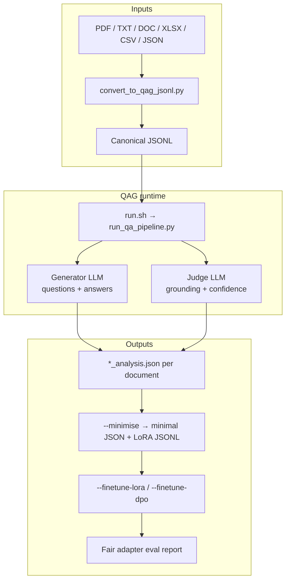
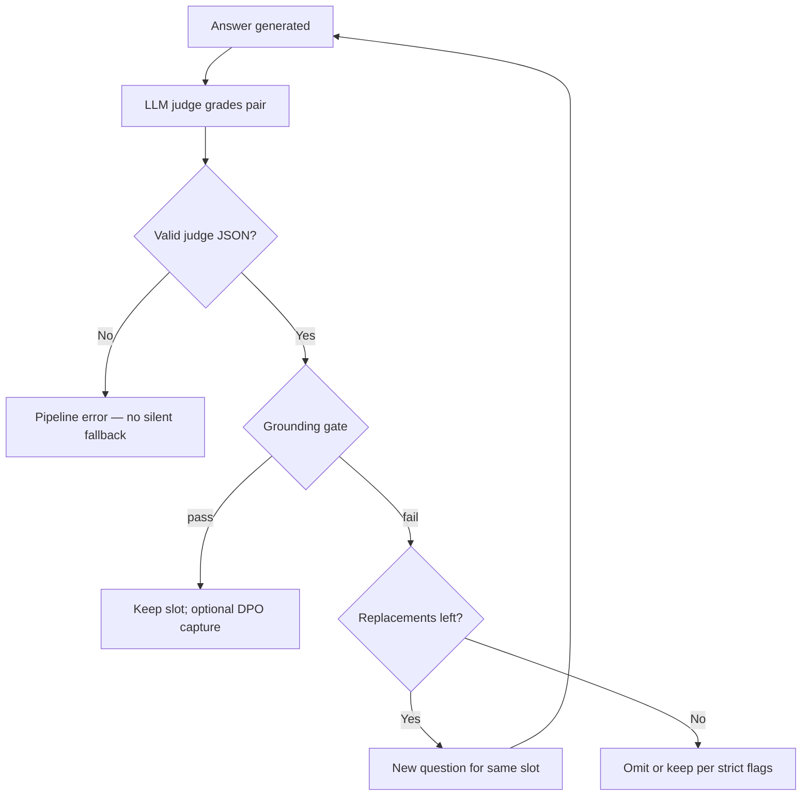
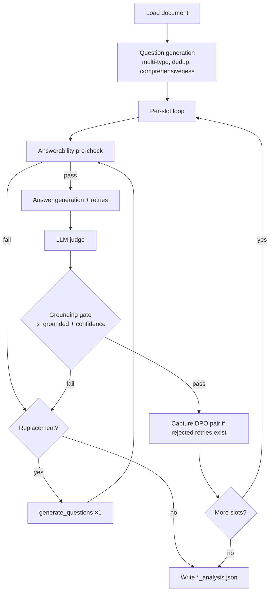
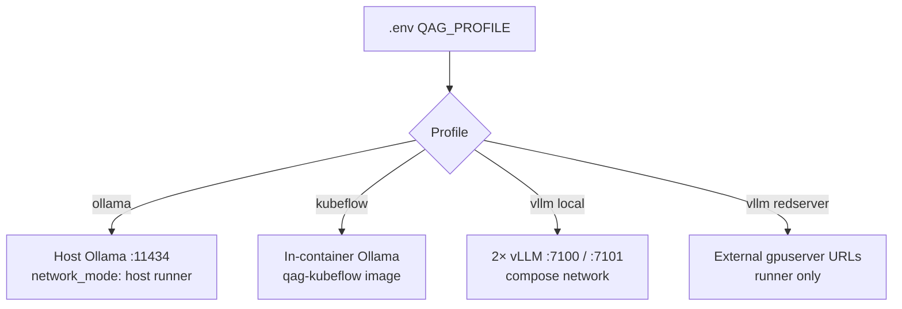
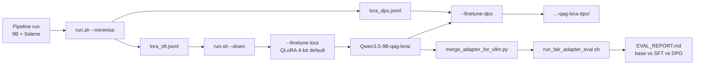

# QAG — System Architecture

**Audience:** technical leads, architects, senior engineers  
**Purpose:** single entry point for how QAG is designed, deployed, and extended  
**Status:** code-verified against `run_qa_pipeline.py`, `run.sh`, and profile YAMLs

Related docs: [`HANDOVER.md`](HANDOVER.md) (maintainer ops) ·
[`ALGORITHM_REPORT.md`](ALGORITHM_REPORT.md) (pipeline depth) ·
[`architecture/NETWORK_DIAGRAM.md`](architecture/NETWORK_DIAGRAM.md) (ports/URLs)

---

## 1. Executive summary

QAG (Question–Answer Generation) is an **offline-first**, **containerised**
pipeline that turns source documents into **grounded question–answer pairs**
with an **independent LLM judge**. It is designed for air-gapped deployment,
reproducible batch runs, resume after interruption, and optional **LoRA
finetuning** (SFT + DPO) on the generator model.

| Design choice | Rationale |
|---------------|-----------|
| **Separate generator and judge** | Avoids self-grading bias; judge uses its own model, config, and endpoint |
| **Strict LLM judge (fail-fast)** | Invalid or missing judge output stops the run — no silent downgrade |
| **Profile-based deployment** | One self-contained YAML per environment (`ollama` / `kubeflow` / `vllm`) |
| **Adapter-only finetune** | Base HF weights stay read-only; LoRA written to a separate directory |
| **Timestamped run folders** | Every batch is auditable; resume skips completed `*_analysis.json` |
| **Host launcher (`run.sh`)** | Single operator surface for compose, vLLM lifecycle, export, and training |

---

## 2. System context



**Problem solved:** produce training-grade Q&A from document corpora with
quality gates, not one-shot LLM prompts.

**Non-goals:** QAG is not a general RAG serving platform, not a model hub, and
not an online API product — it is a **batch pipeline** with optional offline
finetune on exported data.

---

## 3. Architecture principles

### 3.1 Separation of concerns

| Layer | Responsibility | Primary artifacts |
|-------|----------------|-------------------|
| **Host orchestration** | Profile selection, Docker, vLLM up/down, training | `run.sh`, `.env`, compose files |
| **Pipeline logic** | Per-document Q&A, slot loop, grading | `run_qa_pipeline.py`, `utils/*` |
| **Inference backends** | Model serving | Ollama, vLLM, or external gpuserver |
| **Post-processing** | Export, summarise, dataset build | `scripts/utils/*`, `scripts/lora/*` |
| **Configuration** | Tunable behaviour per deployment | `config/config.<profile>.yaml` |

### 3.2 Fail-fast quality path



Production configs use `hallucination.method: llm` with
`judge_required: true`. Legacy `semantic` / `hybrid` labels remain in some YAML
keys for compatibility but **do not load embedding models** in current code.

### 3.3 Actual runtime orchestrator

The **live** per-document control flow is the **imperative slot loop** in
`run_qa_pipeline.py` (`_process_one_document()`), not LangGraph.

| Component | Status |
|-----------|--------|
| `utils/langchain_components.py` | **Active** — prompts and structured parsing |
| `utils/langgraph_pipeline.py` | **Present, unwired** — `run_document_graph()` is exported but not called from the main pipeline |
| `framework.use_langgraph: true` in YAML | **Aspirational flag** — does not switch runtime today |

When reading older diagrams that label “LangGraph orchestrator”, interpret them
as the **logical stage graph**; the implementation is the slot loop documented
in [`ALGORITHM_REPORT.md`](ALGORITHM_REPORT.md) §3.4.

---

## 4. Logical architecture — pipeline stages



| Stage | Module | Notes |
|-------|--------|-------|
| Config | `utils/config_manager.py` | Profile YAML + env overrides for generator and judge |
| Questions | `utils/question_generator.py` | Batch then per-slot replacements |
| Answers | `utils/answer_generator.py` | Structured output, evidence, retries |
| Judge | `utils/hallucination_checker.py` | Routes by `judge.provider` |
| Parallelism | `run_qa_pipeline.py` | `ThreadPoolExecutor` over documents (`run.parallel_documents`) |
| Output paths | `utils/output_manager.py` | `output/<provider>/<model>/<timestamp>/` |

**Parallel documents** scale throughput; **per-document orchestration** is
unchanged — each worker runs the full slot loop independently.

---

## 5. Deployment profiles

Selection: `QAG_PROFILE` in `.env` → `bash run.sh --show-config`.



| Profile | Compose file | Generator | Judge | Typical hardware |
|---------|--------------|-----------|-------|------------------|
| `ollama` | `docker-compose.yml` | Host Ollama | Host Ollama (different model tag) | 2×24 GB + GGUF |
| `kubeflow` | `docker-compose.kubeflow.yml` | In-container Ollama | Same | Bundled offline image |
| `vllm` (local) | `docker-compose.vllm-stack.yml` | `vllm:7100` | `vllm-judge:7101` | 2×24 GB (9B + 8B) |
| `vllm` (redserver) | `docker-compose.vllm-redserver.yml` | gpuserver `:52328` | gpuserver `:53366` | Orchestrator CPU; GPUs remote |

**Redserver activation** requires four `.env` keys in addition to
`QAG_PROFILE=vllm`:

- `QAG_VLLM_CONFIG_FILE=config/config.vllm.redserver.yaml`
- `VLLM_BASE_URL=http://gpuserver:52328/v1`
- `VLLM_JUDGE_BASE_URL=http://gpuserver:53366/v1`
- `QAG_VLLM_COMPOSE_EXTRA=docker-compose.vllm-redserver.yml`

Server-to-profile mapping: [`SERVER_MODEL_PROFILES.md`](SERVER_MODEL_PROFILES.md).

**Model format rule:** Ollama profiles use **GGUF store** (`blobs/`,
`manifests/`). vLLM profiles use **HuggingFace directories** under
`QAG_MODELS_LLM_HOST`. These are not interchangeable.

---

## 6. Physical / network topology

### 6.1 Local vLLM (reference layout)

| Service | Container | Host port | GPU | Internal URL |
|---------|-----------|-----------|-----|--------------|
| Generator | `qag-vllm` | 7100 | 0 (default) | `http://vllm:7100/v1` |
| Judge | `qag-vllm-judge` | 7101 | 1 (default) | `http://vllm-judge:7101/v1` |
| Runner | `qag-runner` | — | CPU | Calls generator + judge over compose network |

Compose project: `qag_offline`. Full port and troubleshooting map:
[`architecture/NETWORK_DIAGRAM.md`](architecture/NETWORK_DIAGRAM.md).

### 6.2 Ollama profile

The runner uses **`network_mode: host`** so `localhost:11434` inside the
container reaches host Ollama (including when Ollama binds `127.0.0.1` only).
No `host.docker.internal` hop is required on current compose.

### 6.3 Redserver / gpuserver

Redserver runs **pipeline orchestration only** — no local `--vllm-up`. Health
checks target gpuserver endpoints, not `:7100` / `:7101`.

---

## 7. Data architecture

### 7.1 Input path

| Step | Tool | Output |
|------|------|--------|
| Convert heterogeneous files | `scripts/conversion/convert_to_qag_jsonl.py` | Canonical JSONL |
| Pipeline ingest | `run_qa_pipeline.py` | Reads `run.input_file` (`.json` or `.jsonl` by extension) |

**Important:** YAML keys `run.input_type`, `run.input_folder`, and
`run.max_files` are **not wired** to the converter. Use converter CLI flags
(`--input-type`, `--input`) for format control. See
[`ALGORITHM_REPORT.md`](ALGORITHM_REPORT.md) §1.

### 7.2 Run output layout

```
output/<provider>/<model>/<YYYY-MM-DD_HHMMSS>/
  <doc_id>_analysis.json      # full per-document result
  run_summary.json            # optional (--summarize)
  *_analysis_minimal*.json    # post-run (--minimise)
  lora_sft.jsonl              # SFT training export
  lora_sft_eval.jsonl         # 10% holdout for eval split
  lora_dpo.jsonl              # preference pairs (when captured)
  lora_dataset_info.json      # LLaMA-Factory registration helper
```

Each `*_analysis.json` includes `qa_pairs`, optional `dpo_pairs`, grading
metadata, and counters (`question_grounding_retries`,
`answerability_precheck_failures`, etc.).

### 7.3 Resume semantics

- `--resume` reuses the latest (or specified) run folder.
- Documents with existing `*_analysis.json` are skipped unless
  `--only-document-ids-file` forces reprocessing.
- `--num-documents N` is evaluated at **start**; already-completed docs still
  count toward the limit when resuming.

---

## 8. ML lifecycle — finetune and evaluation



| Phase | Command | Host requirement |
|-------|---------|------------------|
| Export | `bash run.sh --minimise [RUN_DIR]` | None (no LLM) |
| SFT | `bash run.sh --finetune-lora [RUN_DIR]` | Stop vLLM; 2 GPUs; `.venv-lora` |
| DPO | `bash run.sh --finetune-dpo [RUN_DIR]` | SFT adapter + `lora_dpo.jsonl` |
| Fair eval | `scripts/lora/run_fair_adapter_eval.sh` | vLLM up; merged weights for Qwen3.5 |

Key env vars: `QAG_LORA_BASE_MODEL`, `QAG_LORA_OUTPUT_DIR`,
`QAG_LORA_QUANTIZATION_BIT` (default `4` on 2×24 GB),
`QAG_LORA_VENV`, `QAG_LORA_GPUS`.

Eval configs: `config/config.vllm.eval-sft-merged.yaml`,
`config/config.vllm.eval-dpo-merged.yaml`.

---

## 9. Technology stack

| Layer | Technologies |
|-------|--------------|
| Language | Python 3 (PEP 8), Bash |
| LLM integration | LangChain 1.x (prompts/parsing), OpenAI-compatible APIs |
| Inference | Ollama (GGUF), vLLM 0.13.x (custom Qwen3.5 image) |
| Training | PyTorch 2.6+cu124, Transformers, PEFT, TRL, bitsandbytes |
| Containers | Docker Compose, NVIDIA Container Toolkit |
| Config | YAML profiles + `.env` host paths |
| Testing | pytest (`tests/`) |
| Documentation | Mermaid, Graphviz (`.dot`), PlantUML (`.puml`) |

Pinned runner deps: `requirements.txt`. LoRA venv:
`scripts/lora/requirements-lora.txt` + `setup_lora_venv.sh` (cu124 torch for
driver CUDA 12.9 or 13.0).

---

## 10. Module map (code reference)

```
/home/tyewhong/qag/
├── run.sh                          # Host launcher (profiles, vLLM, export, finetune)
├── run_qa_pipeline.py              # Pipeline CLI and document workers
├── config/
│   ├── config.ollama.yaml
│   ├── config.kubeflow.yaml
│   ├── config.vllm.yaml
│   └── config.vllm.redserver.yaml
├── utils/
│   ├── config_manager.py           # Profile + env merge
│   ├── question_generator.py
│   ├── answer_generator.py
│   ├── hallucination_checker.py    # LLM judge
│   ├── output_manager.py
│   ├── langchain_components.py
│   └── langgraph_pipeline.py       # Unwired alternate orchestrator
├── scripts/
│   ├── offline/setup_offline.sh    # Air-gap bring-up
│   ├── lora/                       # SFT, DPO, eval, venv pack
│   ├── conversion/                 # Input normalisation
│   └── utils/                      # minimise, summarise, export
├── docker-compose*.yml             # Per-profile stacks
└── docs/                           # This file and runbooks
```

---

## 11. Offline deployment architecture

**Archive root:** `/data/tyewhong/qag/` (`QAG_ARCHIVE_DIR`). Retired bundles:
`/data/tyewhong/qag/zz_old_qag/`.

| Artifact | Built by | Purpose |
|----------|----------|---------|
| `qag_bundle.tar.gz` | `scripts/make_qag_bundle.sh` | Code + compose + docs → `qag_host/` |
| `qag-v1.tar` | `scripts/make_offline_tarballs.sh` | Runner image |
| `qag-kubeflow.tar` | same | Kubeflow all-in-one |
| `models_ollama*.tar.gz` | same | Ollama model store |
| `models_vllm*.tar.gz` | same | HF weight trees |
| `vllm-qwen35-localcuda.rootfs.tar` | `scripts/save_vllm_qwen35_image.sh` | vLLM runtime |
| `lora_venv.tar.gz` | `scripts/lora/pack_lora_venv.sh` | Offline finetune venv |

Bring-up: copy archives → extract bundle → `setup_offline.sh` → edit `.env` →
`bash run.sh --show-config`. Details: [`OFFLINE_SETUP_GUIDE.md`](OFFLINE_SETUP_GUIDE.md).

---

## 12. Security and operations

| Topic | Approach |
|-------|----------|
| **Offline mode** | `OFFLINE_MODE=1`, `HF_HUB_OFFLINE=1` in containers |
| **File ownership** | `HOST_UID` / `HOST_GID` + privileged entrypoint fix on mounts |
| **Secrets** | API keys in `.env` (local dummy keys for vLLM); not committed |
| **TLS** | Optional corporate CA via `certbundle/` for proxy environments |
| **Observability** | Per-doc JSON, `run.log` from fair eval, `run_summary.json` |

Operator commands: `bash run.sh --status`, `--down`, `--logs`,
`python3 scripts/verify_docs_links.py`.

---

## 13. Documentation map (for your presentation)

| Audience | Start here | Then |
|----------|------------|------|
| **Technical lead** | **This file** | `NETWORK_DIAGRAM.md`, `ALGORITHM_REPORT.md` §1–§3 |
| New maintainer | `HANDOVER.md` | `SERVER_MODEL_PROFILES.md`, `OFFLINE_SETUP_GUIDE.md` |
| Stakeholder | `QAG_Management_Overview.html` | `QAG_Pipeline_Flowchart_Drawn.html` |
| Build / release | `ONLINE_SETUP_GUIDE.md` | `algorithm-baselines/README.md` |
| Deep algorithm | `ALGORITHM_REPORT.md` | `qag_grading_test_flow.dot` / `.svg` |

**Regeneratable decks** (from repo root):

```bash
python3 scripts/utils/build_qag_management_overview_pptx.py
python3 scripts/utils/build_technical_workflow_ppt_10.py
python3 scripts/utils/build_qag_pipeline_flowchart_pptx.py
```

**Diagram sources of truth:** `docs/architecture/diagrams/*.dot`,
`docs/architecture/diagrams/*.puml`. Regenerate PNG before stakeholder exports.

After pipeline changes, say **baseline now** in Cursor to snapshot verified
docs under `docs/algorithm-baselines/vN/`.

---

## 14. Known limitations (honest engineering notes)

| Item | Detail |
|------|--------|
| LangGraph flag | `use_langgraph: true` in YAML does not activate `run_document_graph()` |
| Semantic fallback keys | Present in YAML; production path is strict LLM judge only |
| Redserver `--status` | Probes local `:7100`/`:7101`; use gpuserver health on redserver |
| DPO final checkpoint | Fair eval defaults to `checkpoint-44`; last epoch can collapse on Qwen3.5 |
| Input YAML keys | `run.input_type` / `input_folder` not wired to converter — use CLI flags |

These are documented deliberately so architecture reviews reflect **actual**
behaviour, not aspirational diagrams alone.

---

## 15. Suggested 20-minute technical lead walkthrough

1. **Context** — §2 diagram: documents → grounded Q&A → optional finetune.
2. **Quality model** — §3.2: separate judge, grounding gate, replacement loop.
3. **Deployment** — §5: pick profile by server; show `bash run.sh --show-config`.
4. **Network** — §6 + live `NETWORK_DIAGRAM.md` for ports and redserver split.
5. **Data contract** — §7: `*_analysis.json` → `--minimise` → LoRA JSONL.
6. **Improvement loop** — §8: SFT/DPO/fair eval and where `EVAL_REPORT.md` lands.
7. **Evidence of rigour** — §13 algorithm baselines, pytest, `verify_docs_links.py`.

---

*Last aligned with codebase layout and `run_qa_pipeline.py` slot-loop orchestration.
For change control, update this file when profiles, compose topology, or finetune
flow changes, then run **baseline now**.*
