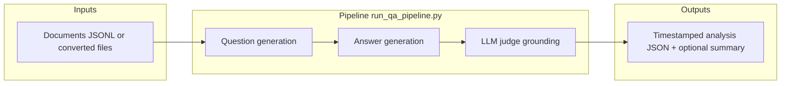

# QAGRedo — Maintainer handover

This document is the **single onboarding index** for a new owner: what the system is, where to change behavior, and which other files to read. Keep it updated when architecture or entrypoints change.

## What this system does



| Stage | Role |
|-------|------|
| **Generator LLM** | Produces questions (multi-type) and answers from each document. |
| **Judge LLM** | Separate model/config — verifies answers against the document (reduces self-evaluation bias). |
| **Grading** | **LLM judge** (default in profile configs). Legacy `semantic` / `hybrid` config values no longer load embedding models. |

Failure path: if the judge is unreachable or returns invalid output where required, the pipeline fails fast (no silent downgrade by default).

---

## Documentation map

Read in this order for day-one orientation:

| Order | Document | Purpose |
|-------|----------|---------|
| 1 | `docs/README.md` | Documentation hub: what to read by role. |
| 2 | `README.md` | Quick start, profiles, tarball commands. |
| 3 | `docs/SERVER_MODEL_PROFILES.md` | Which profile fits greenserver / Opserver / redserver. |
| 4 | `docs/OFFLINE_SETUP_GUIDE.md` | Offline host runbook and step-by-step configure guide. |
| 5 | `docs/ONLINE_SETUP_GUIDE.md` | Build machine: bundles, checksums, archive layout. |
| 6 | `docs/ALGORITHM_REPORT.md` | Algorithm and design rationale (deep). |
| 7 | `docs/architecture/NETWORK_DIAGRAM.md` | Host/container URLs and ports. |
| 8 | `docs/KUBEFLOW_DEPLOY.md` | `kubeflow` profile only (in-container Ollama). |

Stakeholder-friendly HTML (optional): `docs/QAGRedo_Management_Overview.html`, `docs/QAGRedo_Pipeline_Flowchart_Drawn.html`, `docs/architecture/diagrams/QAGRedo_Sequence_Final_7step_VIEW_IN_BROWSER.html`.

---

## Runtime profiles (`QAGREDO_PROFILE`)

Selection is **profile-based** (`QAGREDO_PROFILE` in `.env`). Do not use legacy `QAGREDO_USE_VLLM_STACK` unless you are debugging old compose wiring.

| Profile | Compose | LLM backend |
|---------|---------|-------------|
| `dev` | `docker-compose.yml` | **Host Ollama** — `ollama` must exist on the host. |
| `kubeflow` | `docker-compose.kubeflow.yml` | **In-container Ollama** — image `qagredo-kubeflow`; models on disk via `QAGREDO_MODELS_DIR`. |
| `vllm` | `docker-compose.vllm-stack.yml` (+ optional `docker-compose.vllm-redserver.yml`) | **Two vLLM services** — generator and judge; HF weights under `QAGREDO_MODELS_LLM_HOST`. |

Match **Ollama store** (`blobs/`, `manifests/`) to `dev`/`kubeflow`; match **HF directories** to `vllm`. Formats are not interchangeable.

---

## Where to change behavior

| Concern | Primary location |
|---------|------------------|
| Profile, data paths, UID/GID, model roots | `.env` |
| Model tags, question counts, YAML tuning | `config/config.<profile>.yaml` |
| Generator vs judge **env overrides** (optional) | `.env` — `OLLAMA_*`, `OLLAMA_JUDGE_*`, `VLLM_*`, `VLLM_JUDGE_*`, etc. (see `utils/config_manager.py`) |
| vLLM GPU mapping (2-GPU default) | `docker-compose.vllm-stack.yml` |
| 4-GPU split (redserver) | `QAGREDO_VLLM_COMPOSE_EXTRA=docker-compose.vllm-redserver.yml` + `.env` TP sizes |

Daily runs should **not** rely on `config/config.yaml` alone — use the profile files above.

---

## Code map (Python)

| Area | Path | Notes |
|------|------|------|
| CLI entry | `run_qa_pipeline.py` | Loads YAML, drives document loop. |
| Config merge / env | `utils/config_manager.py` | Profile YAML + environment overrides (generator + judge). |
| Questions | `utils/question_generator.py` | Types, comprehensiveness, Ollama native chat when needed. |
| Answers | `utils/answer_generator.py` | Structured answers, retries. |
| Judge | `utils/hallucination_checker.py` | Routes by `judge.provider` (Ollama native vs OpenAI-compatible). |
| Ollama detection | `utils/ollama_urls.py` | URL helpers. |
| Host entry | `run.sh` | Profile selection, compose, ownership guard for `HOST_UID`/`HOST_GID`. |

Tests: `tests/` — e.g. `tests/test_backend_selection.py` for provider routing.

---

## Docker images and offline artifacts

| Artifact | Role |
|----------|------|
| `qagredo_bundle.tar.gz` | Code + compose + configs into `qagredo_host/` (from `scripts/make_qagredo_bundle.sh`). |
| `qagredo-v1.tar` | Default runner image for `dev` / `vllm`. |
| `qagredo-kubeflow.tar` | All-in-one image for `kubeflow`. |
| `models_ollama*.tar.gz` | Ollama model store. |
| `models_vllm.tar.gz` | HF trees for vLLM. |

Build: `bash scripts/make_offline_tarballs.sh --all` (outputs default under `offline_out/`; large archives often staged under `/data/tyewhong/qagredo/` per project convention).

---

## Diagrams (sources of truth)

| Format | Location |
|--------|----------|
| Graphviz | `docs/*.dot`, `docs/architecture/diagrams/*.dot` |
| PlantUML | `docs/architecture/diagrams/QAGRedo_Pipeline_Flowchart.puml` |
| Regenerate PNG | Example: `dot -Tpng docs/architecture/diagrams/network_docker_compose_ollama.dot -o docs/architecture/diagrams/network_docker_compose_ollama.png` |

Raster assets live next to sources (e.g. `docs/qagredo_input_prep_explained_16x9.png`). Prefer updating **source** then re-exporting PNG.

---

## Regression checks before release

```bash
bash run.sh --status
python3 -m unittest discover -s tests -p 'test_*.py'
```

---

## Contact points for updates

When adding a feature, update **this file** if documentation hierarchy changes, and touch **`README.md`** if user-facing quick start changes. Keep **`docs/SERVER_MODEL_PROFILES.md`** aligned with real hardware assumptions.
