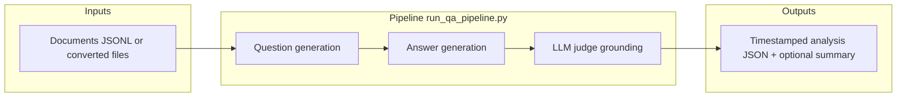

# QAGRedo — Maintainer handover

This document is the maintainer cheat sheet: what the system does, where to change behavior, and what to verify before release. Keep it updated when architecture or entrypoints change.

## What this system does



| Stage | Role |
|-------|------|
| **Generator LLM** | Produces questions (multi-type) and answers from each document. |
| **Judge LLM** | Separate model/config — verifies answers against the document (reduces self-evaluation bias). |
| **Grading** | **LLM judge** (default in profile configs). Legacy `semantic` / `hybrid` config values no longer load embedding models. |

Failure path: if the judge is unreachable or returns invalid output where required, the pipeline fails fast (no silent downgrade by default).

---

## First read order

For day-one orientation, read in this order:

| Order | Document | Purpose |
|-------|----------|---------|
| 1 | `docs/README.md` | Docs hub by role. |
| 2 | `README.md` | Quick start, profiles, tarball commands. |
| 3 | `docs/SERVER_MODEL_PROFILES.md` | Server-to-profile mapping. |
| 4 | `docs/OFFLINE_SETUP_GUIDE.md` | Offline host setup and operations. |
| 5 | `docs/ONLINE_SETUP_GUIDE.md` | Build machine and archive workflow. |
| 5b | `docs/Siteserver_vLLM_Change_Guide.md` | vLLM / Qwen3.5 on siteserver (when `QAGREDO_PROFILE=vllm`). |
| 6 | `docs/architecture/NETWORK_DIAGRAM.md` | Host/container URLs and ports. |
| 7 | `docs/ALGORITHM_REPORT.md` | Pipeline algorithm and design rationale. |
| 8 | `docs/KUBEFLOW_DEPLOY.md` | `kubeflow` profile only. |

Visual overview docs: `docs/QAGRedo_Management_Overview.html` (profiles + resume), `docs/QAGRedo_Pipeline_Flowchart_Drawn.html`, `docs/architecture/diagrams/QAGRedo_Sequence_Final_7step_VIEW_IN_BROWSER.html`. Regenerate PPTX from `scripts/utils/build_*.py`; pipeline HTML via `scripts/utils/_rewrite_drawn_flowchart_html.py`; PNG from `.dot` sources (see `docs/README.md`).

---

## 30-minute handover walkthrough (what to say)

1. **Problem** — Turn documents into grounded Q&A pairs with a **separate judge** model (not self-grading).
2. **Profiles** — `.env` → `QAGREDO_PROFILE` (`ollama` | `kubeflow` | `vllm`); edit **only** `config/config.<profile>.yaml` (see `config/README.md`).
3. **Offline bring-up** — Copy archives from `/data/tyewhong/qagredo/` per `OFFLINE_SETUP_GUIDE.md` §2; `setup_offline.sh --profile vllm`.
4. **vLLM daily ops** — `bash run.sh --vllm-up generator` → `--vllm-up judge` → `bash run.sh --pipeline-only --resume --num-documents N`.
5. **Outputs** — `output/<provider>/<model>/<timestamp>/doc_*_analysis.json`; post-run `--minimise` and `--summarize`.
6. **Where to change** — Models/counts in profile YAML; paths in `.env`; algorithm details in `ALGORITHM_REPORT.md`.

Stakeholder deck: open `docs/QAGRedo_Management_Overview.html` in a browser.

---

## Operator cheat sheet (vLLM)

```bash
bash run.sh --status
bash run.sh --vllm-up generator
bash run.sh --vllm-up judge
bash run.sh --pipeline-only --resume --num-documents 100
bash run.sh --minimise "output/vllm/qwen-qwen3.5-9b/2026-05-28_145345"
bash run.sh --summarize "output/vllm/qwen-qwen3.5-9b/2026-05-28_145345" --json
```

If `--pipeline-only` fails with “Generator not healthy”, vLLM containers are down — run `--vllm-up` first.

---

## Runtime profiles (`QAGREDO_PROFILE`)

Selection is **profile-based** — set `QAGREDO_PROFILE` in `.env` (`ollama` | `kubeflow` | `vllm`).

| Profile | Compose | LLM backend |
|---------|---------|-------------|
| `ollama` | `docker-compose.yml` | **Host Ollama** — `ollama` must exist on the host. |
| `kubeflow` | `docker-compose.kubeflow.yml` | **In-container Ollama** — image `qagredo-kubeflow`; models on disk via `QAGREDO_MODELS_DIR`; `run.sh` reuses loaded image and keeps a warm container until `run.sh --down`. |
| `vllm` | `docker-compose.vllm-stack.yml` (+ optional `docker-compose.vllm-siteserver.yml`) | **Two vLLM services** — generator (GPU 0, :7100) and judge (GPU 1, :7101); same `VLLM_IMAGE` tag on both. Run via **`--vllm-up`** + **`--pipeline-only`** or one-shot **`bash run.sh`**. |

Match **Ollama store** (`blobs/`, `manifests/`) to `ollama`/`kubeflow`; match **HF directories** to `vllm`. Formats are not interchangeable.

---

## Change points

| Concern | Primary location |
|---------|------------------|
| Which config file to edit | `config/README.md` |
| Profile, data paths, UID/GID, model roots | `.env` |
| Model tags, question counts, YAML tuning | `config/config.<profile>.yaml` |
| Generator vs judge **env overrides** (optional) | `.env` — `OLLAMA_*`, `OLLAMA_JUDGE_*`, `VLLM_*`, `VLLM_JUDGE_*`, etc. (see `utils/config_manager.py`) |
| vLLM GPU mapping (2-GPU default) | `docker-compose.vllm-stack.yml` |
| 4-GPU split (siteserver) | `QAGREDO_VLLM_COMPOSE_EXTRA=docker-compose.vllm-siteserver.yml` + `.env` TP sizes |

Only three profile YAMLs exist — edit `config/config.<profile>.yaml`. Confirm with `bash run.sh --show-config` or `bash run.sh --edit-config`.

---

## Code map

| Area | Path | Notes |
|------|------|------|
| CLI entry | `run_qa_pipeline.py` | Loads YAML, drives document loop. |
| Config merge / env | `utils/config_manager.py` | Profile YAML + environment overrides (generator + judge). |
| Questions | `utils/question_generator.py` | Types, comprehensiveness, Ollama native chat when needed. |
| Answers | `utils/answer_generator.py` | Structured answers, retries. |
| Judge | `utils/hallucination_checker.py` | Routes by `judge.provider` (Ollama native vs OpenAI-compatible). |
| Ollama detection | `utils/ollama_urls.py` | URL helpers. |
| Host entry | `run.sh` | Profile launcher; shortcuts `--down`, `--status`, `--logs`, `--show-config`, `--minimise`, `--resume` / `--skip-existing-outputs`; **vllm-only:** `--vllm-up generator\|judge\|all`, `--pipeline-only` (see **`Siteserver_vLLM_Change_Guide.md`** Part D). |

Tests live in `tests/`; `tests/test_backend_selection.py` covers provider routing.

---

## Offline artifacts

| Artifact | Role |
|----------|------|
| `qagredo_bundle.tar.gz` | Code + compose + configs into `qagredo_host/` (from `scripts/make_qagredo_bundle.sh`). |
| `qagredo-v1.tar` | Default runner image for `ollama` / `vllm`. |
| `qagredo-kubeflow.tar` | All-in-one image for `kubeflow`. |
| `models_ollama*.tar.gz` | Ollama model store. |
| `models_vllm.tar.gz` | HF trees for vLLM. |
| `vllm-qwen35-localcuda.rootfs.tar` | Qwen3.5-compatible vLLM image (`VLLM_IMAGE=qagredo-vllm:qwen35-localcuda`). |

Build with `bash scripts/make_offline_tarballs.sh --all` (default output: `/data/tyewhong/qagredo/`; set `QAGREDO_ARCHIVE_DIR` / `QAGREDO_OFFLINE_OUT` to override).

---

## Diagram sources

| Format | Location |
|--------|----------|
| Graphviz | `docs/*.dot`, `docs/architecture/diagrams/*.dot` (e.g. `docs/siteserver_vllm_change_flow.dot` → `siteserver_vllm_change_flow.png`) |
| PlantUML | `docs/architecture/diagrams/QAGRedo_Pipeline_Flowchart.puml` |
| Regenerate PNG | `dot -Tpng docs/architecture/diagrams/network_docker_compose_ollama.dot -o docs/architecture/diagrams/network_docker_compose_ollama.png` |
| Verify doc images | `python3 scripts/verify_docs_links.py` |

Raster assets live next to sources (for example `docs/qagredo_input_prep_explained_16x9.png`). Prefer updating the source first, then re-exporting PNG.

---

## Release checks

```bash
bash run.sh --status
bash run.sh --minimise       # export *_analysis_minimal.json + *_analysis_minimal_{good,bad}_pairs.json
bash run.sh --minimise-good   # split-only: export per-doc *_analysis_minimal_good_pairs.json
bash run.sh --minimise-bad    # split-only: export per-doc *_analysis_minimal_bad_pairs.json
bash run.sh -- --resume   # after a partial run: skip docs with *_analysis.json
python3 -m unittest discover -s tests -p 'test_*.py'
```

Answer slots (`reject_ungrounded_after_retries: true` in profile YAML): after failed answer retries, text is **discarded**; replacement questions run up to `max_question_regeneration_rounds`. Failed slots are **kept** in `qa_pairs` (for `--minimise-bad`) unless `run.save_grounded_qa_pairs_only: true` or `run.reject_insufficient_answers` omits insufficient-info answers. Use `--minimise-good` / `--minimise-bad` for per-document split files.

`--minimal-qa-output` (during run) is **not** the same as `bash run.sh --minimise` (post-run export from full `*_analysis.json`).

---

## Update rules

When adding a feature, update this file if maintainer navigation changes, and update `README.md` if user-facing quick start changes. Keep `docs/SERVER_MODEL_PROFILES.md` aligned with real hardware assumptions.
