# QAG Offline Setup Guide

Step-by-step guide for **air-gapped** QAG installs. If anything here
conflicts with older notes, follow this file.

New maintainers: read [`HANDOVER.md`](HANDOVER.md) first. Technical lead /
architecture review: [`ARCHITECTURE.md`](ARCHITECTURE.md). Server role
mapping: [`SERVER_MODEL_PROFILES.md`](SERVER_MODEL_PROFILES.md).

> **Can't see flowcharts?** Mermaid blocks render only in **Markdown Preview**
> (`Ctrl+Shift+V`), not in the raw editor. If preview still shows `flowchart`
> text, run once from the repo root:
> `bash scripts/offline/install_vscode_diagram_preview.sh`
> (installs the bundled VSIX). **Or** scroll to the **PNG** under each chart —
> those work without any extension.

---

## 0) Pick your offline host first

There are three common offline targets. They are **not** interchangeable —
each uses a different profile and archive set:

- **Opserver** — §2 (`ollama` / `kubeflow`) or §3 (local vLLM)
- **Redserver** — §4 (vLLM on gpuserver; orchestrator only)
- **siteserver** — separate guide (4-GPU local vLLM)

**Viewing flowcharts on an offline host (Opserver or Redserver):** see **§1.6**
(one-time VSIX install from the bundle — no internet, no Marketplace).

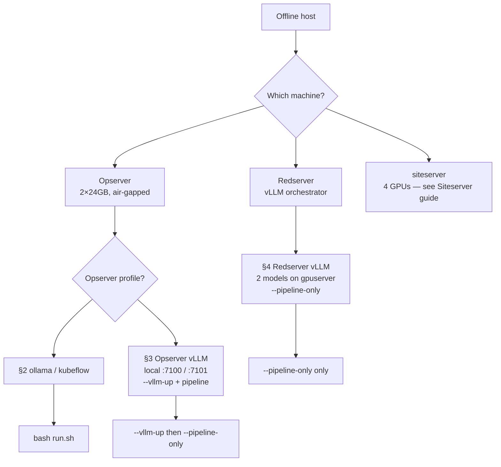

**PNG (works in any Markdown preview — no VSIX):**

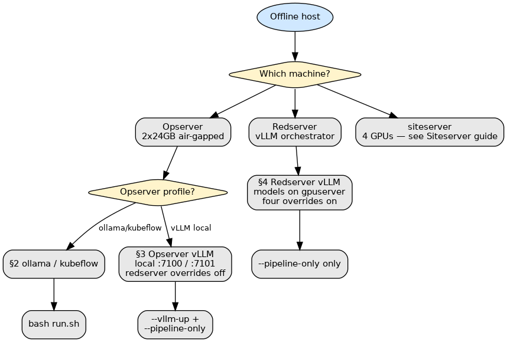

**ASCII (same decision — works in any terminal):**

```text
Offline host
    |
    +-- Opserver (2 GPU, air-gapped)
    |       +-- ollama / kubeflow     -> §2  -> bash run.sh
    |       +-- vLLM local on host    -> §3  -> --vllm-up + --pipeline-only
    |
    +-- Redserver (vLLM orchestrator)
    |       +-- vLLM on gpuserver     -> §4  -> --pipeline-only only
    |
    +-- siteserver (4 GPU) -> Siteserver_vLLM_Change_Guide.md
```

| Host | Profile | vLLM / models | Runbook |
|------|---------|---------------|---------|
| **Opserver** | `ollama` or `kubeflow` | Ollama on same host | **§2** |
| **Opserver** | `vllm` — **local** | You start generator + judge on Opserver (`:7100` / `:7101`) | **§3** |
| **Redserver** | `vllm` — **external** | **Already running** on gpuserver; Redserver = orchestrator only | **§4** |
| **siteserver** | `vllm` | Local (often 4-GPU) | [`Siteserver_vLLM_Change_Guide.md`](Siteserver_vLLM_Change_Guide.md) |

**Opserver vs Redserver (both use `vllm` profile but different roles):**

| | **§3 Opserver vLLM** | **§4 Redserver vLLM** |
|--|----------------------|------------------------|
| Models running before QAG? | **No** — you start them | **Yes** — on gpuserver |
| `docker load` vLLM rootfs? | **Yes** | **No** |
| `models_vllm*.tar.gz` on host? | **Yes** | **No** |
| Start vLLM | `bash run.sh --vllm-up generator\|judge` | **Do not** use `--vllm-up` |
| Run pipeline | `--pipeline-only` | `--pipeline-only` |
| Config YAML | `config/config.vllm.yaml` | `config/config.vllm.redserver.yaml` |
| Select YAML | `QAG_PROFILE=vllm`; redserver values unset | All four redserver overrides set |
| `llm.base_url` | `http://vllm:7100/v1` | `http://gpuserver:52328/v1` (example) |

All working paths on Opserver and Redserver use **`/home/tyewhong/qag/`**
(archives) and **`/home/tyewhong/qag/qag_host/`** (install tree).

---

## 1) Shared concepts (both hosts)

### 1.1 Paths — build host vs Opserver / Redserver

| What | Online **build host** | **Opserver / Redserver** (offline) |
|------|----------------------|-------------------------------------|
| Archive staging (`.tar` / `.tar.gz`) | `/data/tyewhong/qag/` | **`/home/tyewhong/qag/`** |
| Install / working tree (`qag_host/`) | (dev repo: `/home/tyewhong/qag/qag_host/`) | **`/home/tyewhong/qag/qag_host/`** |
| Retired archives | `/data/tyewhong/qag/zz_old_qag/` | (usually N/A on offline hosts) |
| Legacy archive dir | `/data/tyewhong/qagredo/` — migrate with `bash scripts/migrate_archive_dir.sh --execute` | do not use |
| Input documents (example) | — | `/home/tyewhong/khangzhie-data/pathfinder/txt` or `/data/local/tyewhong/Data/txt` |

On **Opserver and Redserver**, copy archives to **`/home/tyewhong/qag/`**, extract
the bundle to **`/home/tyewhong/qag/qag_host/`**, and run all commands from
`qag_host/`. Do **not** use `/data/tyewhong/qag/` on those hosts unless you
have a site-specific reason and update `QAG_ARCHIVE_DIR` in `.env` to match.

In `qag_host/.env` on Opserver / Redserver (for `setup_offline.sh` discovery):

```bash
QAG_ARCHIVE_DIR=/home/tyewhong/qag
```

Build output on the **online** machine lands in `/data/tyewhong/qag/`
(`QAG_ARCHIVE_DIR` / `QAG_OFFLINE_OUT` in `.env` on the build host).

Copy archives from the build-host **archive root** only (not `zz_old_qag/`).
Always copy matching `.sha256` sidecars.

### 1.2 Install order (all scenarios)

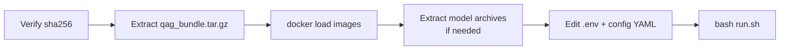

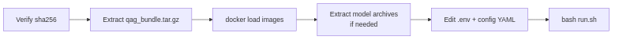


1. Verify checksums (§1.4).
2. Extract `qag_bundle.tar.gz` → `qag_host/` (§1.3).
3. **Opserver or Redserver — one-time (optional):** install VS Code Mermaid
   VSIX from bundle (§1.6). *For reading `docs/*.md` in VS Code; not required
   for `bash run.sh`.*
4. `docker load` only the images your scenario needs (§5).
5. Extract model archives only if models live on **this** host (§5).
6. Configure `.env` and the YAML reported by `bash run.sh --show-config`
   (`config.vllm.redserver.yaml` on Redserver).
7. Run (`bash run.sh` or vLLM split commands in §9).

`setup_offline.sh` automates image/model steps for **§2** and **§3** (optional
for **§4** — use `--vllm-external`).

### 1.3 Extract the code bundle (Opserver / Redserver)

```bash
mkdir -p /home/tyewhong/qag
tar xzf /home/tyewhong/qag/qag_bundle.tar.gz -C /home/tyewhong/qag
cd /home/tyewhong/qag/qag_host
```

Expected items: `run.sh`, `config/`, `docker-compose*.yml`, `setup_offline.sh`,
`docs/vscode-extensions/bierner.markdown-mermaid-*.vsix` (for §1.6).

Confirm the VSIX is inside the archive **before** or after copy:

```bash
# on build host:
tar tzf /data/tyewhong/qag/qag_bundle.tar.gz | grep '\.vsix$'
# on Opserver / Redserver (after archives in /home/tyewhong/qag/):
tar tzf /home/tyewhong/qag/qag_bundle.tar.gz | grep '\.vsix$'
# expect: qag_host/docs/vscode-extensions/bierner.markdown-mermaid-....vsix
```

If the line is missing, rebuild on the **online** build host:

```bash
bash scripts/offline/fetch_vscode_mermaid_vsix.sh
bash scripts/make_qag_bundle.sh
```

### 1.4 Verify checksums

On **Opserver / Redserver**, before install:

```bash
cd /home/tyewhong/qag
sha256sum -c qag_bundle.tar.gz.sha256
# Repeat only for archives you copied (see §2, §3, or §4):
sha256sum -c qag-v1.tar.sha256
# sha256sum -c vllm-qwen35-localcuda.rootfs.tar.sha256   # Opserver §3 only
# sha256sum -c models_ollama.tar.gz.sha256               # Opserver §2
# sha256sum -c models_vllm_Qwen3_5-9B.tar.gz.sha256      # Opserver §3 only
```

Re-copy any file that fails before continuing.

### 1.5 Transfer example

From the online **build host** to **Opserver / Redserver**:

```bash
ARCH=/data/tyewhong/qag
DEST=user@offline-host:/home/tyewhong/qag/

# Minimum — adjust file list to your scenario (§2 or §3)
rsync -avP \
  "$ARCH/qag_bundle.tar.gz" \
  "$ARCH/qag_bundle.tar.gz.sha256" \
  "$DEST"
```

Use `scp` or USB if `rsync` is unavailable. Large files (10–90 GB): `rsync -P`
resumes after interruption.

### 1.6 Offline host — install VS Code Mermaid VSIX (Opserver / Redserver)

**Why:** Opserver and Redserver have **no internet**. VS Code Marketplace will
not work. Mermaid flowcharts in `docs/*.md` show as plain text unless you
install the extension from the **`.vsix` inside `qag_bundle.tar.gz`**.

**Does not affect QAG runs** — documentation viewing only. Skip if you only
need ASCII tables or PNG images in preview.

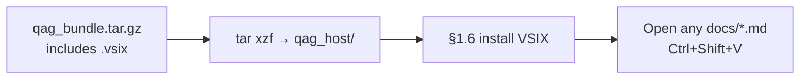

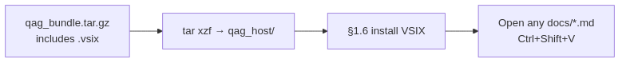


#### Build host (online — before USB/rsync to Opserver or Redserver)

The VSIX is **not** downloaded on the offline host. Fetch once when building
the bundle:

```bash
cd /home/tyewhong/qag
bash scripts/offline/fetch_vscode_mermaid_vsix.sh
bash scripts/make_qag_bundle.sh
# bundle ~56M includes docs/vscode-extensions/*.vsix
```

Copy `qag_bundle.tar.gz` + `.sha256` to Opserver or Redserver.

#### Opserver or Redserver — VS Code on **Linux** (on the server)

Use this when VS Code runs **on the same Linux machine** as `qag_host`.

**Method A — script (recommended):**

```bash
cd /home/tyewhong/qag/qag_host
bash scripts/offline/install_vscode_diagram_preview.sh
```

**Method B — VS Code GUI:**

1. File → **Open Folder** → `/home/tyewhong/qag/qag_host`
2. Extensions → **⋯** → **Install from VSIX…**
3. Select `docs/vscode-extensions/bierner.markdown-mermaid-1.32.1.vsix`
4. **Developer: Reload Window**

**Do not** use Marketplace on an air-gapped host — it requires internet.

#### VS Code on **Windows** (cannot open `/home/tyewhong/...`)

Windows VS Code does **not** see Linux paths unless you use **Remote-SSH** or
**copy files to the PC**. Pick one:

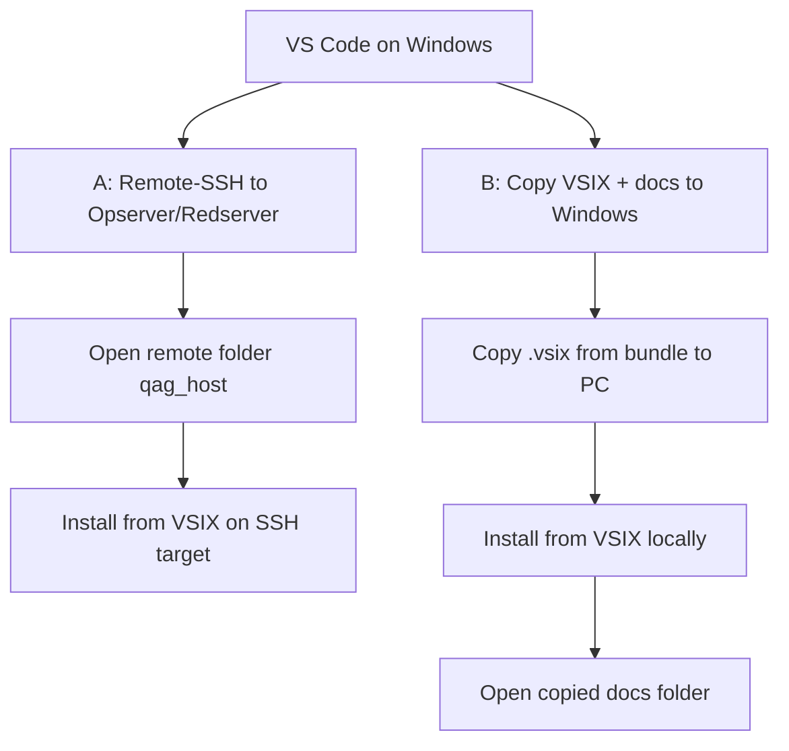

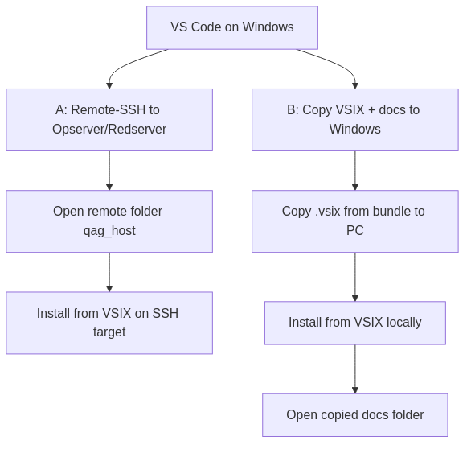


**Option A — Remote-SSH (read docs on the server)**

Prerequisite: install the **Remote - SSH** extension on Windows **while you still
have internet** (one-time).

1. Connect: **Remote-SSH: Connect to Host…** → your Opserver/Redserver.
2. **File → Open Folder** → `/home/tyewhong/qag/qag_host` (path on the **remote**
   Linux host — shown in the remote file picker).
3. Extensions → **⋯** → **Install from VSIX…**
4. Pick the file **on the remote host**:
   `docs/vscode-extensions/bierner.markdown-mermaid-1.32.1.vsix`
5. If prompted **“Install in SSH: …?”** → choose **Install in SSH** (remote).
6. Reload window → open `docs/OFFLINE_SETUP_GUIDE.md` → `Ctrl+Shift+V`.

**Option B — Copy VSIX (+ docs) to your Windows PC**

Use when you do not use Remote-SSH. No Linux path on Windows is required.

1. **Get the `.vsix` onto Windows** (from build host or USB), for example:
   - Extract on Linux, copy only the VSIX to USB:
     ```bash
     # on Linux (build host or Opserver after extract)
     cp /home/tyewhong/qag/qag_host/docs/vscode-extensions/bierner.markdown-mermaid-*.vsix /media/usb/
     ```
   - Or on Windows with 7-Zip: open `qag_bundle.tar.gz` → `qag_host/docs/vscode-extensions/` → extract `*.vsix`.
   - Or `scp` from a machine that has the bundle:
     ```powershell
     scp user@buildhost:/data/tyewhong/qag/qag_bundle.tar.gz C:\Users\You\Downloads\
     ```
     then extract the VSIX with 7-Zip.

2. **Optional — copy docs to read offline on Windows:**
   ```bash
   # on Linux — copy docs folder to USB
   cp -a /home/tyewhong/qag/qag_host/docs /media/usb/qag_docs
   ```

3. On **Windows VS Code** (local, not Remote-SSH):
   - Extensions → **⋯** → **Install from VSIX…**
   - Select e.g. `C:\Users\You\Downloads\bierner.markdown-mermaid-1.32.1.vsix`
   - **Developer: Reload Window**
   - **File → Open Folder** → `C:\Users\You\qag_docs` (or wherever you copied `docs/`)
   - Open `OFFLINE_SETUP_GUIDE.md` → `Ctrl+Shift+V`

QAG **runs on Linux** (`bash run.sh` on Opserver/Redserver). VS Code on Windows
is only for **reading documentation** unless you use Remote-SSH to edit remote
files.

#### Verify diagrams work

```bash
# file must exist after extract
ls docs/vscode-extensions/bierner.markdown-mermaid-*.vsix
```

In VS Code: open `docs/OFFLINE_SETUP_GUIDE.md` → **Markdown: Open Preview**
(`Ctrl+Shift+V`). Mermaid blocks should render as flowcharts; PNG images
(e.g. `offline_host_pick.png`) work even without the extension.

More detail: [`VIEWING_DIAGRAMS_OFFLINE.md`](VIEWING_DIAGRAMS_OFFLINE.md).

---

## 2) Opserver offline (`ollama` or `kubeflow`)

Opserver is the **air-gapped validation** host (2×24GB). This section is for
**Ollama** profiles only. For **vLLM on Opserver** (local generator + judge),
use **§3** instead.

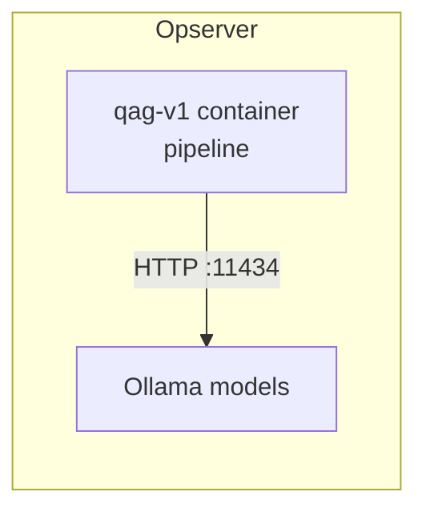

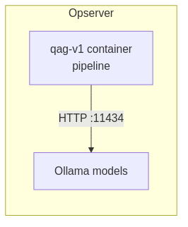


### 2.1 Which profile?

| Profile | When to use | Host needs `ollama` binary? |
|---------|-------------|------------------------------|
| **`ollama`** | Ollama already installed and running on the host | **Yes** |
| **`kubeflow`** | No host Ollama; one container runs Ollama inside QAG | **No** |

Set in `.env`:

```bash
QAG_PROFILE=ollama     # or kubeflow
```

### 2.2 Archives to copy (Opserver)

| Profile | Required archives | Skip |
|---------|-------------------|------|
| **`ollama`** | `qag_bundle.tar.gz`, `qag-v1.tar`, Ollama store (`models_ollama.tar.gz` or split `models_ollama_<tag>.tar.gz`) | vLLM image, HF weights |
| **`kubeflow`** | `qag_bundle.tar.gz`, `qag-kubeflow.tar`, Ollama store (combined or split) | `qag-v1.tar`, vLLM image, HF weights |

**Alternative for `ollama`:** skip model archives if the host Ollama store
already has the tags from `config/config.ollama.yaml` (`ollama list`).

### 2.3 Install steps (Opserver)

```bash
# 1. Bundle (§1.3)
cd /home/tyewhong/qag/qag_host

# 1b. One-time: VS Code Mermaid VSIX for docs (§1.6 — no internet)
bash scripts/offline/install_vscode_diagram_preview.sh

# 2. Load runner image (ollama) or kubeflow image
docker load -i /home/tyewhong/qag/qag-v1.tar          # ollama
# docker load -i /home/tyewhong/qag/qag-kubeflow.tar  # kubeflow

# 3. Extract Ollama store (unless host already has tags)
mkdir -p /data/models/models_ollama
tar xzf /home/tyewhong/qag/models_ollama.tar.gz \
  -C /data/models/models_ollama --strip-components=1
ls -ld /data/models/models_ollama/blobs \
       /data/models/models_ollama/manifests

# 4. Optional one-shot installer
bash setup_offline.sh --profile ollama    # or kubeflow
```

For **split** Ollama archives, see §6.

### 2.4 Configure Opserver

**Data path** (preset mode):

```bash
QAG_OFFLINE_HOST=data
QAG_OFFLINE_INPUT=txt
QAG_SHARED_DATA_ROOT=/data/local/tyewhong/Data
```

**`ollama` profile** — tags in `config/config.ollama.yaml`:

```yaml
llm:
  model: "qwen3.5:9b"
judge:
  model: "llama3.1:8b-instruct-fp16"
```

**`kubeflow` profile** — model store in `.env`:

```bash
QAG_PROFILE=kubeflow
QAG_MODELS_DIR=/data/models/models_ollama
```

Tags in `config/config.kubeflow.yaml` (same pattern as ollama).

### 2.5 First run (Opserver)

```bash
bash run.sh --show-config
bash run.sh -- --num-documents 2
```

Stop in-container Ollama when done (`kubeflow` only):

```bash
bash run.sh --down
```

### 2.6 Opserver JSON/JSONL → TXT (optional)

If inputs are JSON/JSONL and you want one `.txt` per document:

```bash
python3 scripts/conversion/convert_to_qag_jsonl.py \
  --input "/path/to/input.json" \
  --output "/path/to/input.jsonl"

python3 scripts/utils/split_jsonl_to_txt.py \
  --input "/path/to/input.jsonl" \
  --output-dir "/data/local/tyewhong/Data/txt"
```

Then set `run.input_folder` + `run.input_glob: "*.txt"` in the active config
YAML. Details: [`SERVER_MODEL_PROFILES.md`](SERVER_MODEL_PROFILES.md).

### 2.7 Opserver upgrade (code only)

| Step | Action |
|------|--------|
| 1 | Copy new `qag_bundle.tar.gz` (+ `.sha256`) |
| 2 | Copy new `qag-v1.tar` or `qag-kubeflow.tar` if image is old |
| 3 | `bash qag_host/scripts/offline/extract_qag_bundle.sh --code-only` |
| 4 | `docker load` new image tar if needed |
| 5 | `bash run.sh --show-config` — site `.env` / `config/` unchanged |
| 6 | `bash run.sh -- --num-documents 1` smoke test |

Use `--code-only` so an existing `qag_host/.env` and `qag_host/config/` are
not overwritten. Plain `tar xzf` still replaces them (bundle ships build-host
`.env` and YAML).

No need to re-copy Ollama model archives unless model tags changed.

---

## 3) Opserver offline (`vllm` — local)

Opserver runs **both** vLLM models on the **same air-gapped host** (generator
GPU 0 `:7100`, judge GPU 1 `:7101`). QAG starts the vLLM containers, then runs
the pipeline.

For **Ollama** on Opserver, use **§2**. For **vLLM on gpuserver** with
Redserver as orchestrator only, use **§4**.

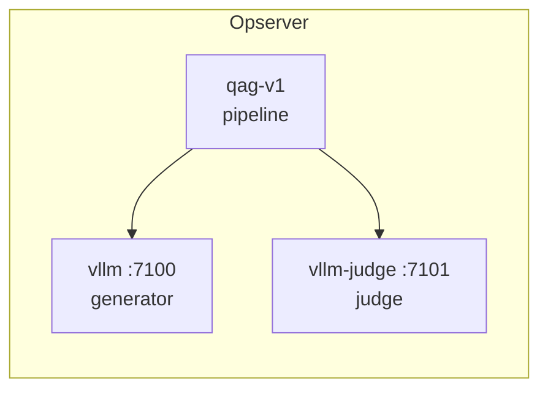

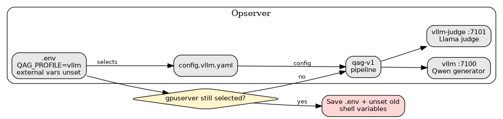

| Item | Opserver §3 |
|------|-------------|
| You start vLLM? | **Yes** (`--vllm-up`) |
| Archives | Bundle + runner + vLLM image + HF weights |
| `setup_offline.sh` | Optional (`--profile vllm`) |
| VSIX (§1.6) | **Once** after bundle extract |

### 3.1 Archives to copy

**Follow this guide on Opserver:** after extracting the bundle, open
`qag_host/docs/OFFLINE_SETUP_GUIDE.md` — **§3** (pipeline) and **§3.6**
(finetuning). The bundle ships that file; no internet is required.

| File | Pipeline? | Finetune? |
|------|-----------|-----------|
| `qag_bundle.tar.gz` (+ `.sha256`) | **Yes** | **Yes** (includes `scripts/lora/` + this doc) |
| `qag-v1.tar` | **Yes** | No |
| `vllm-qwen35-localcuda.rootfs.tar` | **Yes** | No |
| `models_vllm_Qwen3_5-9B.tar.gz` | **Yes** | **Yes** (read-only SFT/DPO base) |
| `models_vllm_Selene-1-Mini-Llama-3_1-8B.tar.gz` | **Yes** | No (judge for pipeline only) |
| `lora_venv.tar.gz` | No | **Yes** (offline host cannot `pip install`) |
| `models_vllm_*-sft/dpo-merged.tar.gz` | No | **No** (outputs of a prior train; skip for new data) |

**Not in any archive:** training documents. Use **your Opserver dataset**
(already on that host or copied from your own source — not pathfinder / server1
`.txt` from the build host). Point `QAG_DATA_DIR` at that folder (§3.3).

Split HF weights (recommended for large transfers):

| Archive | HF folder | Role |
|---------|-----------|------|
| `models_vllm_Qwen3_5-9B.tar.gz` | `Qwen3.5-9B/` | Generator + finetune base |
| `models_vllm_Selene-1-Mini-Llama-3_1-8B.tar.gz` | `Selene-1-Mini-Llama-3.1-8B/` | Judge |

Legacy judge archive `models_vllm_Meta-Llama-3_1-8B-Instruct.tar.gz` is
retired — do not copy it for new Opserver installs.

### 3.2 Install steps

```bash
# Bundle
tar xzf /home/tyewhong/qag/qag_bundle.tar.gz -C /home/tyewhong/qag
cd /home/tyewhong/qag/qag_host

# One-time: VS Code Mermaid VSIX (§1.6)
bash scripts/offline/install_vscode_diagram_preview.sh

# Images
docker load -i /home/tyewhong/qag/qag-v1.tar
docker load -i /home/tyewhong/qag/vllm-qwen35-localcuda.rootfs.tar
docker images | grep -E 'qag-v1|qag-vllm'

# Model weights → same root
ARCH=/home/tyewhong/qag
mkdir -p /data/models
tar xzf "$ARCH/models_vllm_Qwen3_5-9B.tar.gz" -C /data/models
tar xzf "$ARCH/models_vllm_Selene-1-Mini-Llama-3_1-8B.tar.gz" -C /data/models
ls /data/models/Qwen3.5-9B/config.json
ls /data/models/Selene-1-Mini-Llama-3.1-8B/config.json

# Finetune only (offline — pre-built venv from build host; §3.6)
tar xzf "$ARCH/lora_venv.tar.gz" -C /home/tyewhong/qag/qag_host

# Optional installer (loads images + extracts models if archives present)
bash setup_offline.sh --profile vllm
```

### 3.3 Configure `.env`

```bash
QAG_PROFILE=vllm
QAG_ARCHIVE_DIR=/home/tyewhong/qag
QAG_MODELS_LLM_HOST=/data/models

VLLM_IMAGE=qag-vllm:qwen35-localcuda
VLLM_MODEL=/models/Qwen3.5-9B
VLLM_SERVED_MODEL_NAME=Qwen/Qwen3.5-9B
VLLM_JUDGE_MODEL=/models/Selene-1-Mini-Llama-3.1-8B
VLLM_JUDGE_SERVED_NAME=AtlaAI/Selene-1-Mini-Llama-3.1-8B

# Finetune (§3.6) — optional overrides; defaults shown
QAG_LORA_BASE_MODEL=/data/models/Qwen3.5-9B
QAG_LORA_OUTPUT_DIR=/data/models/Qwen3.5-9B-qag-lora
QAG_LORA_GPUS=0,1
QAG_LORA_QUANTIZATION_BIT=0
QAG_LORA_VENV=/home/tyewhong/qag/qag_host/.venv-lora

# Your training corpus on Opserver (not shipped in tars — any folder of .txt)
QAG_DATA_DIR=/path/to/your/opserver/dataset/txt
```

Set `QAG_DATA_DIR` to wherever **your** finetuning documents live on Opserver.
You do **not** copy pathfinder or server1 `.txt` from the build host unless
that is the dataset you intend to use. Opserver has **no internet** — do not
rely on `pip install` or Marketplace; use the pre-staged `lora_venv.tar.gz`
for finetuning (§3.6.2).

### 3.4 Configure `config/config.vllm.yaml`

Use **Docker service names** (pipeline runs inside the `qag` container).
Do **not** use `localhost`:

```yaml
llm:
  model: "Qwen/Qwen3.5-9B"
  base_url: "http://vllm:7100/v1"
judge:
  model: "AtlaAI/Selene-1-Mini-Llama-3.1-8B"
  base_url: "http://vllm-judge:7101/v1"
```

`llm.model` / `judge.model` must match what `/v1/models` returns on each
port.

For this local two-GPU layout, save `.env` with `QAG_PROFILE=vllm` and no
redserver config override or external base URLs. Keep
`QAG_VLLM_COMPOSE_EXTRA` empty unless using a documented local siteserver
override. Run `bash run.sh --show-config`; it must report
`config/config.vllm.yaml`.

### 3.5 First run

```bash
bash run.sh --vllm-up generator
bash run.sh --vllm-up judge
bash run.sh --status
bash run.sh --pipeline-only --num-documents 2
```

If vLLM is **already** healthy on `:7100` / `:7101`, skip `--vllm-up` and run
`--pipeline-only` only.

### 3.6 Host LoRA finetuning (offline Opserver)

Train a **LoRA adapter only** on Opserver from **your Opserver dataset**
(whatever you set in `QAG_DATA_DIR` — independent of server1/pathfinder).
The base model at `/data/models/Qwen3.5-9B` stays read-only; adapters are
written to separate folders (defaults below). Finetuning uses **local host
GPUs**, not the vLLM Docker containers — stop them first with
`bash run.sh --down`.

**Printable checklist:** this section in `qag_host/docs/OFFLINE_SETUP_GUIDE.md`
(on disk after bundle extract). Detailed redserver variant (external vLLM):
[`REDSERVER_ONSITE_SETUP.md`](REDSERVER_ONSITE_SETUP.md) §8.5.

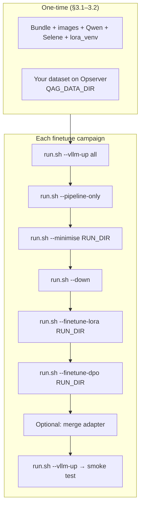

#### 3.6.1 Prerequisites

| Requirement | Where | Check on Opserver |
|-------------|-------|-------------------|
| This guide | `qag_host/docs/OFFLINE_SETUP_GUIDE.md` | §3 + §3.6 |
| Training scripts | `qag_host/scripts/lora/` (in bundle) | `ls scripts/lora/train_qwen_lora.sh` |
| Base HF weights | `/data/models/Qwen3.5-9B` | `ls /data/models/Qwen3.5-9B/config.json` |
| LoRA Python venv | `qag_host/.venv-lora` (from `lora_venv.tar.gz`) | `ls .venv-lora/bin/python` |
| Training JSONL | `output/vllm/.../<run>/lora_sft.jsonl` | after `bash run.sh --minimise` |
| Local GPUs | host (default `0,1`) | `nvidia-smi` |
| Corpus | path in `QAG_DATA_DIR` on Opserver | `bash run.sh --show-config` lists `*.txt` |

You do **not** need SFT/DPO **merged** weight archives from the build host,
and you do **not** need `.txt` files from the build host. Documents must
already be on Opserver (or copied from your training-data source) before
`--pipeline-only`.

#### 3.6.2 LoRA venv (offline — no internet)

Opserver cannot run `scripts/lora/setup_lora_venv.sh` (it calls `pip install`).
Copy `lora_venv.tar.gz` (+ `.sha256`) from the build host and extract **once**:

```bash
cd /home/tyewhong/qag/qag_host
sha256sum -c /home/tyewhong/qag/lora_venv.tar.gz.sha256
tar xzf /home/tyewhong/qag/lora_venv.tar.gz
```

Confirm `QAG_LORA_VENV=/home/tyewhong/qag/qag_host/.venv-lora` in `.env`
(see §3.3).

Dry-run before a long train:

```bash
bash scripts/lora/train_qwen_lora.sh "output/vllm/.../<timestamp>/" --dry-run
```

#### 3.6.3 Pipeline → export training data

vLLM must be **up** for the pipeline; finetuning happens **after** export.

```bash
cd /home/tyewhong/qag/qag_host

bash run.sh --vllm-up all
bash run.sh --status

# Pipeline on your Opserver dataset (adjust count / resume as needed)
bash run.sh --pipeline-only --num-documents 100
# Resume: bash run.sh --pipeline-only --resume --num-documents 1000

RUN=output/vllm/qwen-qwen3.5-9b/<timestamp>/

bash run.sh --minimise "$RUN"
wc -l "$RUN/lora_sft.jsonl"
# lora_dpo.jsonl only when retry-based DPO pairs exist
ls "$RUN/lora_dpo.jsonl" 2>/dev/null || echo "No DPO pairs — skip §3.6.5"
```

`--minimise` writes SFT data always. It writes `lora_dpo.jsonl` only when the
run captured a gate-passing answer with a rejected retry for the same question.

#### 3.6.4 Train SFT adapter

Stop vLLM containers to free GPUs:

```bash
bash run.sh --down
nvidia-smi

bash run.sh --finetune-lora "$RUN"
```

| Setting | Default | Notes |
|---------|---------|-------|
| Base model | `/data/models/Qwen3.5-9B` | Read-only (`QAG_LORA_BASE_MODEL`) |
| Adapter output | `/data/models/Qwen3.5-9B-qag-lora` | `QAG_LORA_OUTPUT_DIR` |
| GPUs | `0,1` | `device_map="auto"` — not DDP |
| Precision | fp16 (`QAG_LORA_QUANTIZATION_BIT=0`) | Use `4` if CUDA OOM |

Verify:

```bash
test -f /data/models/Qwen3.5-9B-qag-lora/adapter_model.safetensors \
  && echo "SFT adapter OK"
```

#### 3.6.5 Train DPO adapter (optional)

Only when `lora_dpo.jsonl` exists in the run folder **and** SFT finished:

```bash
bash run.sh --finetune-dpo "$RUN"
```

Default DPO output: `/data/models/Qwen3.5-9B-qag-lora-dpo` (override
`QAG_LORA_DPO_OUTPUT_DIR` in `.env`).

#### 3.6.6 Merge for vLLM serving (optional)

vLLM serves merged folders more easily than raw LoRA adapters. Requires a
free GPU (`bash run.sh --down`):

```bash
python3 scripts/lora/merge_adapter_for_vllm.py \
  --base-model /data/models/Qwen3.5-9B \
  --adapter /data/models/Qwen3.5-9B-qag-lora \
  --output-dir /data/models/Qwen3.5-9B-qag-sft-merged

# After DPO — use the best checkpoint if the final epoch collapsed
python3 scripts/lora/merge_adapter_for_vllm.py \
  --base-model /data/models/Qwen3.5-9B \
  --adapter /data/models/Qwen3.5-9B-qag-lora-dpo/checkpoint-44 \
  --output-dir /data/models/Qwen3.5-9B-qag-dpo-merged
```

Point `VLLM_MODEL` and `VLLM_SERVED_MODEL_NAME` at the merged folder when
testing that adapter in vLLM.

#### 3.6.7 Resume pipeline after training

```bash
bash run.sh --vllm-up all
bash run.sh --pipeline-only --num-documents 2
```

#### 3.6.8 Finetune troubleshooting (Opserver)

| Symptom | Likely cause | Fix |
|---------|--------------|-----|
| `Base model not found` | Qwen weights missing | §3.2 — extract `models_vllm_Qwen3_5-9B.tar.gz` |
| `pip install` fails | Offline host, no venv | §3.6.2 — copy `lora_venv.tar.gz` |
| CUDA OOM during train | fp16 too large | `QAG_LORA_QUANTIZATION_BIT=4` in `.env` |
| Finetune won't start | vLLM still running | `bash run.sh --down` first |
| No `lora_dpo.jsonl` | No retry-based pairs | Skip DPO; SFT-only is fine |

### 3.7 Opserver vLLM upgrade

| Step | Action |
|------|--------|
| 1 | Copy new `qag_bundle.tar.gz` |
| 2 | Copy new `qag-v1.tar` or vLLM rootfs if images are old |
| 3 | `bash qag_host/scripts/offline/extract_qag_bundle.sh --code-only` |
| 4 | `docker load` updated images if needed |
| 5 | `bash run.sh --vllm-up` if needed, then `--pipeline-only --num-documents 1` |

Re-copy HF weight archives only if model folders changed.

---

## 4) Redserver offline (`vllm` — external gpuserver)

Redserver is the **orchestrator-only** host: vLLM **already runs** on
**gpuserver** (or another reachable host). Redserver runs the `qag-v1`
pipeline container and calls OpenAI-compatible `/v1` endpoints over the
network.

Do **not** use this section for Opserver local vLLM — that is **§3**.

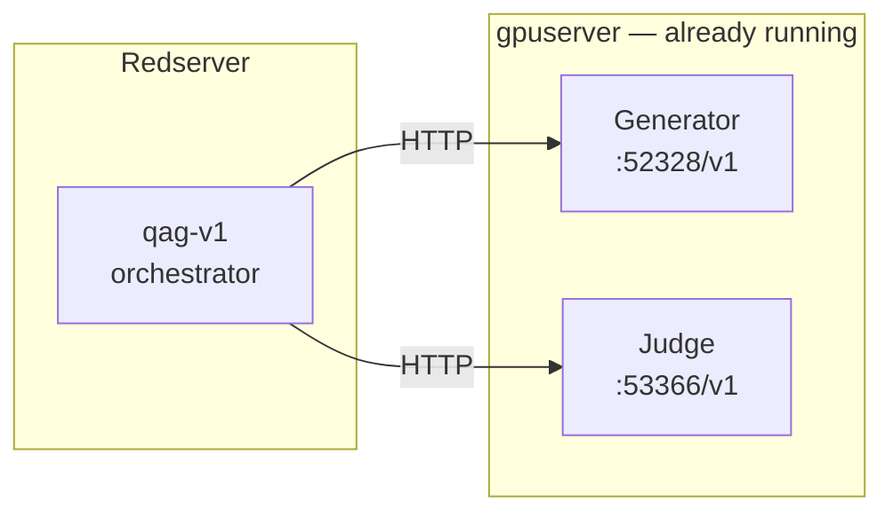


| Item | Redserver §4 |
|------|----------------|
| vLLM on Redserver? | **No** — orchestrator only |
| `docker load vllm rootfs`? | **No** |
| `models_vllm*.tar.gz` on Redserver? | **No** — weights stay on gpuserver |
| Start vLLM | **Do not** use `--vllm-up` |
| Run pipeline | `--pipeline-only` only |

Step-by-step checklist with scenarios A/B/C:
[`REDSERVER_ONSITE_SETUP.md`](REDSERVER_ONSITE_SETUP.md).

### 4.1 Archives to copy

| File | Required? |
|------|-----------|
| `qag_bundle.tar.gz` | **Yes** |
| `qag-v1.tar` | **Yes** if runner missing or old |
| `vllm-qwen35-localcuda.rootfs.tar` | **No** |
| `models_vllm*.tar.gz` | **No** — weights stay on gpuserver |

Approximate transfer size: **~45 MB – 11 GB** (bundle + optional runner).

### 4.2 Install steps

```bash
tar xzf /home/tyewhong/qag/qag_bundle.tar.gz -C /home/tyewhong/qag
cd /home/tyewhong/qag/qag_host

# One-time: VS Code Mermaid extension (no internet — VSIX is in the bundle)
bash scripts/offline/install_vscode_diagram_preview.sh

docker load -i /home/tyewhong/qag/qag-v1.tar
docker images | grep qag-v1

# Do NOT docker load vllm-qwen35-localcuda.rootfs.tar — vLLM runs on gpuserver.

# Optional QAG installer (skips local vLLM image/weights when URLs are set)
bash setup_offline.sh --profile vllm --vllm-external

# Or apply the shipped redserver preset (preserves an existing .env backup)
bash scripts/offline/apply_redserver_env.sh
```

See **§1.6** if the install script cannot find the VSIX (rebuild bundle on
the build host).

### 4.3 Verify gpuserver endpoints (before QAG)

On redserver (or any host that can reach gpuserver):

```bash
curl -s http://gpuserver:52328/v1/models | head
curl -s http://gpuserver:53366/v1/models | head
```

Note the **served model names** in the JSON — you will copy them into YAML.

### 4.4 Configure `.env`

```bash
QAG_PROFILE=vllm
QAG_ARCHIVE_DIR=/home/tyewhong/qag
QAG_VLLM_CONFIG_FILE=config/config.vllm.redserver.yaml

# Input documents (host path — mounted as /workspace/data in qag container)
QAG_OFFLINE_HOST=
QAG_OFFLINE_INPUT=
QAG_DATA_DIR=/home/tyewhong/khangzhie-data/pathfinder/txt

# Health checks in run.sh use these (must end with /v1)
VLLM_BASE_URL=http://gpuserver:52328/v1
VLLM_JUDGE_BASE_URL=http://gpuserver:53366/v1

# Pass URLs into the qag container
QAG_VLLM_COMPOSE_EXTRA=docker-compose.vllm-redserver.yml
```

Alternative shared-data layout: `QAG_OFFLINE_HOST=data`, `QAG_OFFLINE_INPUT=txt`,
`QAG_SHARED_DATA_ROOT=/data/local/tyewhong/Data` → `.../Data/txt`.

If hostname `gpuserver` does not resolve **inside** the `qag` container, set
`GPUSERVER_IP` in `.env` and uncomment `extra_hosts` in
`docker-compose.vllm-redserver.yml`.

### 4.5 Configure `config/config.vllm.redserver.yaml`

Shipped example (adjust ports and model names to match `/v1/models`):

```yaml
llm:
  provider: "vllm"
  model: "Qwen3.5-9B"
  base_url: "http://gpuserver:52328/v1"
judge:
  provider: "vllm"
  model: "Qwen3.6-27B"
  base_url: "http://gpuserver:53366/v1"
```

Activate it with `QAG_VLLM_CONFIG_FILE` in `.env` (above). Keep
`config/config.vllm.yaml` unchanged for local vLLM deployments.

### 4.6 First run

Do **not** run `--vllm-up` (that starts local vLLM containers).

```bash
bash run.sh --show-config    # confirm DATA_DIR lists your .txt files
curl -sf http://gpuserver:52328/health
curl -sf http://gpuserver:53366/health
bash run.sh --pipeline-only --num-documents 1
```

`bash run.sh --status` checks local ports `7100` / `7101`, so it is not a
gpuserver health check.

Resume / production:

```bash
bash run.sh --pipeline-only --resume --num-documents 100
```

**Parallel documents** (process multiple docs at once):

```bash
bash run.sh --pipeline-only --resume --parallel-documents 2 --num-documents 100
```

Default `run.parallel_documents: 2` is in `config/config.vllm.redserver.yaml`;
override with `--parallel-documents N` or edit the YAML.

### 4.7 Input data and documentation on site

| What | In bundle? | Action on redserver |
|------|------------|---------------------|
| Code + configs + `scripts/lora/` | Yes (`qag_bundle.tar.gz`) | `tar xzf` → `qag_host/` |
| All `docs/*.md` guides | Yes (inside bundle) | Read under `qag_host/docs/` |
| VSIX (Mermaid preview) | Yes (inside bundle) | `bash scripts/offline/install_vscode_diagram_preview.sh` |
| Pathfinder / corpus `.txt` | **No** | `rsync` separately to `QAG_DATA_DIR` |
| vLLM inference weights | **No** | Stay on gpuserver |
| Generator HF weights (finetune) | **No** | Copy `models_vllm_Qwen3_5-9B.tar.gz`; extract to `/data/models` |
| LoRA Python venv (finetune) | **No** | Copy `lora_venv.tar.gz` from build host (see §8.5 in onsite guide) |

Example corpus copy:

```bash
rsync -avP /path/to/corpus/ user@redserver:/home/tyewhong/khangzhie-data/pathfinder/txt/
```

Printable checklist: [`REDSERVER_ONSITE_SETUP.md`](REDSERVER_ONSITE_SETUP.md).

### 4.8 Redserver upgrade

| Step | Action |
|------|--------|
| 1 | Copy new `qag_bundle.tar.gz` |
| 2 | Copy new `qag-v1.tar` if runner is old |
| 3 | Back up `qag_host/.env`, then re-extract bundle; `docker load` runner |
| 4 | Restore/merge site `.env` values (URLs, data path, `QAG_VLLM_CONFIG_FILE`) |
| 5 | `bash run.sh --pipeline-only --num-documents 1` |

No vLLM image or model archives unless gpuserver models changed.

---

## 5) Archive reference (all types)

| Archive | Type | Install action | Result |
|---------|------|----------------|--------|
| `qag_bundle.tar.gz` | gzip tarball | `tar xzf` → parent dir | `qag_host/` (code, compose, configs, **VSIX** §1.6) |
| *(inside bundle)* `docs/vscode-extensions/*.vsix` | VS Code extension | §1.6 `install_vscode_diagram_preview.sh` or Install from VSIX | Mermaid in `docs/*.md` previews (Opserver / Redserver, one-time) |
| `qag-v1.tar` | Docker save | `docker load -i` | `qag-v1:latest` (**ollama**, **vllm**) |
| `qag-kubeflow.tar` | Docker save | `docker load -i` | `qag-kubeflow:latest` (**kubeflow**) |
| `vllm-qwen35-localcuda.rootfs.tar` | Docker save | `docker load -i` | `qag-vllm:qwen35-localcuda` (**Opserver §3**) |
| `models_ollama.tar.gz` | gzip tarball | `tar xzf` | Ollama `blobs/` + `manifests/` (**Opserver §2**) |
| `models_ollama_<tag>.tar.gz` | gzip tarball (split) | `tar xzf` each | Same Ollama store (**§7**) |
| `models_vllm.tar.gz` | gzip tarball | `tar xzf` → `/data/models` | Both HF folders (**Opserver §3**) |
| `models_vllm_<name>.tar.gz` | gzip tarball (split) | `tar xzf` each into same root | One HF folder (**Opserver §3**) |
| `models_llama.tar.gz` | gzip tarball (legacy) | `tar xzf` into same root | Judge folder (**Opserver §3**) |

`docker load` is idempotent — safe to re-run.

---

## 6) Build archives on the online machine

```bash
# Opserver — host Ollama package
bash scripts/make_offline_tarballs.sh --bundle --image-dev --models-ollama

# Opserver — in-container Ollama (kubeflow)
bash scripts/make_offline_tarballs.sh --bundle --image-kubeflow --models-ollama

# Opserver — split Ollama (file size limits)
bash scripts/make_offline_tarballs.sh --bundle --image-dev \
  --models-ollama-split=qwen3.5:9b,llama3.1:8b-instruct-fp16

# Opserver §3 — full local vLLM package
bash scripts/make_offline_tarballs.sh --bundle --image-dev --image-vllm --models-vllm

# Opserver §3 — split HF weights
bash scripts/make_offline_tarballs.sh \
  --models-vllm-split=Qwen3.5-9B,Meta-Llama-3.1-8B-Instruct

# Redserver §4 — orchestrator only (bundle includes VSIX for §1.6)
bash scripts/make_offline_tarballs.sh --bundle --image-dev
# On build host, ensure VSIX present before bundle:
# bash scripts/offline/fetch_vscode_mermaid_vsix.sh && bash scripts/make_qag_bundle.sh

# Everything (all profiles)
bash scripts/make_offline_tarballs.sh --all
```

Outputs: `ls -lh /data/tyewhong/qag/`

---

## 7) Split Ollama archive extraction (Opserver)

If split files include a top-level `models/` directory, extracting inside
`/data/models` creates `/data/models/models/...` — use `--strip-components=1`:

```bash
mkdir -p /data/models/models_ollama
tar xzf models_ollama_qwen3.5_9b.tar.gz \
  -C /data/models/models_ollama --strip-components=1
tar xzf models_ollama_llama3.1_8b-instruct-fp16.tar.gz \
  -C /data/models/models_ollama --strip-components=1

ls -ld /data/models/models_ollama/blobs \
       /data/models/models_ollama/manifests
```

---

## 8) `setup_offline.sh` — when to use it

| Scenario | Run `setup_offline.sh`? | Typical flags |
|----------|-------------------------|---------------|
| Opserver `ollama` / `kubeflow` (§2) | **Yes** (recommended) | `--profile ollama` or `kubeflow` |
| Opserver vLLM local (§3) | **Yes** (optional if manual) | `--profile vllm` |
| Redserver vLLM external gpuserver (§4) | **Yes** (safe now) | `--profile vllm --vllm-external` |
| Images already loaded, only re-extract models | Yes | `--skip-images --force --profile …` |
| Code-only upgrade, models unchanged | Usually **no** | — |

```bash
cd /home/tyewhong/qag/qag_host
bash setup_offline.sh --profile vllm --vllm-external   # Redserver §4 → gpuserver
bash setup_offline.sh --profile vllm                   # Opserver §3 local vLLM
```

**External vLLM auto-detection:** if `.env` already has `VLLM_BASE_URL`,
`VLLM_JUDGE_BASE_URL`, `QAG_VLLM_CONFIG_FILE=*redserver*`, or
`QAG_VLLM_COMPOSE_EXTRA=*vllm-redserver*`, the script skips local vLLM image
and HF weight checks (no false `[FAIL]` / `[WARN]` for missing rootfs tar).

What it does:

| Phase | Action |
|-------|--------|
| 1 | Find archives under `QAG_ARCHIVE_DIR` (set `/home/tyewhong/qag` in `.env` on Opserver/Redserver) |
| 2 | `docker load` for profile images |
| 3 | Extract model archives |
| 4 | Fix ownership on `output/`, `data/`, caches |
| 5 | Create starter `.env` if missing |
| 6 | Smoke tests (profile-scoped; external vLLM skips local GPU weights) |

Verify after install (local vLLM / Opserver):

```bash
bash scripts/offline/verify_offline_deployment.sh --profile vllm
```

---

## 9) First run quick reference

From `qag_host/` after config is done:

**Opserver (`ollama` / `kubeflow`):**

```bash
bash run.sh --show-config
bash run.sh -- --num-documents 2
```

**Opserver vLLM local (§3):**

```bash
bash run.sh --vllm-up generator
bash run.sh --vllm-up judge
bash run.sh --pipeline-only --num-documents 2
```

**Redserver vLLM external gpuserver (§4):**

```bash
bash run.sh --pipeline-only --num-documents 1
```

**Resume** (any profile):

```bash
bash run.sh --pipeline-only --resume --num-documents 100
bash run.sh --pipeline-only --skip-existing-outputs
```

**Post-run** (no LLM rerun):

```bash
bash run.sh --minimise
bash run.sh --summarize --latest --json
```

`--minimise` writes LoRA SFT data and conditionally writes `lora_dpo.jsonl`
when a gate-passing answer has a rejected retry for the same question.
Runs created before retry capture cannot reconstruct DPO pairs.

**Optional host finetune** (stop local containers first; full offline guide
**§3.6** in this file, or [`REDSERVER_ONSITE_SETUP.md`](REDSERVER_ONSITE_SETUP.md)
§8.5 for external vLLM):

```bash
bash run.sh --down
bash run.sh --finetune-lora "output/vllm/.../<timestamp>/"
```

Requires `scripts/lora/` (in bundle), generator HF weights at
`/data/models/Qwen3.5-9B`, and `.venv-lora` pre-staged offline. Adapter-only
(Option A): base stays read-only; output defaults to
`/data/models/Qwen3.5-9B-qag-lora`. See `README.md` §7.

YAML knobs: `run.skip_existing_outputs`, `run.resume`, and
`run.resume_run_dir` in the active YAML shown by `bash run.sh --show-config`.

---

## 10) Troubleshooting

### Opserver — ollama / kubeflow (§2)

| Symptom | Likely cause | Fix |
|---------|--------------|-----|
| `ollama: command not found` | `ollama` profile without host binary | Install Ollama or switch to `kubeflow` |
| `Ollama not reachable on port 11434` | Host Ollama not running | Start `ollama serve` |
| `[Fail] kubeflow image present` | Tar not loaded | `docker load -i qag-kubeflow.tar` |
| `[Fail] ollama store present` | Bad `QAG_MODELS_DIR` | Point at dir with `blobs/` + `manifests/` |

### Opserver — vLLM local (§3)

| Symptom | Likely cause | Fix |
|---------|--------------|-----|
| Local run checks `gpuserver:52328` | Saved `.env` or current shell still has redserver values | Save `.env`; unset `QAG_VLLM_CONFIG_FILE`, both external base URLs, and the redserver compose extra |
| `Generator not healthy` | vLLM down on :7100 | `bash run.sh --vllm-up generator` |
| `Connection error` from pipeline | `localhost` in YAML URLs | Use `http://vllm:7100/v1` and `http://vllm-judge:7101/v1` |
| `model not found` | YAML name ≠ served name | Align with `curl localhost:7100/v1/models` |
| `qwen3_5 not recognized` | Old vLLM image | `VLLM_IMAGE=qag-vllm:qwen35-localcuda` |
| `setup_offline.sh`: archives `<not found>` | `.tar` / `.tar.gz` in `/data/models/` only | **Archives** → `/home/tyewhong/qag/` (`QAG_ARCHIVE_DIR`). **Extracted weights** → `/data/models/` (`QAG_MODELS_LLM_HOST`). Or extract manually + `docker load`, then `--skip-images` |

### Redserver — vLLM external gpuserver (§4)

| Symptom | Likely cause | Fix |
|---------|--------------|-----|
| `Generator not healthy at http://gpuserver:…` | Network / vLLM down | `curl` from host; fix gpuserver |
| Pipeline cannot resolve `gpuserver` | DNS inside container | `extra_hosts` + `GPUSERVER_IP` |
| Wrong model in API errors | YAML ≠ `/v1/models` | Update `config.vllm.redserver.yaml` |
| Accidentally started local vLLM | Ran `--vllm-up` | Use `--pipeline-only` only |

### Redserver — VS Code diagrams (§1.6)

| Symptom | Likely cause | Fix |
|---------|--------------|-----|
| `flowchart TD` text in preview | VSIX not installed | §1.6 — `install_vscode_diagram_preview.sh` |
| `No VSIX in ...` from install script | Old bundle without `.vsix` | Rebuild bundle on build host; re-copy tar |
| Marketplace install fails | No internet on redserver | **Install from VSIX** only (bundled path) |
| PNG missing in preview | Wrong VS Code folder | Open `qag_host` as workspace root |

**Redserver diagnostics:**

```bash
bash run.sh --show-config
curl -sf http://gpuserver:52328/health
curl -sf http://gpuserver:53366/health
```

---

## 11) Switching profiles later

1. Change `QAG_PROFILE` in `.env`.
2. Install archives for the new profile (§2, §3, or §4).
3. Edit only the matching config YAML:
   `config.ollama.yaml` / `config.kubeflow.yaml` / `config.vllm.yaml`
   (or `config.vllm.redserver.yaml` for Redserver §4).
4. When leaving redserver mode for local vLLM, clear the config override,
   both external base URLs, and redserver compose extra; unset stale shell
   exports too.
5. Save `.env`, run `bash run.sh --show-config`, then run per §9.

---

## 12) Related docs

| Doc | Use when |
|-----|----------|
| [`REDSERVER_ONSITE_SETUP.md`](REDSERVER_ONSITE_SETUP.md) | Printable redserver checklist (scenarios A/B/C) |
| [`SERVER_MODEL_PROFILES.md`](SERVER_MODEL_PROFILES.md) | greenserver / Opserver / siteserver mapping |
| [`Siteserver_vLLM_Change_Guide.md`](Siteserver_vLLM_Change_Guide.md) | 4-GPU siteserver vLLM |
| [`ONLINE_SETUP_GUIDE.md`](ONLINE_SETUP_GUIDE.md) | Build host validation |
| [`HANDOVER.md`](HANDOVER.md) | Code map and release checks |
