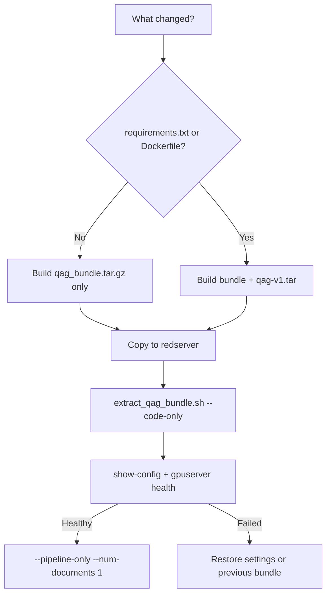
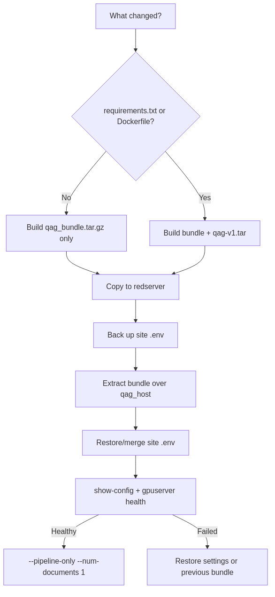

# Redserver Code-Only Update

Use this guide when redserver is already working and you want to update QAG
code, configuration, scripts, or documentation without transferring vLLM
images or model weights.






## What “code only” means

The runner bind-mounts these paths from `qag_host` into the container:

- `run_qa_pipeline.py`
- `utils/`
- `scripts/` (includes `scripts/lora/` for host-side finetune)
- `config/`
- `README.md` and `docs/`

Updates to those paths normally require only `qag_bundle.tar.gz`.

| Change | Transfer |
|--------|----------|
| Python logic in existing dependencies | `qag_bundle.tar.gz` |
| YAML, shell scripts, compose files, or docs | `qag_bundle.tar.gz` |
| `requirements.txt` adds/changes a Python package | Bundle + rebuilt `qag-v1.tar` |
| `Dockerfile` or system packages change | Bundle + rebuilt `qag-v1.tar` |
| gpuserver model or vLLM service changes | Not a code-only update |

Do not copy `vllm-*.tar` or HuggingFace weights for a normal code-only update.
Those remain on gpuserver for inference. **Exception:** host LoRA finetune
needs generator HF weights on redserver — see
[`REDSERVER_ONSITE_SETUP.md`](REDSERVER_ONSITE_SETUP.md) §1.4.

## 1. Build on the connected machine

From the repository:

```bash
cd /home/tyewhong/qag
python3 scripts/verify_docs_links.py
bash scripts/make_qag_bundle.sh
```

Output:

```text
/data/tyewhong/qag/qag_bundle.tar.gz
/data/tyewhong/qag/qag_bundle.tar.gz.sha256
```

If dependencies or the Dockerfile changed, build the runner too:

```bash
bash scripts/make_offline_tarballs.sh --bundle --image-dev
```

## 2. Copy to redserver

```bash
rsync -avP \
  /data/tyewhong/qag/qag_bundle.tar.gz \
  /data/tyewhong/qag/qag_bundle.tar.gz.sha256 \
  user@redserver:/home/tyewhong/qag/
```

Copy `qag-v1.tar` and its checksum only when the decision table says the
runner image must be rebuilt.

## 3. Install the code bundle (keep site config)

On redserver:

```bash
cd /home/tyewhong/qag
sha256sum -c qag_bundle.tar.gz.sha256

bash qag_host/scripts/offline/extract_qag_bundle.sh --code-only
cd qag_host
```

`--code-only` refreshes code, compose, docs, and scripts but **does not**
replace an existing `qag_host/.env` or `qag_host/config/`. First install
(with no prior `.env`) still gets the bundle defaults.

Manual fallback (if the script is missing from an old bundle):

```bash
test ! -f qag_host/.env || cp qag_host/.env .env.redserver.before_code_update
tar xzf qag_bundle.tar.gz -C /home/tyewhong/qag
cp .env.redserver.before_code_update qag_host/.env
```

Review at least:

```text
QAG_PROFILE=vllm
QAG_VLLM_CONFIG_FILE=config/config.vllm.redserver.yaml
QAG_VLLM_COMPOSE_EXTRA=docker-compose.vllm-redserver.yml
QAG_DATA_DIR=<redserver corpus path>
VLLM_BASE_URL=http://gpuserver:52328/v1
VLLM_JUDGE_BASE_URL=http://gpuserver:53366/v1
```

Save `.env`. If `--show-config` later prints `config/config.vllm.yaml`, the
redserver block was not restored/saved or stale shell exports are overriding
it; restore all four vLLM override values and unset conflicting shell values.

If a new `qag-v1.tar` was copied:

```bash
cd /home/tyewhong/qag
sha256sum -c qag-v1.tar.sha256
docker load -i qag-v1.tar
cd qag_host
```

## 4. Verify before production

```bash
bash run.sh --show-config
curl -sf http://gpuserver:52328/health
curl -sf http://gpuserver:53366/health
bash run.sh --pipeline-only --num-documents 1
```

Expected:

- `--show-config` prints `config/config.vllm.redserver.yaml`.
- `DATA_DIR` lists the intended input files.
- Both gpuserver health checks succeed.
- One new `*_analysis.json` appears under `output/vllm/...`.

Do not use `--vllm-up`. `bash run.sh --status` checks local ports `7100` and
`7101`, not external gpuserver.

## 5. Resume production

```bash
bash run.sh --pipeline-only \
  --resume \
  --parallel-documents 2 \
  --num-documents 100
```

## Rollback

If the smoke test fails:

1. Keep the failed run output for diagnosis.
2. Restore the previous known-good code bundle over `qag_host/`.
3. Restore `.env.redserver.before_code_update`.
4. If the runner image changed, load the previous known-good `qag-v1.tar`.
5. Repeat the gpuserver checks and one-document smoke test.

Do not delete `output/`, the input corpus, or archive files during rollback.
