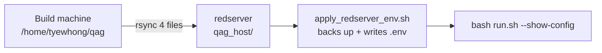
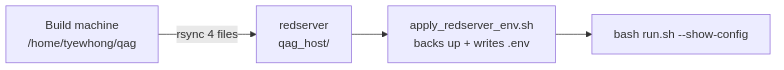

# Redserver — which files to replace

Minimal guide when redserver is **already working** and you only need to
sync config from the build machine or a new bundle.






---

## Option A — four files only (fastest)

Copy into `/home/tyewhong/qag/qag_host/`:

| File | Destination |
|------|-------------|
| `config/config.vllm.redserver.yaml` | `qag_host/config/` |
| `docker-compose.vllm-redserver.yml` | `qag_host/` |
| `scripts/offline/dotenv.redserver.template` | `qag_host/scripts/offline/` |
| `scripts/offline/apply_redserver_env.sh` | `qag_host/scripts/offline/` |

From the build machine:

```bash
DEST=user@redserver:/home/tyewhong/qag/qag_host
rsync -avP /home/tyewhong/qag/config/config.vllm.redserver.yaml "$DEST/config/"
rsync -avP /home/tyewhong/qag/docker-compose.vllm-redserver.yml "$DEST/"
rsync -avP /home/tyewhong/qag/scripts/offline/dotenv.redserver.template \
  "$DEST/scripts/offline/"
rsync -avP /home/tyewhong/qag/scripts/offline/apply_redserver_env.sh \
  "$DEST/scripts/offline/"
```

On **redserver** (generates `.env` with your `id -u` / `id -g`):

```bash
cd /home/tyewhong/qag/qag_host
bash scripts/offline/apply_redserver_env.sh
bash run.sh --show-config
```

The apply script backs up an existing `.env`, then writes the shipped
redserver preset. Reapply any site-specific hostname, IP, or corpus-path
changes before the smoke test.

---

## Option B — full bundle (code refresh, keep site config)

```bash
rsync -avP /data/tyewhong/qag/qag_bundle.tar.gz* user@redserver:/home/tyewhong/qag/
# on redserver:
cd /home/tyewhong/qag
bash qag_host/scripts/offline/extract_qag_bundle.sh --code-only
cd qag_host
bash run.sh --show-config
```

`--code-only` keeps an existing `qag_host/.env` and `qag_host/config/`.
Do **not** run `apply_redserver_env.sh` after a code-only upgrade unless you
intentionally want to reset `.env` from the redserver template.

First install (no `.env` yet): omit `--code-only`, then run
`bash scripts/offline/apply_redserver_env.sh` and set `QAG_DATA_DIR`.

---

## Shipped redserver preset (current)

| Setting | Value |
|---------|--------|
| Config selector | `QAG_VLLM_CONFIG_FILE=config/config.vllm.redserver.yaml` |
| Generator URL | `VLLM_BASE_URL=http://gpuserver:52328/v1` |
| Judge URL | `VLLM_JUDGE_BASE_URL=http://gpuserver:53366/v1` |
| Compose extra | `QAG_VLLM_COMPOSE_EXTRA=docker-compose.vllm-redserver.yml` |
| Input | `QAG_DATA_DIR=/home/tyewhong/khangzhie-data/pathfinder/txt` |
| Generator | `http://gpuserver:52328/v1` — `Qwen3.5-9B` |
| Judge | `http://gpuserver:53366/v1` — `Qwen3.6-27B` |
| Parallel docs | `parallel_documents: 2` |
| DPO pairs | Gate-passing answer + highest-confidence rejected same-question retry |

---

## LoRA export (after a run)

```bash
bash run.sh --minimise "output/vllm/.../<timestamp>/"
# or:
bash run.sh --export-lora "output/vllm/.../<timestamp>/"
```

| File | Purpose |
|------|---------|
| `lora_sft.jsonl` | LoRA SFT training (sharegpt `messages`) |
| `lora_sft_eval.jsonl` | 10% hold-out eval |
| `lora_dpo.jsonl` | Conditional gate-passing same-question preference pairs |
| `lora_dataset_info.json` | LLaMA-Factory `dataset_info` snippet |

`lora_dpo.jsonl` is conditional: it is written only when at least one final
slot gate passes with a rejected retry for that question. A replacement is never
paired with the failed question it replaced. Legacy/manual good and bad files
with the exact same question remain supported as a fallback. Runs created
before retry capture must be rerun; discarded attempts cannot be reconstructed.

---

## LoRA finetune on host (Option A)

Full redserver walkthrough: [`REDSERVER_ONSITE_SETUP.md`](REDSERVER_ONSITE_SETUP.md) **§8.5**.

Training scripts ship in `qag_bundle.tar.gz` under `scripts/lora/`. You still
need **generator HF weights** on redserver (`models_vllm_Qwen3_5-9B.tar.gz` →
`/data/models/Qwen3.5-9B`) and a pre-built `.venv-lora` for offline pip (§8.5.3).

After export, train an adapter without modifying the base model:

```bash
bash run.sh --down   # free GPUs
bash run.sh --finetune-lora "output/vllm/.../<timestamp>/"
```

| `.env` key | Default | Purpose |
|------------|---------|---------|
| `QAG_LORA_BASE_MODEL` | `$QAG_MODELS_LLM_HOST/Qwen3.5-9B` | Read-only base weights |
| `QAG_LORA_OUTPUT_DIR` | `.../Qwen3.5-9B-qag-lora` | Adapter output |
| `QAG_LORA_GPUS` | `0,1` | `device_map` sharding |
| `QAG_LORA_QUANTIZATION_BIT` | `0` (fp16) | Use `4` if OOM |

Output: `adapter_config.json`, `adapter_model.safetensors`,
`qag_lora_manifest.json`. Alternative: copy JSONL to LLaMA-Factory (table
above).

**DPO stage** (after SFT, when `lora_dpo.jsonl` exists):

```bash
bash run.sh --finetune-dpo "output/vllm/.../<timestamp>/"
```

Output defaults to `${QAG_LORA_OUTPUT_DIR}-dpo` (override
`QAG_LORA_DPO_OUTPUT_DIR`).

---

## Verify

```bash
bash run.sh --show-config
curl -sf http://gpuserver:52328/health
curl -sf http://gpuserver:53366/health
bash run.sh --pipeline-only --num-documents 1
bash run.sh --minimise "output/vllm/.../<latest>/"
ls output/vllm/.../lora_sft.jsonl
test -f output/vllm/.../lora_dpo.jsonl \
  && ls output/vllm/.../lora_dpo.jsonl \
  || echo "No recovered answer retries; no DPO file"
ls output/vllm/.../*_minimal_bad_pairs.json | head
```

`bash run.sh --status` probes local ports `7100` and `7101`; it is not the
external gpuserver health check.

---

## Do not replace

| Path | Why |
|------|-----|
| `output/` | Finished runs |
| `/home/tyewhong/khangzhie-data/pathfinder/txt/` | Input corpus |
| `qag-v1` Docker image | Unless runner upgrade |

Full checklist: [`REDSERVER_ONSITE_SETUP.md`](REDSERVER_ONSITE_SETUP.md).
