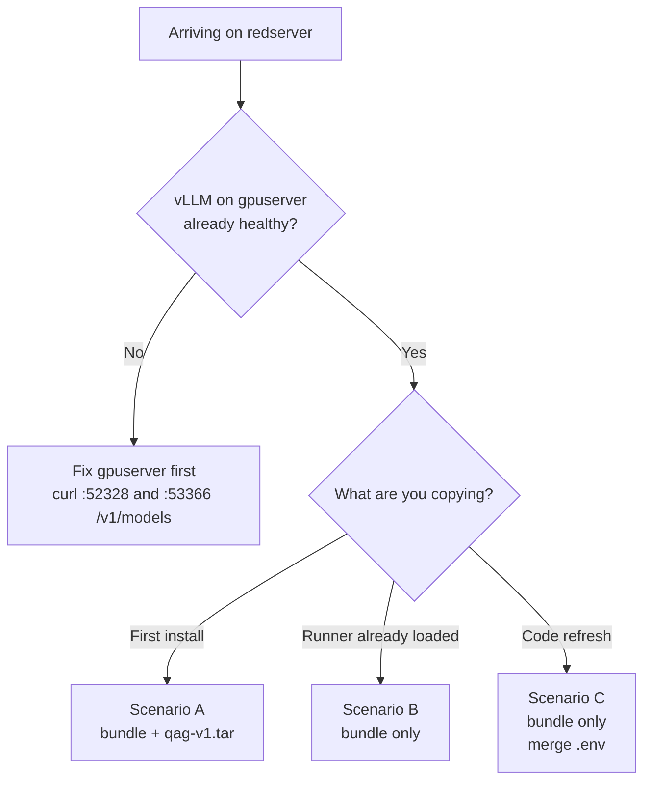
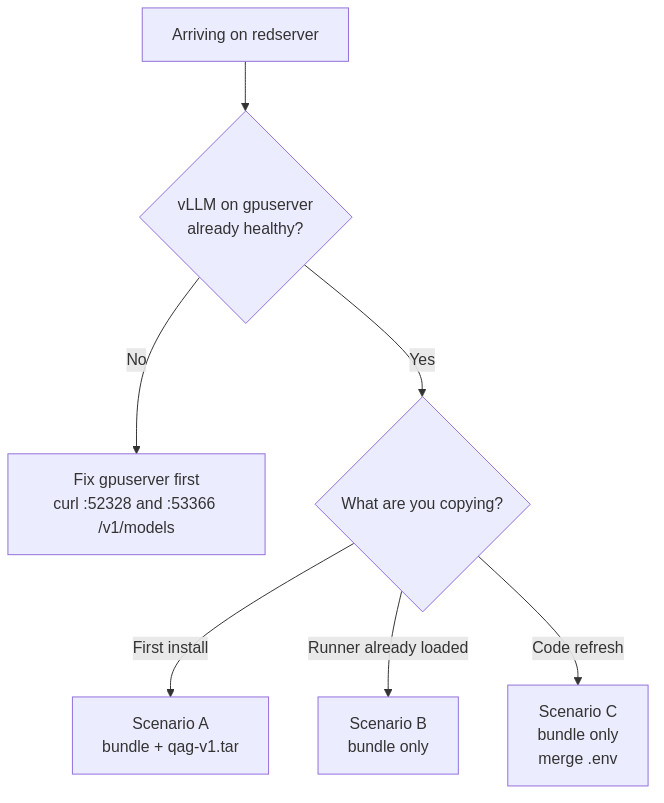
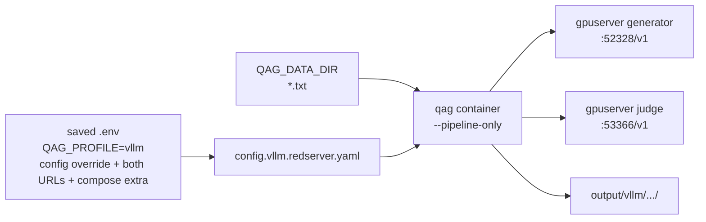
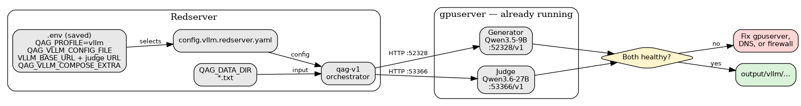
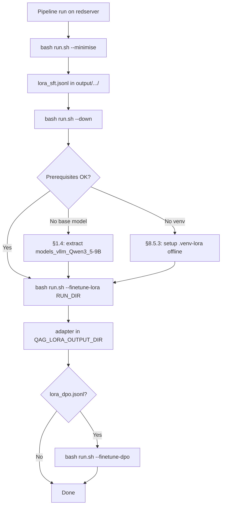

# Redserver On-Site Setup Guide (external vLLM on gpuserver)

Step-by-step guide for installing or upgrading QAG on the **offline redserver**.
Redserver runs the **orchestrator only** (`qag-v1` pipeline container). Generator
and judge vLLM services **already run on gpuserver** (or another reachable host).

**Related docs:** [`HANDOVER.md`](HANDOVER.md) · [`OFFLINE_SETUP_GUIDE.md`](OFFLINE_SETUP_GUIDE.md) §4
· [`REDSERVER_CODE_ONLY_UPDATE.md`](REDSERVER_CODE_ONLY_UPDATE.md)
· [`VIEWING_DIAGRAMS_OFFLINE.md`](VIEWING_DIAGRAMS_OFFLINE.md)
· [`config/README.md`](../config/README.md)

> **Not this guide:** local dual-GPU vLLM on the same host as QAG →
> [`OFFLINE_SETUP_GUIDE.md`](OFFLINE_SETUP_GUIDE.md) §3 (Opserver).

---

## 0) Before you start — pick your scenario






| Scenario | When | Archives to copy | Approx. size |
|----------|------|------------------|--------------|
| **A — Fresh install** | No `qag-v1` image on redserver | `qag_bundle.tar.gz` + `qag-v1.tar` | ~57 MB + ~11 GB |
| **B — Runner present** | `docker images \| grep qag-v1` OK | `qag_bundle.tar.gz` only | ~57 MB |
| **C — Upgrade** | Back up site `.env`, replace `qag_host/`, then restore/merge site values | `qag_bundle.tar.gz` (+ `qag-v1.tar` if runner old) | ~57 MB – 11 GB |

**Build host (online):** `/data/tyewhong/qag/`  
**Redserver archives + working tree:** `/home/tyewhong/qag/`  
**Install tree after extract:** `/home/tyewhong/qag/qag_host/`

**Do not copy to redserver:** `vllm-qwen35-localcuda.rootfs.tar`, `models_vllm*.tar.gz`
(weights stay on gpuserver).

---

## 1) What to bring to the site

### 1.1 Archives (from build host)

| File | Required? | Purpose |
|------|-----------|---------|
| `qag_bundle.tar.gz` | **Always** | Code, configs, compose, **`scripts/lora/`**, **all `docs/`**, VSIX, `setup_offline.sh` |
| `qag_bundle.tar.gz.sha256` | Recommended | Integrity check |
| `qag-v1.tar` | First install or old runner | Pipeline container image |
| `qag-v1.tar.sha256` | Recommended | Integrity check |

Build on the online machine:

```bash
cd /home/tyewhong/qag
bash scripts/offline/fetch_vscode_mermaid_vsix.sh   # once, if VSIX missing
bash scripts/make_qag_bundle.sh
# Output: /data/tyewhong/qag/qag_bundle.tar.gz (+ .sha256)
```

Or: `bash scripts/make_offline_tarballs.sh --bundle --image-dev` (bundle + runner).

### 1.2 Documentation (inside the bundle)

All Markdown guides ship under `qag_host/docs/` — no separate doc copy needed
if you deploy the current bundle. Key files on site:

| Document | Use on site |
|----------|-------------|
| `docs/REDSERVER_ONSITE_SETUP.md` | This checklist |
| `docs/OFFLINE_SETUP_GUIDE.md` | §4 Redserver reference |
| `docs/HANDOVER.md` | Maintainer cheat sheet |
| `docs/VIEWING_DIAGRAMS_OFFLINE.md` | Mermaid in VS Code (offline) |
| `docs/ALGORITHM_REPORT.md` | Pipeline / slot-loop debugging |
| `config/README.md` | Which YAML to edit |

One-time VS Code setup (Mermaid in Markdown preview):

```bash
cd /home/tyewhong/qag/qag_host
bash scripts/offline/install_vscode_diagram_preview.sh
```

### 1.3 Input documents (NOT in archives)

Copy your corpus separately. Example — pathfinder `.txt` files:

```bash
rsync -avP /path/to/corpus/ user@redserver:/home/tyewhong/khangzhie-data/pathfinder/txt/
```

Point `.env` at that folder (see §6).

### 1.4 Finetune add-on (optional)

Host LoRA finetuning runs **on redserver** (not in Docker, not on gpuserver).
Inference vLLM stays on gpuserver; you only need the **generator HF weights**
locally for training.

| File | Required for finetune? | Purpose |
|------|------------------------|---------|
| `scripts/lora/` | **Yes** (inside `qag_bundle.tar.gz`) | `train_qwen_lora.sh`, `setup_lora_venv.sh`, trainers |
| `models_vllm_Qwen3_5-9B.tar.gz` (+ `.sha256`) | **Yes** | Generator HF folder → `/data/models/Qwen3.5-9B` |
| `lora_venv.tar.gz` (optional) | Recommended offline | Pre-built `.venv-lora` from build host (see §8.5) |

**Do not copy for finetune:** `vllm-qwen35-localcuda.rootfs.tar` (gpuserver
serves inference). Judge weights (`Meta-Llama-3.1-8B-Instruct`) are not needed
for LoRA SFT on the generator.

From the build host:

```bash
ARCH=/data/tyewhong/qag
DEST=user@redserver:/home/tyewhong/qag/

rsync -avP \
  "$ARCH/models_vllm_Qwen3_5-9B.tar.gz" \
  "$ARCH/models_vllm_Qwen3_5-9B.tar.gz.sha256" \
  "$DEST"
```

On redserver after copy:

```bash
mkdir -p /data/models
tar xzf /home/tyewhong/qag/models_vllm_Qwen3_5-9B.tar.gz -C /data/models
ls /data/models/Qwen3.5-9B/config.json
```

Full finetune walkthrough: **§8.5**.

---

## 2) Transfer example

From the **build host**:

```bash
ARCH=/data/tyewhong/qag
DEST=user@redserver:/home/tyewhong/qag/

# Scenario B/C — bundle only
rsync -avP \
  "$ARCH/qag_bundle.tar.gz" \
  "$ARCH/qag_bundle.tar.gz.sha256" \
  "$DEST"

# Scenario A — add runner
rsync -avP \
  "$ARCH/qag-v1.tar" \
  "$ARCH/qag-v1.tar.sha256" \
  "$DEST"
```

Use USB or `scp` if `rsync` is unavailable. Large files: `rsync -P` resumes.

---

## 3) On redserver — verify and extract

```bash
cd /home/tyewhong/qag
sha256sum -c qag_bundle.tar.gz.sha256
sha256sum -c qag-v1.tar.sha256    # if copied

mkdir -p /home/tyewhong/qag
# First install:
tar xzf qag_bundle.tar.gz -C /home/tyewhong/qag
# Upgrade (keep site .env + config/):
# bash qag_host/scripts/offline/extract_qag_bundle.sh --code-only
cd qag_host
ls -la config/config.vllm.redserver.yaml docs/
```

Expected: `run.sh`, `config/`, `utils/`, `docker-compose.vllm-redserver.yml`,
`docs/` (full tree), `setup_offline.sh`.

---

## 4) Load runner image

```bash
docker load -i /home/tyewhong/qag/qag-v1.tar
docker images | grep qag-v1
```

Skip if `qag-v1:latest` is already current.

Optional automated install:

```bash
cd /home/tyewhong/qag/qag_host
bash setup_offline.sh --profile vllm --vllm-external
```

---

## 5) Verify gpuserver (before QAG)

On redserver:

```bash
curl -s http://gpuserver:52328/v1/models | head
curl -s http://gpuserver:53366/v1/models | head
```

Note **served model names** — they must match `config/config.vllm.redserver.yaml`.

If `gpuserver` does not resolve **inside** the `qag` container, set `GPUSERVER_IP`
in `.env` and uncomment `extra_hosts` in `docker-compose.vllm-redserver.yml`.

---

## 6) Configure `.env`

For a fresh install, apply the shipped preset first; it backs up an existing
`.env` and fills `HOST_UID` / `HOST_GID` from the current account:

```bash
cd /home/tyewhong/qag/qag_host
bash scripts/offline/apply_redserver_env.sh
```

Then review `/home/tyewhong/qag/qag_host/.env` and merge any site-specific
data path, hostname, or `GPUSERVER_IP`.

### 6.1 Redserver minimum

```bash
# [1] Profile
QAG_PROFILE=vllm
QAG_ARCHIVE_DIR=/home/tyewhong/qag

# [2] Input documents — custom path (pathfinder example)
QAG_OFFLINE_HOST=
QAG_OFFLINE_INPUT=
QAG_DATA_DIR=/home/tyewhong/khangzhie-data/pathfinder/txt

# [3] File ownership (run: id -u / id -g)
HOST_UID=1000
HOST_GID=1000

# [4] External vLLM on gpuserver
QAG_VLLM_CONFIG_FILE=config/config.vllm.redserver.yaml
VLLM_BASE_URL=http://gpuserver:52328/v1
VLLM_JUDGE_BASE_URL=http://gpuserver:53366/v1
QAG_VLLM_COMPOSE_EXTRA=docker-compose.vllm-redserver.yml
# GPUSERVER_IP=<ip>   # if hostname fails inside container
```

Save `.env` before running. `run.sh` reads the saved file, then restores
shell-exported values with higher priority. If an old mode persists, unset the
four vLLM override names in that terminal.

**Alternative input layout** (shared data tree):

```bash
QAG_OFFLINE_HOST=data
QAG_OFFLINE_INPUT=txt
QAG_SHARED_DATA_ROOT=/data/local/tyewhong/Data
# → /data/local/tyewhong/Data/txt
```

### 6.2 Config file map

| What you change | File |
|-----------------|------|
| Profile, data path, gpuserver URLs | `.env` or `bash scripts/offline/apply_redserver_env.sh` |
| Question counts, parallel docs, final failed-slot retention | `config/config.vllm.redserver.yaml` |

**Quick sync:** [`REDSERVER_FILE_REPLACE.md`](REDSERVER_FILE_REPLACE.md).

Confirm:

```bash
bash run.sh --show-config
bash run.sh --edit-config    # opens active profile YAML
```

`--show-config` should list files under `DATA_DIR` (your txt folder).

---

## 7) Configure `config/config.vllm.redserver.yaml`

Shipped defaults (adjust model names to match `/v1/models` on gpuserver):

```yaml
run:
  input_folder: "."              # scans QAG_DATA_DIR (mounted as /workspace/data)
  input_glob: "*.txt"
  parallel_documents: 2          # concurrent documents (override on CLI too)
  num_documents: 0               # 0 = all loaded
  save_grounded_qa_pairs_only: false

question_generation:
  validation:
    answerability_strict: false  # keep bad pairs → bash run.sh --minimise-bad

llm:
  model: "Qwen3.5-9B"
  base_url: "http://gpuserver:52328/v1"
judge:
  model: "Qwen3.6-27B"
  base_url: "http://gpuserver:53366/v1"
```

**Input path rule:** set the **host folder** in `.env` (`QAG_DATA_DIR`), not as
an absolute path in YAML. Inside the container, data appears at `/workspace/data`;
`input_folder: "."` means “all matching files in that mount”.

---

## 8) Run the pipeline

**Do not** run `--vllm-up` (that starts local vLLM containers on redserver).





### 8.1 Smoke test

```bash
cd /home/tyewhong/qag/qag_host
curl -sf http://gpuserver:52328/health
curl -sf http://gpuserver:53366/health
bash run.sh --pipeline-only --num-documents 1
```

Do not use `bash run.sh --status` as the gpuserver health check: it currently
probes local vLLM ports `7100` and `7101`.

### 8.2 Production / resume

```bash
bash run.sh --pipeline-only --resume --num-documents 100
```

Process **all** documents: `num_documents: 0` in YAML or omit `--num-documents`.

### 8.3 Parallel documents (multiple at once)

Process **N documents concurrently** (thread pool; each doc runs the full slot loop):

```bash
bash run.sh --pipeline-only --resume --parallel-documents 2 --num-documents 100
```

| Setting | Where |
|---------|--------|
| CLI override | `--parallel-documents N` |
| Default | `run.parallel_documents` in `config.vllm.redserver.yaml` (shipped: `2`) |

Logs show: `[INFO] parallel_documents=2 (per-document orchestrator unchanged).`

Raise `N` only if gpuserver vLLM keeps up without timeouts.

### 8.4 Post-run exports

```bash
bash run.sh --summarize --latest --json
bash run.sh --minimise "output/vllm/<model>/<timestamp>/"
# LoRA JSONL only:
bash run.sh --export-lora "output/vllm/<model>/<timestamp>/"
```

`--minimise` always writes SFT data. It writes `lora_dpo.jsonl` only when the
run captured a gate-passing answer with a rejected retry for the same question.
Legacy exact-question good/bad files remain supported. Existing pre-capture
runs must be rerun to produce retry-based DPO.

See **§8.5** for the full host LoRA finetune guide (base model, venv, commands).

### 8.5 Host LoRA finetuning (optional)

Train a **LoRA adapter only** on redserver. The base model at
`/data/models/Qwen3.5-9B` stays read-only; the adapter is written to a separate
folder (default `/data/models/Qwen3.5-9B-qag-lora`). gpuserver vLLM is
unchanged — finetuning uses **local GPUs on redserver**, not the remote
inference stack.



#### 8.5.1 Prerequisites

| Requirement | Where | Check |
|-------------|-------|-------|
| Training scripts | `qag_host/scripts/lora/` (in bundle) | `ls scripts/lora/train_qwen_lora.sh` |
| Base HF weights | `/data/models/Qwen3.5-9B` | `ls /data/models/Qwen3.5-9B/config.json` |
| Training JSONL | `output/vllm/.../<timestamp>/lora_sft.jsonl` | `bash run.sh --minimise "<run_dir>"` |
| Local GPUs | redserver host (default `0,1`) | `nvidia-smi` |
| Python venv | `qag_host/.venv-lora` | See §8.5.3 |

#### 8.5.2 Configure `.env` (optional overrides)

Uncomment or add in `qag_host/.env` (defaults shown):

```bash
QAG_MODELS_LLM_HOST=/data/models
QAG_LORA_BASE_MODEL=/data/models/Qwen3.5-9B
QAG_LORA_OUTPUT_DIR=/data/models/Qwen3.5-9B-qag-lora
QAG_LORA_GPUS=0,1
QAG_LORA_QUANTIZATION_BIT=0    # fp16; use 4 if OOM
QAG_LORA_VENV=/home/tyewhong/qag/qag_host/.venv-lora
```

#### 8.5.3 LoRA venv on an offline host

Redserver has **no internet**. First-time `bash run.sh --finetune-lora` calls
`scripts/lora/setup_lora_venv.sh`, which runs `pip install` — that will fail
offline unless you pre-stage the venv.

**Option A — copy a pre-built venv from the build host (recommended):**

On the **online build host** (once):

```bash
cd /home/tyewhong/qag
bash scripts/lora/setup_lora_venv.sh
tar czf /data/tyewhong/qag/lora_venv.tar.gz -C /home/tyewhong/qag .venv-lora
```

Copy and extract on **redserver**:

```bash
rsync -avP /data/tyewhong/qag/lora_venv.tar.gz* user@redserver:/home/tyewhong/qag/
cd /home/tyewhong/qag/qag_host
tar xzf /home/tyewhong/qag/lora_venv.tar.gz
```

Set `QAG_LORA_VENV=/home/tyewhong/qag/qag_host/.venv-lora` in `.env`.

**Option B — build on redserver** only if the host can reach PyPI (not typical).

Dry-run before a long train:

```bash
bash scripts/lora/train_qwen_lora.sh "output/vllm/.../<timestamp>/" --dry-run
```

#### 8.5.4 Train SFT adapter

```bash
cd /home/tyewhong/qag/qag_host

# Stop local qag containers (frees redserver GPUs; gpuserver unaffected)
bash run.sh --down

# Latest run folder, or pass an explicit path
bash run.sh --finetune-lora
bash run.sh --finetune-lora "output/vllm/qwen-qwen3.5-9b/<timestamp>/"
```

| Setting | Default | Notes |
|---------|---------|-------|
| Precision | fp16 (`QAG_LORA_QUANTIZATION_BIT=0`) | Shards base model across `QAG_LORA_GPUS` |
| GPUs | `0,1` | `device_map="auto"` — not DDP |
| OOM fallback | `QAG_LORA_QUANTIZATION_BIT=4` | 4-bit QLoRA |

**Output** (under `QAG_LORA_OUTPUT_DIR`):

- `adapter_config.json`
- `adapter_model.safetensors`
- `qag_lora_manifest.json`

#### 8.5.5 Train DPO adapter (optional)

Only when `lora_dpo.jsonl` exists in the run folder **and** SFT finished:

```bash
bash run.sh --finetune-dpo "output/vllm/qwen-qwen3.5-9b/<timestamp>/"
```

Default DPO output: `${QAG_LORA_OUTPUT_DIR}-dpo` (override
`QAG_LORA_DPO_OUTPUT_DIR` in `.env`).

#### 8.5.6 Verify finetune artifacts

```bash
ls -la /data/models/Qwen3.5-9B-qag-lora/
test -f /data/models/Qwen3.5-9B-qag-lora/adapter_model.safetensors \
  && echo "SFT adapter OK"
test -f output/vllm/.../lora_sft.jsonl && wc -l output/vllm/.../lora_sft.jsonl
```

Resume pipeline after training (gpuserver vLLM was never stopped):

```bash
bash run.sh --pipeline-only --resume --num-documents N
```

---

## 9) Upgrade an existing redserver install

| Step | Action |
|------|--------|
| 1 | Copy new `qag_bundle.tar.gz` (+ `.sha256`) from build host |
| 2 | Copy new `qag-v1.tar` only if runner is old |
| 3 | `bash qag_host/scripts/offline/extract_qag_bundle.sh --code-only` |
| 4 | `docker load -i qag-v1.tar` if needed |
| 5 | `bash run.sh --show-config` (site `.env` unchanged) |
| 6 | `bash run.sh --pipeline-only --num-documents 1` |

Do **not** re-copy vLLM image or model archives unless gpuserver models changed.

---

## 10) Troubleshooting

| Symptom | Likely cause | Fix |
|---------|--------------|-----|
| `--show-config` reports `config.vllm.yaml` | Redserver override missing, unsaved, or shadowed | Restore/save all four override values; unset conflicting shell exports |
| `Generator not healthy` on `--vllm-up` | Wrong mode for redserver | Use `--pipeline-only` only; vLLM is on gpuserver |
| `model not found` | YAML name ≠ `/v1/models` | Update `config.vllm.redserver.yaml`; `curl gpuserver:52328/v1/models` |
| Cannot reach gpuserver from container | DNS / firewall | `GPUSERVER_IP` + `extra_hosts` in compose extra |
| No input files | Wrong `QAG_DATA_DIR` | `bash run.sh --show-config` → check `DATA_DIR` listing |
| Import errors in pipeline | Old `qag-v1` image | Load new `qag-v1.tar` |
| Permission denied on `output/` | Docker UID mismatch | Set `HOST_UID`/`HOST_GID` to `id -u` / `id -g` |
| Timeouts under parallel load | `parallel_documents` too high | Lower to `1` or `2` |
| `Base model not found` on finetune | HF weights not on redserver | §1.4 — extract `models_vllm_Qwen3_5-9B.tar.gz` |
| `pip install` fails on finetune | Offline host, no venv | §8.5.3 — copy `lora_venv.tar.gz` from build host |
| CUDA OOM during finetune | fp16 too large for GPUs | `QAG_LORA_QUANTIZATION_BIT=4` in `.env` |

```bash
bash run.sh --show-config
curl -sf http://gpuserver:52328/health
curl -sf http://gpuserver:53366/health
```

---

## 11) Pre-flight checklist (printable)

```text
[ ] qag_bundle.tar.gz (+ .sha256) on /home/tyewhong/qag/
[ ] qag-v1.tar loaded (first install or upgrade)
[ ] Input corpus on host (e.g. pathfinder txt/)
[ ] tar xzf → qag_host/
[ ] VSIX installed (optional, for docs preview)
[ ] curl gpuserver:52328 and :53366 /v1/models OK
[ ] .env: QAG_PROFILE=vllm and QAG_DATA_DIR
[ ] .env: QAG_VLLM_CONFIG_FILE=config/config.vllm.redserver.yaml
[ ] .env: QAG_VLLM_COMPOSE_EXTRA=docker-compose.vllm-redserver.yml
[ ] .env: VLLM_BASE_URL and VLLM_JUDGE_BASE_URL point to gpuserver
[ ] config.vllm.redserver.yaml model names match gpuserver
[ ] bash run.sh --show-config — DATA_DIR lists .txt files
[ ] bash run.sh --pipeline-only --num-documents 1 succeeds
[ ] output/vllm/.../*_analysis.json present
[ ] (finetune) models_vllm_Qwen3_5-9B extracted to /data/models/Qwen3.5-9B
[ ] (finetune) scripts/lora/ present under qag_host/
[ ] (finetune) .venv-lora ready (§8.5.3)
[ ] (finetune) lora_sft.jsonl exported from a completed run
```

---

## 12) Quick command reference

| Goal | Command |
|------|---------|
| Show active config + data path | `bash run.sh --show-config` |
| Edit profile YAML | `bash run.sh --edit-config` |
| Smoke test | `bash run.sh --pipeline-only --num-documents 1` |
| Resume production | `bash run.sh --pipeline-only --resume --num-documents N` |
| Parallel documents | `bash run.sh --pipeline-only --resume --parallel-documents 2` |
| Stop containers | `bash run.sh --down` |
| Health | `curl -sf http://gpuserver:52328/health && curl -sf http://gpuserver:53366/health` |
| Minimal + LoRA export | `bash run.sh --minimise "<run_dir>"` |
| Host LoRA finetune | `bash run.sh --finetune-lora "<run_dir>"` — full guide **§8.5** |
| DPO finetune | `bash run.sh --finetune-dpo "<run_dir>"` (needs SFT adapter + `lora_dpo.jsonl`) |
| Run summary JSON | `bash run.sh --summarize --latest --json` |

Full command table: [`docs/README.md`](README.md).

---

*Aligned with: external vLLM on gpuserver, `config/config.vllm.redserver.yaml`,
bundle build via `bash scripts/make_qag_bundle.sh`.*
