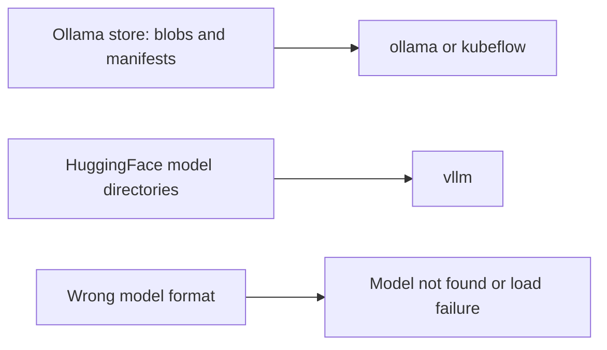

# QAGRedo Server Model Profiles

This guide maps QAGRedo runtime profiles to the three server roles:
greenserver, Opserver, and siteserver.

For the full documentation index and code layout, see **`docs/HANDOVER.md`**.

## Profile Decision Flow


What this shows: pick the profile by server constraints first, then pick
generator and judge model names in the matching `config/config.<profile>.yaml`.
Failure path: if model loading fails, confirm the model format matches the
profile before changing Python code.

## greenserver

greenserver is online and has 2x24GB VRAM. Prefer Ollama for newer GGUF models
because it can run newer model families more comfortably on this hardware.

Use host Ollama:

```bash
QAGREDO_PROFILE=ollama
ollama serve
ollama pull qwen3.5:9b
ollama pull llama3.1:8b-instruct-fp16
bash run.sh --show-config
bash run.sh -- --num-documents 2
```

Edit `config/config.ollama.yaml`:

```yaml
llm:
  provider: "ollama"
  model: "qwen3.5:9b"
judge:
  provider: "ollama"
  model: "llama3.1:8b-instruct-fp16"
```

Use vLLM on greenserver only for compatible smaller HuggingFace models, usually
Qwen or Llama models under 10B that your vLLM image can load.

## Opserver

Opserver is offline and has 2x24GB VRAM. Treat it as the air-gapped validation
server. Do not rely on pulls from Hugging Face or Ollama registries at run time.

For host Ollama offline testing:

```bash
bash setup_offline.sh --profile ollama
QAGREDO_PROFILE=ollama bash run.sh --show-config
QAGREDO_PROFILE=ollama bash run.sh -- --num-documents 2
```

Required artifacts:

- `qagredo_bundle.tar.gz`
- `qagredo-v1.tar`
- `models_ollama.tar.gz` or split `models_ollama_<tag>.tar.gz`

For an all-in-one container where Ollama runs inside QAGRedo:

```bash
bash setup_offline.sh --profile kubeflow
QAGREDO_PROFILE=kubeflow bash run.sh --show-config
QAGREDO_PROFILE=kubeflow bash run.sh -- --num-documents 2
```

Required artifacts:

- `qagredo_bundle.tar.gz`
- `qagredo-kubeflow.tar`
- `models_ollama.tar.gz` or split `models_ollama_<tag>.tar.gz`

Failure path: if the profile is `ollama`, `ollama` must already run on the host.
If the profile is `kubeflow`, `QAGREDO_MODELS_DIR` must point to an Ollama
store containing `blobs/` and `manifests/`. In this profile, `run.sh` reuses
the loaded image (no default rebuild) and keeps Ollama warm until
`bash run.sh --down`.

## siteserver

siteserver is offline and has 4 GPUs. Use it for the main performance comparison:
newer GGUF models through Ollama versus HuggingFace models through vLLM.

For Ollama comparison runs, use the same `ollama` or `kubeflow` guidance as
Opserver, but choose the newer model tags in `config/config.ollama.yaml` or
`config/config.kubeflow.yaml`.

For 4-GPU vLLM runs, use the siteserver compose override:

```bash
QAGREDO_PROFILE=vllm \
QAGREDO_VLLM_COMPOSE_EXTRA=docker-compose.vllm-siteserver.yml \
VLLM_TP_SIZE=2 \
VLLM_JUDGE_TP_SIZE=2 \
bash run.sh --show-config
```

Then run (pick one mode):

**Split** (start each vLLM service, then pipeline — same image on GPUs 0–1 and 2–3):

```bash
QAGREDO_PROFILE=vllm \
QAGREDO_VLLM_COMPOSE_EXTRA=docker-compose.vllm-siteserver.yml \
VLLM_TP_SIZE=2 VLLM_JUDGE_TP_SIZE=2 \
bash run.sh --vllm-up generator
bash run.sh --vllm-up judge
bash run.sh --pipeline-only --num-documents 2
```

**All-in-one:**

```bash
QAGREDO_PROFILE=vllm \
QAGREDO_VLLM_COMPOSE_EXTRA=docker-compose.vllm-siteserver.yml \
VLLM_TP_SIZE=2 VLLM_JUDGE_TP_SIZE=2 \
bash run.sh -- --num-documents 2
```

```bash
bash run.sh --minimise    # optional: minimal JSON from latest run (no vLLM rerun)
```

**Default 2-GPU siteserver** (no compose override): use the same split commands without
`QAGREDO_VLLM_COMPOSE_EXTRA` — generator on GPU 0, judge on GPU 1. Details: **`docs/Siteserver_vLLM_Change_Guide.md`** Part D.

The override maps:

- generator vLLM service to GPUs `0,1`
- judge vLLM service to GPUs `2,3`

`VLLM_TP_SIZE` must match the number of generator GPUs, and
`VLLM_JUDGE_TP_SIZE` must match the number of judge GPUs.

Required artifacts (build on online host under **`/data/tyewhong/qagredo/`**, then copy to siteserver):

- `qagredo_bundle.tar.gz`
- `qagredo-v1.tar`
- `vllm-qwen35-localcuda.rootfs.tar` (Qwen3.5 stack; `VLLM_IMAGE=qagredo-vllm:qwen35-localcuda`)
- `models_vllm.tar.gz`

On siteserver after copy: `docker load -i /data/tyewhong/qagredo/vllm-qwen35-localcuda.rootfs.tar` (and `qagredo-v1.tar` if needed). Runbook: **`docs/Siteserver_vLLM_Change_Guide.md`**.

Failure path: if vLLM reports `qwen3_5` or similar model-type errors, you need
`qagredo-vllm:qwen35-localcuda` (see `docs/Siteserver_vLLM_Change_Guide.md`), or
switch that test to Ollama, or use Qwen2.5 with the legacy `v0.5.3.post1` image.

## Model Format Rules



What this shows: Ollama archives and vLLM archives are not interchangeable.
Failure path: when a run fails before generation starts, check model format,
profile, and served model names first.

Build common offline artifact sets on the online/build machine:

```bash
# Opserver or siteserver Ollama package
bash scripts/make_offline_tarballs.sh --bundle --image-dev --models-ollama

# Opserver or siteserver in-container Ollama package
bash scripts/make_offline_tarballs.sh --bundle --image-kubeflow --models-ollama

# siteserver vLLM package
bash scripts/make_offline_tarballs.sh --bundle --image-dev --image-vllm --models-vllm
```

For size-limited transfers:

```bash
bash scripts/make_offline_tarballs.sh \
  --bundle --image-dev \
  --models-ollama-split=qwen3.5:9b,llama3.1:8b-instruct-fp16
```
