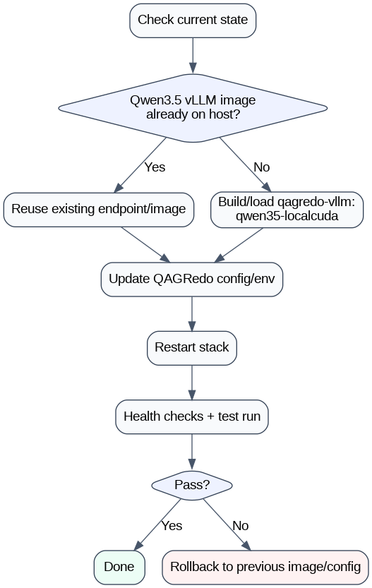

# Siteserver vLLM Change Guide (Detailed Runbook)

Goal: run QAG on siteserver with a **Qwen3.5-compatible** vLLM runtime (`qag-vllm:qwen35-localcuda`, based on vLLM **v0.17.1** + **Transformers 5.4+**), validate functionality, and keep a fast rollback path.

**Not current defaults:** `vllm/vllm-openai:v0.5.3.post1` (fails on `qwen3_5`). Retagging to a newer stock `vllm/vllm-openai` image (including **v0.17.x**) is not enough either — those images still ship Transformers 4.57.x, which does not register `qwen3_5`. Build the supported runtime with `bash scripts/docker_build_vllm_qwen35_compat.sh` (produces `qag-vllm:qwen35-localcuda`).

## Flow Diagram (Image)



## Key rule (most important)

- Changing `.env` / `config/*.yaml` controls endpoints, model names, and behavior.
- It does **not** change the vLLM binary version by itself.
- To use Qwen3.5 on vLLM, your runtime must be the **Qwen3.5 compat image** (`VLLM_IMAGE=qag-vllm:qwen35-localcuda` in `.env`) — not only a newer stock `vllm/vllm-openai` tag.

## Current standard (repo default)

| Item | Value |
|------|--------|
| `.env` `VLLM_IMAGE` | `qag-vllm:qwen35-localcuda` |
| Generator (GPU 0) | `Qwen3.5-9B` → `Qwen/Qwen3.5-9B` on port **7100** |
| Judge (GPU 1) | `Meta-Llama-3.1-8B-Instruct` on port **7101** |
| Compose flags (generator) | `--language-model-only`, `--enforce-eager` (see `docker-compose.vllm-stack.yml`) |
| Split startup | `bash run.sh --vllm-up generator` → `--vllm-up judge` → `bash run.sh --pipeline-only` |

Build / ship image (archives default to **`/data/tyewhong/qag/`** — see `QAG_ARCHIVE_DIR` in `.env`):

```bash
bash scripts/docker_build_vllm_qwen35_compat.sh
bash scripts/save_vllm_qwen35_image.sh
# writes /data/tyewhong/qag/vllm-qwen35-localcuda.rootfs.tar (+ .sha256)

# on siteserver (after rsync/scp from build host):
docker load -i /data/tyewhong/qag/vllm-qwen35-localcuda.rootfs.tar
```

Full offline package list and extract steps: **`docs/OFFLINE_SETUP_GUIDE.md`** · tarball build: **`bash scripts/make_offline_tarballs.sh`** (same output dir).

## Scope and assumptions

- You run QAG with `bash run.sh`.
- You use vLLM profile (`QAG_PROFILE=vllm`).
- Generator and judge are separate vLLM services (dual GPU by default).
- Models stay in the same shared folder (`QAG_MODELS_LLM_HOST`); runtime image and `.env` wiring must match Qwen3.5.

## What success looks like

- `run.sh --show-config` points to intended vLLM generator/judge endpoints.
- Compose (or external service) is truly on `qag-vllm:qwen35-localcuda`.
- One-document smoke run succeeds.
- Output JSON is produced without repeated generator/judge failures.

## Part A: Pre-change checklist

### A1) Capture current state (for rollback and diff)

Run and save outputs:

- `id -u && id -g`
- `docker ps`
- `docker images | rg -i vllm`
- `bash run.sh --show-config`
- `bash run.sh --status`

Backup files:

- `.env`
- `config/config.vllm.yaml`
- Any compose override used by vLLM profile:
  - `docker-compose.vllm-stack.yml`
  - `docker-compose.vllm-siteserver.yml` (if used)

Recommended backup command:

- `cp .env .env.bak.before-qwen35-vllm`
- `cp config/config.vllm.yaml config/config.vllm.yaml.bak.before-qwen35-vllm`

### A2) Confirm ownership settings

- Ensure `.env` has `HOST_UID` and `HOST_GID` matching `id -u` and `id -g` (offline siteserver: `1013` / `1015`).
- Keep `QAG_ALLOW_FOREIGN_OWNERSHIP` unset or `0` unless intentional.

### A3) Decide your switch path

Pick one:

- Path 1: existing `qag-vllm:qwen35-localcuda` service already running (external endpoint reuse).
- Path 2: existing `qag-vllm:qwen35-localcuda` image on siteserver (compose uses this image).
- Path 3: no local `qag-vllm:qwen35-localcuda` image/service (load/build first, then Path 2).

## Part B: Detailed procedures by path

## Path 1: Reuse already-running vLLM `qag-vllm:qwen35-localcuda` endpoint

Use when `qag-vllm:qwen35-localcuda` is known working in another code stack on same server.

### B1.1) Confirm endpoint health

- `curl -sf http://<gen-host>:<gen-port>/health`
- `curl -sf http://<judge-host>:<judge-port>/health`

If health endpoint differs in your service wrapper, use that wrapper’s check.

### B1.2) Update `config/config.vllm.yaml`

Set:

- `llm.base_url: http://<gen-host>:<gen-port>/v1`
- `judge.base_url: http://<judge-host>:<judge-port>/v1`
- `llm.model: <exact served generator model name>`
- `judge.model: <exact served judge model name>`

Keep provider fields consistent with your pipeline expectations.

### B1.3) Restart QAG runner cleanly

- `bash run.sh --down`
- `bash run.sh --show-config` (verify final values)
- Either split startup (Part **D1**) or `bash run.sh` (Part **D2**)

### B1.4) Validate

- Smoke test: Part **D1** (`--pipeline-only`) or Part **D2** (`bash run.sh -- --num-documents 1`)
- Check no repeated connection or model-not-found errors.

## Path 2: Use local compose with `qag-vllm:qwen35-localcuda` image

Use when image already exists locally but compose is launching older tag.

### B2.1) Identify the exact local image/tag

- `docker images | rg -i "vllm|qag-vllm:qwen35-localcuda"`

Record the exact tag you will use.

### B2.2) Update compose service image tags

In the compose file(s) used by vLLM profile, set generator/judge image tags to your `qag-vllm:qwen35-localcuda` image tag.

If using override via `.env`:

- `QAG_VLLM_COMPOSE_EXTRA=docker-compose.vllm-siteserver.yml`

ensure the override references `qag-vllm:qwen35-localcuda` image tags.

### B2.3) Align `config/config.vllm.yaml`

Set base URLs to match exposed service ports and set model names to served names.

### B2.4) Restart

- `bash run.sh --down`
- `bash run.sh --status`
- `bash run.sh --show-config`
- Start vLLM: Part **D1** (split) or `bash run.sh` (Part **D2**)

### B2.5) Validate

- Health:
  - `curl -sf http://localhost:7100/health`
  - `curl -sf http://localhost:7101/health`
- Smoke run: Part **D1** or **D2**

## Path 3: `qag-vllm:qwen35-localcuda` not available locally

### B3.1) Obtain runtime

Either:

- Load image tar that contains `qag-vllm:qwen35-localcuda` (e.g. `docker load -i /data/tyewhong/qag/vllm-qwen35-localcuda.rootfs.tar`), or
- Build: `bash scripts/docker_build_vllm_qwen35_compat.sh` (produces `qag-vllm:qwen35-localcuda`), or export with `bash scripts/save_vllm_qwen35_image.sh` (writes under `/data/tyewhong/qag/` by default).

### B3.2) Verify image exists

- `docker images | rg -i "vllm|qag-vllm:qwen35-localcuda"`

Then continue with Path 2.

## Special scenario you asked: `qag-vllm:qwen35-localcuda` not running now, but tested elsewhere

Yes, you can switch and run via `run.sh` if:

- You point QAG to that already-tested `qag-vllm:qwen35-localcuda` runtime (external endpoint), or
- You make compose launch a local `qag-vllm:qwen35-localcuda` image.

You cannot activate `qag-vllm:qwen35-localcuda` by config only if compose still launches old runtime.

## Part C: Exact config mapping checklist

Before run:

- `.env`
  - `QAG_PROFILE=vllm`
  - `HOST_UID=<id -u>`
  - `HOST_GID=<id -g>`
  - optional: `QAG_VLLM_COMPOSE_EXTRA=<override file>` if required

- `config/config.vllm.yaml`
  - `llm.base_url` ends with `/v1`
  - `judge.base_url` ends with `/v1`
  - `llm.model` exact served generator model name
  - `judge.model` exact served judge model name

- Compose
  - generator image is `qag-vllm:qwen35-localcuda`
  - judge image is `qag-vllm:qwen35-localcuda` (if judge uses vLLM)

## Part D: End-to-end execution sequence

1. Backup config files.
2. Apply runtime wiring change (external endpoint or image tag).
3. Update `config/config.vllm.yaml`.
4. `bash run.sh --down`
5. `bash run.sh --status`
6. `bash run.sh --show-config`
   - Must report `config/config.vllm.yaml`; if it reports the redserver YAML,
     save `.env` and clear the redserver override block/shell exports.
7. **Smoke test** — pick **one** run mode (see below).
8. Review output under `output/vllm/<model>/<timestamp>/`.
9. Optional post-run (no vLLM needed): `bash run.sh --summarize --latest --json` (run-wide stats → `run_summary.json` in that folder).
10. Optional: `bash run.sh --minimise` (or `--minimise "<that_run_dir>"`) for per-doc minimal outputs, quality split files, LoRA SFT, and conditional retry-based DPO.
11. Optional: `bash run.sh --minimise-good` / `--minimise-bad` when you only want one side of the split.
12. Optional: `bash run.sh --finetune-lora "<that_run_dir>"` after `--down` to train a LoRA adapter on the host (base model read-only).
13. Run normal workload; repeat steps 9–12 after large runs if you need handoff files.

### D1) Split startup (recommended on siteserver — GPU 0 generator, GPU 1 judge)

Start each vLLM container separately, then run the pipeline only (no second vLLM start):

```bash
bash run.sh --vllm-up generator          # Qwen3.5 on GPU 0, port 7100 — wait until healthy
bash run.sh --vllm-up judge            # Llama 3.1 on GPU 1, port 7101 — wait until healthy
bash run.sh --pipeline-only --num-documents 1
```

Full run after smoke test (vLLM already up):

```bash
bash run.sh --pipeline-only --num-documents 10
```

Other useful flags (same as `bash run.sh --help`):

| Command | When to use |
|---------|-------------|
| `bash run.sh --vllm-up all` | Start generator + judge in one step (like default `bash run.sh` vLLM phase) |
| `bash run.sh --status` | Check compose + `:7100` / `:7101` health |
| `bash run.sh --logs` | Tail vLLM / pipeline logs |
| `bash run.sh --down` | Stop all services |
| `bash run.sh --minimise` | Write minimal/split files, SFT, and conditional gate-passing retry DPO |
| `bash run.sh --finetune-lora "<run_dir>"` | Host LoRA SFT (adapter only; stop vLLM first) |
| `bash run.sh --minimise "<run_dir>"` | Same, for a specific run folder under `output/vllm/.../` |
| `bash run.sh --minimise-good` | Export only per-doc `*_analysis_minimal_good_pairs.json` from existing `*_analysis.json` |
| `bash run.sh --minimise-bad` | Export only per-doc `*_analysis_minimal_bad_pairs.json` from existing `*_analysis.json` |
| `bash run.sh --summarize --latest` | Print a text summary of the latest run to the terminal (grades, grounded/ungrounded counts, timings) |
| `bash run.sh --summarize --latest --json` | Same, and save **`run_summary.json`** next to the `*_analysis.json` files (under `output/vllm/<model>/<timestamp>/`) |
| `bash run.sh --summarize --all` | Summarise every date folder under `output/` (combined view) |
| `bash run.sh --summarize --json output/vllm/.../<timestamp>/` | Summarise one explicit run folder (omit `--latest` when the path is known) |
| `bash run.sh --pipeline-only -- --resume` | Skip docs with existing `*_analysis.json`; reuse latest run folder under `output/`. |
| `bash run.sh --pipeline-only -- --skip-existing-outputs` | Skip already-processed docs; write new outputs to a new timestamp folder. |

**Post-run summarise (recommended after smoke or batch runs):**

```bash
# terminal summary only
bash run.sh --summarize --latest

# terminal summary + run_summary.json for sharing / dashboards
bash run.sh --summarize --latest --json
```

Does not restart vLLM or rerun the pipeline. Equivalent direct script:

```bash
bash scripts/utils/summarize_run.sh --latest --json
```

### D2) All-in-one (single command starts vLLM + pipeline)

```bash
bash run.sh -- --num-documents 1
```

(`--` passes `--num-documents` to the pipeline; omit it for config default.)

Normal workload:

```bash
bash run.sh -- --num-documents 10
```

## Part E: Verification matrix

Check these in order:

- Connectivity:
  - generator endpoint reachable
  - judge endpoint reachable
- Model resolution:
  - no `model not found` errors
- Runtime behavior:
  - no repeated 5xx / timeout loops
- Pipeline outcome:
  - analysis JSON generated
  - grading present
  - no persistent fallback warnings

## Part F: Troubleshooting quick map

- Symptom: health ok, but pipeline fails immediately
  - likely model name mismatch in `config/config.vllm.yaml`

- Symptom: config updated, but logs still show old runtime behavior
  - compose still using old image tag

- Symptom: passes preflight, fails during grading only
  - judge endpoint/model mismatch, generator may be fine

- Symptom: permission warnings or write failures
  - UID/GID mismatch; fix `.env` `HOST_UID`/`HOST_GID`

- Symptom: works in one stack, fails in QAG
  - endpoint path mismatch (`/v1`) or different served model alias

## Part G: Rollback plan (ready before change)

Rollback triggers:

- repeated generator/judge failures after config correction
- incompatible runtime behavior
- unstable response under smoke test

Rollback steps:

1. Restore `.env` backup.
2. Restore `config/config.vllm.yaml` backup.
3. Restore compose image tags (if changed).
4. `bash run.sh --down && bash run.sh`
5. Smoke test `--num-documents 1`.

## Part H: Print-friendly operator checklist

- [ ] Backup `.env` and `config/config.vllm.yaml`
- [ ] Confirm `QAG_PROFILE=vllm`
- [ ] Confirm redserver config/URL overrides are commented or unset
- [ ] Confirm correct UID/GID values
- [ ] Confirm `qag-vllm:qwen35-localcuda` runtime source (external endpoint or local image)
- [ ] Update compose image tags if needed
- [ ] Update `llm.base_url` / `judge.base_url`
- [ ] Update `llm.model` / `judge.model`
- [ ] Run restart sequence (`--down`, `--status`, `--show-config`, then Part **D1** or **D2**)
- [ ] Validate output and logs
- [ ] Optional: `bash run.sh --summarize --latest --json` for `run_summary.json` (no pipeline rerun)
- [ ] Optional: `bash run.sh --minimise` for minimal/split files + LoRA SFT/conditional DPO (no pipeline rerun)
- [ ] Optional: `bash run.sh --minimise-good` / `--minimise-bad` when only one split side is needed (no pipeline rerun)
- [ ] Keep rollback artifacts until completion sign-off

## Part I: Where to change GPU count, GPU devices, model path, and input data path

This section answers exactly where to edit for siteserver operations.

### I1) Change to 4 GPUs (vLLM tensor parallel / capacity)

Primary places:

- `.env`
  - `QAG_GPU_COUNT=4` (overall GPU request used by profile stack)
  - `VLLM_TP_SIZE=2` and `VLLM_JUDGE_TP_SIZE=2` for 4-GPU split (2 for generator, 2 for judge), or choose your intended split
  - `QAG_VLLM_COMPOSE_EXTRA=docker-compose.vllm-siteserver.yml` (recommended when using 4-GPU override compose file)

- Compose override file (usually `docker-compose.vllm-siteserver.yml`)
  - Set per-service GPU device mapping (`device_ids`) to explicit GPU indices
  - Ensure generator and judge services each get the intended GPUs

Recommended validation:

- `bash run.sh --show-config`
- `bash run.sh --status`
- `docker compose -f docker-compose.vllm-stack.yml -f docker-compose.vllm-siteserver.yml config` (inspect rendered final config)

### I2) Change which GPU devices are used (the GPU itself)

Where to edit:

- `docker-compose.vllm-siteserver.yml` (or whichever compose file is active)
  - In each vLLM service (`vllm`, `vllm-judge`), edit GPU device selectors (`device_ids`)
  - Example strategy:
    - generator -> GPUs `0,1`
    - judge -> GPUs `2,3`

Notes:

- Keep device mapping non-overlapping unless intentionally sharing.
- If the server has MIG or custom scheduling, follow site GPU policy.

### I3) Change model paths

Depends on profile:

- vLLM profile:
  - `.env`:
    - `VLLM_MODEL` (generator model path)
    - `VLLM_JUDGE_MODEL` (judge model path)
  - Ensure path exists on host and is mounted/visible in container according to compose.

- kubeflow profile:
  - `.env`:
    - `QAG_MODELS_DIR=<host-model-dir>`
  - This mounts into container at `/opt/ollama/models` per current stack.

Model name alignment:

- `config/config.vllm.yaml` `llm.model` / `judge.model` must match served model names.
- Paths define what runtime loads; config model names define what pipeline requests.

### I4) Change input data path

Primary location:

- `.env`
  - `DATA_DIR=<host-input-folder>`
  - or use shortcut variables already supported by `run.sh`:
    - `QAG_DATA_DIR`
    - `QAG_OFFLINE_HOST` + `QAG_OFFLINE_INPUT`

How pipeline reads files:

- `run.sh` maps host `DATA_DIR` to container `/workspace/data`.
- Actual file selection is controlled in profile YAML:
  - `config/config.vllm.yaml` -> `run.input_file` or `run.input_folder`.

So input path setup has two layers:

1. `.env` points mount root (`DATA_DIR`).
2. `config/config.vllm.yaml` chooses file(s) under that mounted root.

### I5) Quick examples (copy pattern)

- 4-GPU with siteserver override:
  - `.env`: `QAG_VLLM_COMPOSE_EXTRA=docker-compose.vllm-siteserver.yml`
  - `.env`: `QAG_GPU_COUNT=4`
  - `.env`: `VLLM_TP_SIZE=2`
  - `.env`: `VLLM_JUDGE_TP_SIZE=2`

- Model paths:
  - `.env`: `VLLM_MODEL=/models/<generator-model-dir>`
  - `.env`: `VLLM_JUDGE_MODEL=/models/<judge-model-dir>`

- Input path:
  - `.env`: `DATA_DIR=/data/local/tyewhong/Data/json`
  - `config/config.vllm.yaml`: `run.input_file: your_input.jsonl`

### I6) Restart after any of these changes

Always apply with clean restart:

1. `bash run.sh --down`
2. `bash run.sh --show-config`
3. `bash run.sh --status`
4. Smoke test: Part **D1** (split) or Part **D2** (all-in-one)

If behavior is not as expected, check rendered compose + logs before changing more settings.
