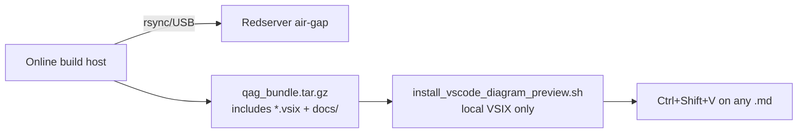
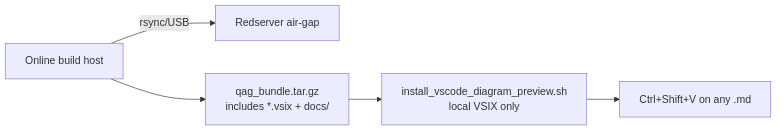

# Viewing flowcharts in all Markdown files (offline / redserver)

**Redserver has no internet.** Everything below runs **air-gapped** — no
Marketplace, no `curl`, no mermaid.live. The VS Code extension ships **inside**
`qag_bundle.tar.gz` (built on the online machine).






| Step | Where | Internet? |
|------|--------|-----------|
| Download VSIX | **Build host only** | Yes (once, when building bundle) |
| Copy `qag_bundle.tar.gz` | USB / rsync → `/home/tyewhong/qag/` on Opserver/Redserver | No |
| `install_vscode_diagram_preview.sh` | Redserver | **No** |
| Open Markdown preview | Redserver VS Code | **No** |

QAG docs use two diagram styles:

| Style | Where | VS Code preview |
|-------|--------|-----------------|
| **Mermaid** | ` ```mermaid ` blocks in most `.md` files | Needs **one-time** extension setup below |
| **PNG** | `` or `*_flow_NN.png` below each Mermaid block | **Default** preview — no extension |

Every active `docs/**/*.md` file ships a **PNG directly under each Mermaid
block** so charts are visible without the VSIX. Regenerate after editing Mermaid:

```bash
python3 scripts/utils/render_mermaid_png_fallbacks.py
```

After one-time VSIX setup, Mermaid blocks also render interactively in preview
(`Ctrl+Shift+V` / `Cmd+Shift+V`).

---

## VS Code on Windows (Opserver / Redserver have no internet)

Linux paths like `/home/tyewhong/qag/qag_host` are **not visible** to VS Code
running locally on Windows. Use **Remote-SSH** or **copy the VSIX to Windows**.

| Approach | Install VSIX from | Open markdown from |
|----------|-------------------|-------------------|
| **Remote-SSH** | Remote path `qag_host/docs/vscode-extensions/*.vsix` | Remote `qag_host/docs/` |
| **Local Windows** | `C:\...\bierner.markdown-mermaid-*.vsix` (copied via USB/scp) | Copied `docs\` folder on PC |

See **§1.6** in [`OFFLINE_SETUP_GUIDE.md`](OFFLINE_SETUP_GUIDE.md) for step-by-step.

**Remote-SSH:** install **Remote - SSH** on Windows while online (one-time).
After connecting, **Install from VSIX** on the SSH session and choose **Install
in SSH** when prompted.

**Local Windows:** copy only the `.vsix` (~11 MB) from `qag_bundle.tar.gz`
(7-Zip) or USB; Install from VSIX locally; open a copied `docs/` folder.

---

## One-time setup on Linux server (no internet)

**Prerequisite:** your `qag_bundle.tar.gz` must include the VSIX. On the build
host before copying to redserver:

```bash
bash scripts/offline/fetch_vscode_mermaid_vsix.sh   # online build host only
bash scripts/make_qag_bundle.sh
```

Check the archive (on either host):

```bash
tar tzf /data/tyewhong/qag/qag_bundle.tar.gz \
  | grep 'docs/vscode-extensions/.*\.vsix'
# expect: qag_host/docs/vscode-extensions/bierner.markdown-mermaid-....vsix
```

On **Opserver / Redserver** (offline):

```bash
tar xzf /home/tyewhong/qag/qag_bundle.tar.gz -C /home/tyewhong/qag
cd /home/tyewhong/qag/qag_host
bash scripts/offline/install_vscode_diagram_preview.sh
```

Do **not** use VS Code **Install Extension** from Marketplace on redserver —
use **Install from VSIX** (the script does this automatically).

This script:

1. Copies `docs/vscode-extensions/extensions.json` → `.vscode/`
2. Copies `docs/vscode-extensions/settings.json` → `.vscode/`
3. Installs `docs/vscode-extensions/bierner.markdown-mermaid-*.vsix`

**Important:** open **`qag_host`** as the VS Code folder (File → Open Folder).
Preview resolves workspace settings from that root.

Restart VS Code if preview still shows raw Mermaid text.

---

## Manual install (if the script has no `code` CLI)

1. Open VS Code → **Extensions** → **⋯** → **Install from VSIX**
2. Choose:
   `qag_host/docs/vscode-extensions/bierner.markdown-mermaid-*.vsix`
3. Copy workspace files:
   ```bash
   cd /home/tyewhong/qag/qag_host
   mkdir -p .vscode
   cp docs/vscode-extensions/extensions.json .vscode/
   cp docs/vscode-extensions/settings.json .vscode/
   ```
4. Reload window (**Developer: Reload Window**).

---

## Daily use

```text
Open docs/OFFLINE_SETUP_GUIDE.md  (or any .md)
        ↓
Ctrl+Shift+V  →  Markdown Preview
        ↓
Mermaid blocks render as flowcharts
PNG images render as pictures
```

Side-by-side: `Ctrl+K V` (preview to the side).

---

## Which docs have Mermaid?

Common files (not exhaustive):

| File | Diagrams |
|------|----------|
| `docs/OFFLINE_SETUP_GUIDE.md` | Host pick, install order, Opserver/Redserver |
| `docs/HANDOVER.md` | Pipeline overview |
| `docs/SERVER_MODEL_PROFILES.md` | Server → profile |
| `docs/REDSERVER_ONSITE_SETUP.md` | Redserver startup |
| `docs/ALGORITHM_REPORT.md` | Slot loop, pipeline stages |
| `config/README.md` | Config selection |

`docs/OFFLINE_SETUP_GUIDE.md` also ships a **PNG** copy of the host-pick chart
(`offline_host_pick.png`) for preview **without** the extension.

---

## Build host: refresh the VSIX (online)

When the bundle is rebuilt on the online machine:

```bash
bash scripts/offline/fetch_vscode_mermaid_vsix.sh
bash scripts/make_qag_bundle.sh
```

Copy the new `qag_bundle.tar.gz` to redserver; re-run
`install_vscode_diagram_preview.sh` only if the VSIX version changed.

---

## Troubleshooting

| Symptom | Fix |
|---------|-----|
| See `flowchart TD` text, not a picture | Install Mermaid extension (above); use **Preview**, not raw editor |
| PNG broken in preview | Open `qag_host` folder; path is relative to the `.md` file |
| Extension install blocked offline | Use **Install from VSIX** (bundled under `docs/vscode-extensions/`) |
| Works in Cursor, not VS Code | Same VSIX works in VS Code; Cursor has built-in Mermaid |

**QAG pipeline does not require any of this** — diagrams are documentation only.
