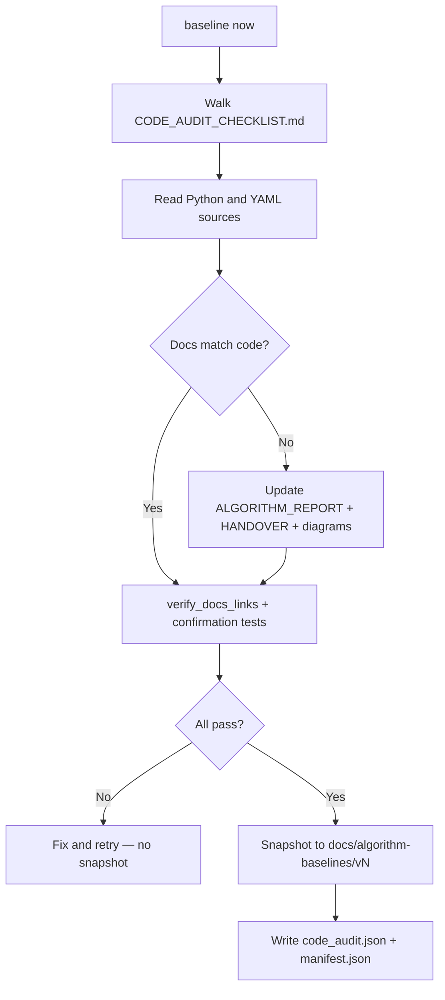
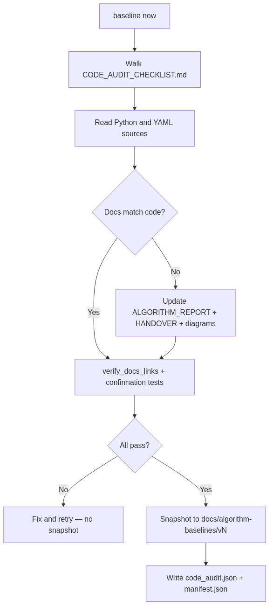
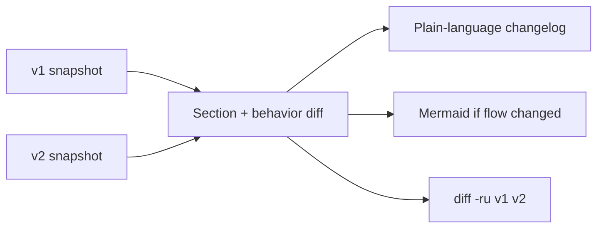
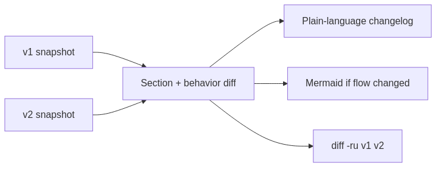

# Algorithm baselines

Versioned, **code-verified** snapshots of pipeline algorithm documentation.
Use this when you finish an upgrade and need a trustworthy record of what the
pipeline does—and what changed between releases.

## When to use

| Situation | Action |
|-----------|--------|
| Finished a pipeline or algorithm upgrade | Say **baseline now** in Cursor |
| Need to see what changed since last release | **compare baseline v1 and v2** |
| Onboarding and unsure docs match code | Read latest `vN/` or run **baseline now** |

## Workflow






The agent **reads code first**, updates live docs where needed, runs tests, then
snapshots. A baseline is not a blind copy of whatever was already written.

## Trigger phrases (Cursor)

| Phrase | Result |
|--------|--------|
| **baseline now** | Code audit → doc sync → tests → next `vN` |
| **list baselines** | Show [`INDEX.md`](INDEX.md) |
| **compare baseline v1 and v2** | Structured changelog between versions |
| **baseline snapshot only** | Copy without audit (rare; typos already verified) |

Rule: [`.cursor/rules/algorithm-baseline.mdc`](../../.cursor/rules/algorithm-baseline.mdc)

## What each version contains

| Path in `vN/` | Source |
|---------------|--------|
| `ALGORITHM_REPORT.md` | `docs/ALGORITHM_REPORT.md` |
| `HANDOVER.md` | `docs/HANDOVER.md` |
| `diagrams/qag_grading_test_flow.*` | `docs/qag_grading_test_flow.*` |
| `diagrams/qag_input_prep_explained_16x9.png` | if present |
| `diagrams/architecture/diagrams/QAG_Pipeline_Flowchart.*` | pipeline flowchart |
| `diagrams/architecture/diagrams/qag_sequence_final_7step.*` | sequence diagram |
| `manifest.json` | file checksums, date, git commit, summary |
| `code_audit.json` | code files read, doc edits, test results |

Excluded from bundle: `siteserver_vllm_change_flow.*`, `network_docker_compose*`
(ops/deployment diagrams, not core algorithm).

## Compare two versions






Comparison covers: `ALGORITHM_REPORT.md` section map, HANDOVER algorithm
sections (What this system does, Change points, Code map, Release checks,
Diagram sources), and `code_audit.json` edit lists from both versions.

## Manual commands

```bash
# After the agent completes the code audit and doc edits:
bash scripts/snapshot_algorithm_baseline.sh --create --summary "after slot-loop upgrade"
bash scripts/snapshot_algorithm_baseline.sh --list
bash scripts/snapshot_algorithm_baseline.sh --diff v1 v2
```

Confirmation tests (required before snapshot):

```bash
python3 scripts/verify_docs_links.py
python3 -m unittest discover -s tests -p 'test_*.py'
```

See [`CODE_AUDIT_CHECKLIST.md`](CODE_AUDIT_CHECKLIST.md) for the full code-to-doc
walk-through and minimum test subset.

## Related files

| File | Role |
|------|------|
| [`CODE_AUDIT_CHECKLIST.md`](CODE_AUDIT_CHECKLIST.md) | Required audit rows before each baseline |
| [`INDEX.md`](INDEX.md) | Version registry |
| [`scripts/snapshot_algorithm_baseline.sh`](../../scripts/snapshot_algorithm_baseline.sh) | Verify links, copy bundle, diff |
