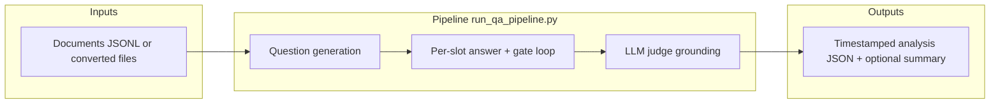
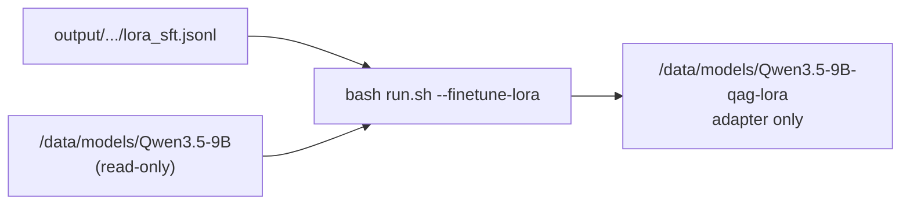
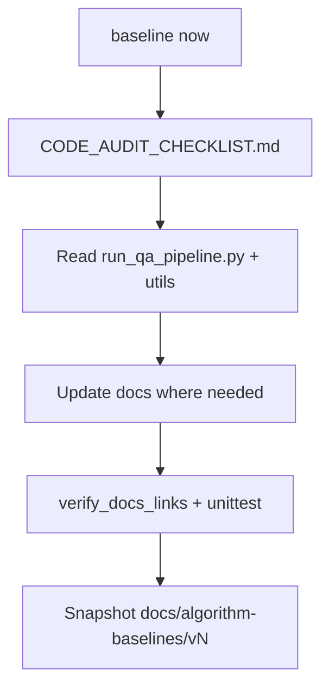

# QAG — Maintainer handover

This document is the maintainer cheat sheet: what the system does, where to change behavior, and what to verify before release. Keep it updated when architecture or entrypoints change.

> **Flowcharts:** each ` ```mermaid ` block has a **PNG** directly below it
> (visible in any Markdown preview). Use `Ctrl+Shift+V` for live Mermaid if the
> VSIX is installed (see [`VIEWING_DIAGRAMS_OFFLINE.md`](VIEWING_DIAGRAMS_OFFLINE.md)).

## What this system does




| Stage | Role |
|-------|------|
| **Generator LLM** | Produces questions (multi-type) and answers from each document. |
| **Slot loop** | Per slot: answerability pre-check, answer retries, judge gate, optional same-question DPO capture on pass, or replacement question on failure. |
| **Judge LLM** | Separate model/config — verifies answers against the document (reduces self-evaluation bias). |
| **Grading** | **LLM judge** (default in profile configs). Legacy `semantic` / `hybrid` config values no longer load embedding models. |

Failure path: if the judge is unreachable or returns invalid output where required, the pipeline fails fast (no silent downgrade by default).

**Behavioral flowcharts:** stage overview above is happy-path only. Per-stage
charts with retries and failure branches are in
[`ALGORITHM_REPORT.md`](ALGORITHM_REPORT.md) §2.5–§7 (grounding,
comprehensiveness, answerability, slot loop, coverage, judge, output).

---

## First read order

For day-one orientation, read in this order:

| Order | Document | Purpose |
|-------|----------|---------|
| 1 | `docs/README.md` | Docs hub by role. |
| 1b | `docs/ARCHITECTURE.md` | **Technical lead:** system design, profiles, data + ML lifecycle. |
| 2 | `README.md` | Quick start, profiles, tarball commands. |
| 3 | `docs/SERVER_MODEL_PROFILES.md` | Server-to-profile mapping. |
| 4 | `docs/OFFLINE_SETUP_GUIDE.md` | Offline host setup and operations. |
| 4b | `docs/REDSERVER_ONSITE_SETUP.md` | Redserver orchestrator-only bring-up. |
| 4c | `docs/REDSERVER_CODE_ONLY_UPDATE.md` | Redserver code-only refresh and rollback. |
| 5 | `docs/ONLINE_SETUP_GUIDE.md` | Build machine and archive workflow. |
| 5b | `docs/Siteserver_vLLM_Change_Guide.md` | vLLM / Qwen3.5 on siteserver (when `QAG_PROFILE=vllm`). |
| 6 | `docs/architecture/NETWORK_DIAGRAM.md` | Host/container URLs and ports. |
| 7 | `docs/ALGORITHM_REPORT.md` | Pipeline algorithm and design rationale. |
| 7b | `docs/algorithm-baselines/README.md` | Code-verified doc snapshots; say **baseline now** after upgrades. |
| 8 | `docs/KUBEFLOW_DEPLOY.md` | `kubeflow` profile only. |

Visual overview docs: `docs/QAG_Management_Overview.html` (profiles + resume), `docs/QAG_Pipeline_Flowchart_Drawn.html`, `docs/architecture/diagrams/QAG_Sequence_Final_7step_VIEW_IN_BROWSER.html`. Regenerate PPTX from `scripts/utils/build_*.py`; pipeline HTML via `scripts/utils/_rewrite_drawn_flowchart_html.py`; PNG from `.dot` sources (see `docs/README.md`).

---

## 30-minute handover walkthrough (what to say)

For a **technical lead** presentation, start with
[`ARCHITECTURE.md`](ARCHITECTURE.md) §15 (20-minute script) instead of this
shorter list.

1. **Problem** — Turn documents into grounded Q&A pairs with a **separate judge** model (not self-grading).
2. **Profiles** — `.env` → `QAG_PROFILE` (`ollama` | `kubeflow` | `vllm`);
   local vLLM leaves all external-vLLM variables unset, while redserver sets
   the config override, both base URLs, and compose extra. Edit only the YAML
   reported by `bash run.sh --show-config` (see `config/README.md`).
3. **Offline bring-up** — Copy archives from `/data/tyewhong/qag/`; follow [`REDSERVER_ONSITE_SETUP.md`](REDSERVER_ONSITE_SETUP.md) (redserver) or [`OFFLINE_SETUP_GUIDE.md`](OFFLINE_SETUP_GUIDE.md) (generic).
4. **vLLM daily ops** — local hosts start generator + judge with `--vllm-up`;
   redserver uses gpuserver and runs `--pipeline-only` only.
5. **Outputs** — `output/<provider>/<model>/<timestamp>/doc_*_analysis.json`; post-run `--minimise`, `--summarize`, and optional `--finetune-lora`.
6. **Where to change** — Models/counts in profile YAML; paths in `.env`; algorithm details in `ALGORITHM_REPORT.md`.

Stakeholder deck: open `docs/QAG_Management_Overview.html` in a browser.

---

## Operator cheat sheet (vLLM)

**Opserver (local vLLM on same host):**

```bash
bash run.sh --show-config  # must report config/config.vllm.yaml
bash run.sh --status
bash run.sh --vllm-up generator
bash run.sh --vllm-up judge
bash run.sh --pipeline-only --resume --num-documents 100
bash run.sh --minimise "output/vllm/qwen-qwen3.5-9b/2026-05-28_145345"
bash run.sh --summarize "output/vllm/qwen-qwen3.5-9b/2026-05-28_145345" --json
# Optional: train LoRA adapter (stop vLLM first; base model stays read-only)
bash run.sh --finetune-lora "output/vllm/qwen-qwen3.5-9b/2026-05-28_145345"
```

**Redserver (external vLLM on gpuserver — do not use `--vllm-up`):**

```bash
bash run.sh --show-config  # must report config/config.vllm.redserver.yaml
bash run.sh --pipeline-only --num-documents 1
bash run.sh --pipeline-only --resume --parallel-documents 2 --num-documents 100
# Optional finetune (§8.5): bash run.sh --down && bash run.sh --finetune-lora [RUN_DIR]
```

See [`REDSERVER_ONSITE_SETUP.md`](REDSERVER_ONSITE_SETUP.md) for archives, input
path (`QAG_DATA_DIR`), finetune (§8.5), and full checklist.

If a local run still checks `gpuserver:52328`, save `.env` and unset
`QAG_VLLM_CONFIG_FILE`, `VLLM_BASE_URL`, `VLLM_JUDGE_BASE_URL`, and
`QAG_VLLM_COMPOSE_EXTRA` in that terminal. Shell-exported values override
`.env`. If `--pipeline-only` checks local `:7100` and fails, start the local
generator and judge with `--vllm-up`. On Redserver, fix gpuserver endpoints
instead.

---

## Runtime profiles (`QAG_PROFILE`)

Selection is **profile-based** — set `QAG_PROFILE` in `.env` (`ollama` | `kubeflow` | `vllm`).

| Profile | Compose | LLM backend |
|---------|---------|-------------|
| `ollama` | `docker-compose.yml` | **Host Ollama** — `ollama` must exist on the host. |
| `kubeflow` | `docker-compose.kubeflow.yml` | **In-container Ollama** — image `qag-kubeflow`; models on disk via `QAG_MODELS_DIR`; `run.sh` reuses loaded image and keeps a warm container until `run.sh --down`. |
| `vllm` (local) | `docker-compose.vllm-stack.yml` (+ optional siteserver extra) | Two local vLLM services on `:7100` / `:7101`; use `config.vllm.yaml` and `--vllm-up`. |
| `vllm` (redserver external) | `docker-compose.vllm-redserver.yml` | Orchestrator calls gpuserver `:52328` / `:53366`; use `config.vllm.redserver.yaml` and never `--vllm-up`. |

Match **Ollama store** (`blobs/`, `manifests/`) to `ollama`/`kubeflow`; match **HF directories** to `vllm`. Formats are not interchangeable.

---

## Change points

| Concern | Primary location |
|---------|------------------|
| Which config file to edit | `config/README.md` |
| Profile, data paths, UID/GID, model roots | `.env` |
| Model tags, question counts, YAML tuning | Active YAML printed by `bash run.sh --show-config` |
| Generator vs judge **env overrides** (optional) | `.env` — `OLLAMA_*`, `OLLAMA_JUDGE_*`, `VLLM_*`, `VLLM_JUDGE_*`, etc. (see `utils/config_manager.py`) |
| vLLM GPU mapping (2-GPU default) | `docker-compose.vllm-stack.yml` |
| 4-GPU split (siteserver) | `QAG_VLLM_COMPOSE_EXTRA=docker-compose.vllm-siteserver.yml` + `.env` TP sizes |
| External vLLM (redserver) | Config override + both base URLs + `QAG_VLLM_COMPOSE_EXTRA=docker-compose.vllm-redserver.yml` |

There are three standard profile YAMLs plus the redserver vLLM variant.
Confirm the selected file with `bash run.sh --show-config` or open it with
`bash run.sh --edit-config`.

---

## Code map

| Area | Path | Notes |
|------|------|------|
| CLI entry | `run_qa_pipeline.py` | Loads YAML, drives document loop. |
| Config merge / env | `utils/config_manager.py` | Profile YAML + environment overrides (generator + judge). |
| Questions | `utils/question_generator.py` | Types, comprehensiveness, Ollama native chat when needed. |
| Answers | `utils/answer_generator.py` | Structured answers, retries. |
| Judge | `utils/hallucination_checker.py` | Routes by `judge.provider` (Ollama native vs OpenAI-compatible). |
| Ollama detection | `utils/ollama_urls.py` | URL helpers. |
| Host entry | `run.sh` | Profile launcher; shortcuts `--down`, `--status`, `--logs`, `--show-config`, `--minimise`, `--finetune-lora`, `--resume` / `--skip-existing-outputs`; local vLLM startup: `Siteserver_vLLM_Change_Guide.md` Part D; redserver external vLLM: `REDSERVER_ONSITE_SETUP.md` §8. |
| LoRA finetune | `scripts/lora/train_qwen_lora.sh` | Host-side fp16/QLoRA SFT from `lora_sft.jsonl`; adapter-only (Option A). |
| DPO finetune | `scripts/lora/train_qwen_dpo.sh` | Preference tune from `lora_dpo.jsonl` on top of SFT adapter. |

Tests live in `tests/`; `tests/test_backend_selection.py` covers provider routing.

---

## Offline artifacts

| Artifact | Role |
|----------|------|
| `qag_bundle.tar.gz` | Code + compose + configs + `scripts/lora/` into `qag_host/` (from `scripts/make_qag_bundle.sh`). |
| `qag-v1.tar` | Default runner image for `ollama` / `vllm`. |
| `qag-kubeflow.tar` | All-in-one image for `kubeflow`. |
| `models_ollama*.tar.gz` | Ollama model store. |
| `models_vllm*.tar.gz` | HF trees for vLLM (combined or per-model split). |
| `vllm-qwen35-localcuda.rootfs.tar` | Qwen3.5-compatible vLLM image (`VLLM_IMAGE=qag-vllm:qwen35-localcuda`). |

**Redserver minimum (pipeline only):** `qag_bundle.tar.gz` plus `qag-v1.tar`
only when the runner image is missing or old. Skip `vllm-*.tar` and
`models_vllm*.tar.gz` for inference — those stay on gpuserver.

**Redserver finetune add-on:** the bundle includes `scripts/lora/`. Also copy
`models_vllm_Qwen3_5-9B.tar.gz` (generator HF weights to `/data/models`) and
pre-built `lora_venv.tar.gz` for offline pip. See
[`REDSERVER_ONSITE_SETUP.md`](REDSERVER_ONSITE_SETUP.md) §8.5.

**Archive staging (build host):** `/data/tyewhong/qag/` (`QAG_ARCHIVE_DIR` in `.env`).
Active profile bundles live in that directory **root**. Retired or other-profile
archives may be parked in `zz_old_qag/` (move back to root before offline
deploy). Legacy path `/data/tyewhong/qagredo/` is deprecated — use
`bash scripts/migrate_archive_dir.sh --execute` once if old files remain there.

Build with `bash scripts/make_offline_tarballs.sh --all` (default output:
`/data/tyewhong/qag/`; set `QAG_ARCHIVE_DIR` / `QAG_OFFLINE_OUT` to override).

---

## Diagram sources

| Format | Location |
|--------|----------|
| Graphviz | `docs/*.dot`, `docs/architecture/diagrams/*.dot` (including `offline_host_pick.dot`, `opserver_vllm_local.dot`, and `redserver_vllm_external.dot`) |
| PlantUML | `docs/architecture/diagrams/QAG_Pipeline_Flowchart.puml` |
| Regenerate PNG | `dot -Tpng docs/architecture/diagrams/network_docker_compose_ollama.dot -o docs/architecture/diagrams/network_docker_compose_ollama.png` |
| Verify doc images | `python3 scripts/verify_docs_links.py` |

Raster assets live next to sources (for example `docs/qag_input_prep_explained_16x9.png`). Prefer updating the source first, then re-exporting PNG.

---

## Release checks

```bash
bash run.sh --status
bash run.sh --minimise       # minimal pairs + SFT; DPO only when rows exist
bash run.sh --export-lora    # SFT JSONL only
bash run.sh --finetune-lora  # host LoRA SFT (adapter only; stop vLLM first)
bash run.sh --finetune-dpo   # DPO tune (needs SFT adapter + lora_dpo.jsonl)
bash run.sh --minimise-good   # split-only: export per-doc *_analysis_minimal_good_pairs.json
bash run.sh --minimise-bad    # split-only: export per-doc *_analysis_minimal_bad_pairs.json
bash run.sh -- --resume   # after a partial run: skip docs with *_analysis.json
python3 scripts/verify_docs_links.py
python3 -m unittest discover -s tests -p 'test_*.py'
```

**Validated production run (2026-06-26, `vllm` strict):** 42-document batch with
`answerability_strict: true` completed with zero pipeline errors; document
grades **39 A**, **2 D**, **1 F**; strict gates omitted ungrounded slots
instead of saving bad pairs (see `ALGORITHM_REPORT.md` Appendix C.6).

Answer slots (`reject_ungrounded_after_retries: true` in profile YAML):
rejected answer attempts are retained in `answer_attempts`. After the final
grounding gate passes, QAG pairs the accepted answer with the
highest-confidence rejected retry for that exact question in `dpo_pairs`; an
unrecovered final answer is discarded. `--export-lora` reads captured
`dpo_pairs` first and retains the legacy exact-question good/bad fallback.
Pre-capture runs cannot reconstruct discarded attempts.
**Per-slot** replacement questions run up to
`max_question_regeneration_rounds` (**`vllm`:** `5`; **`ollama`** /
**`kubeflow`:** `3`; see `ALGORITHM_REPORT.md` §3.4). Replacements do not form
DPO pairs with the questions they replace. **Answerability pre-check**
(`enable_answerability_check: true` in all profiles) runs before each slot's
answer generation; failures skip answer+judge and increment
`answerability_precheck_failures`. The shipped profiles use
**`answerability_strict: false`**, so failed slots are **kept** in `qa_pairs`
for `--minimise-bad` unless `run.save_grounded_qa_pairs_only: true`. Enabling
strict mode omits failed pre-check, gate, and insufficient-info slots. With
`run.reject_insufficient_answers: true`, insufficient-info answers **fail the
grounding gate** (triggering replacements) but are still **kept** in
`qa_pairs` when the slot cannot recover (unless `answerability_strict`). Use
`--minimise-good` / `--minimise-bad` for per-document split files.

`--minimal-qa-output` (during run) is **not** the same as `bash run.sh --minimise` (post-run export from full `*_analysis.json`).

### LoRA finetuning (host, Option A)

After `--minimise` or `--export-lora`, train a **LoRA adapter only** on the host.
The base HF folder (for example `/data/models/Qwen3.5-9B`) stays read-only;
the adapter is written to a separate folder (default
`/data/models/Qwen3.5-9B-qag-lora`).



| Step | Command / setting |
|------|-------------------|
| Export data | `bash run.sh --minimise [RUN_DIR]` or `--export-lora` |
| Free GPUs | `bash run.sh --down` (stop vLLM before training) |
| Train SFT | `bash run.sh --finetune-lora [RUN_DIR]` |
| Train DPO (optional) | `bash run.sh --finetune-dpo [RUN_DIR]` |
| Dry-run | `bash scripts/lora/train_qwen_lora.sh [RUN_DIR] --dry-run` |

Optional `.env` overrides: `QAG_LORA_BASE_MODEL`, `QAG_LORA_OUTPUT_DIR`,
`QAG_LORA_DPO_OUTPUT_DIR`, `QAG_LORA_SFT_ADAPTER` (defaults to SFT output),
`QAG_LORA_GPUS` (default `0,1`), `QAG_LORA_QUANTIZATION_BIT` (`0` = fp16
default; use `4` if OOM). First run creates `.venv-lora` via
`scripts/lora/setup_lora_venv.sh`.

SFT output: `adapter_config.json`, `adapter_model.safetensors`,
`qag_lora_manifest.json`. DPO output: same layout under
`QAG_LORA_DPO_OUTPUT_DIR` (default `${QAG_LORA_OUTPUT_DIR}-dpo`) plus
`qag_lora_dpo_manifest.json`. Serve with base + adapter, or merge later.
Alternative: copy JSONL to LLaMA-Factory (see root `README.md` §6).

After a pipeline or algorithm upgrade, say **baseline now** in Cursor (see
[Algorithm baselines](#algorithm-baselines) below) so docs stay aligned with code.

---

## Algorithm baselines

Code-verified snapshots of algorithm documentation. Use after upgrades so
`ALGORITHM_REPORT.md` and this file match the implementation—not stale prose.




| Step | What happens |
|------|----------------|
| 1 | Agent walks [`docs/algorithm-baselines/CODE_AUDIT_CHECKLIST.md`](algorithm-baselines/CODE_AUDIT_CHECKLIST.md) |
| 2 | Reads pipeline code (`run_qa_pipeline.py`, `utils/*`) before trusting docs |
| 3 | Fixes `ALGORITHM_REPORT.md`, this file, and diagram sources if mismatched |
| 4 | Runs `python3 scripts/verify_docs_links.py` and confirmation tests |
| 5 | Copies bundle to `docs/algorithm-baselines/vN/` with `code_audit.json` |

**Cursor phrases:** `baseline now` · `list baselines` · `compare baseline v1 and v2`

**Script (after audit):**

```bash
bash scripts/snapshot_algorithm_baseline.sh --create --summary "after upgrade"
bash scripts/snapshot_algorithm_baseline.sh --diff v1 v2
```

Full guide: [`docs/algorithm-baselines/README.md`](algorithm-baselines/README.md).
Rule: `.cursor/rules/algorithm-baseline.mdc`.

---

## Update rules

When adding a feature, update this file if maintainer navigation changes, and update `README.md` if user-facing quick start changes. Update **`docs/ARCHITECTURE.md`** when profiles, deployment topology, or finetune flow changes. Keep `docs/SERVER_MODEL_PROFILES.md` aligned with real hardware assumptions.

After algorithm or pipeline changes, run **baseline now** in Cursor (see
[Algorithm baselines](#algorithm-baselines)) before release.
