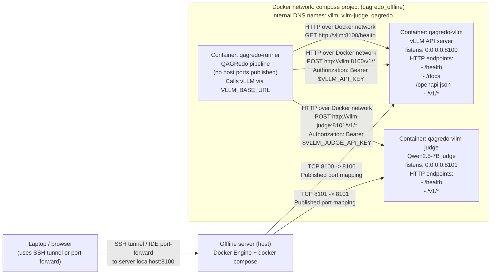
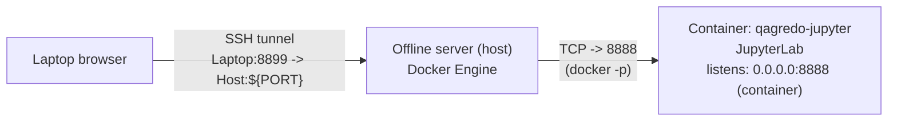

# QAGRedo network diagram (detailed)

This document describes **how QAGRedo communicates across host + containers**, with **ports**, **URLs**, and **who talks to whom**.

## High-level components

- **Host machine (offline server)**: runs Docker Engine + Docker Compose.
- **vLLM container (`qagredo-vllm`)**: serves an **OpenAI-compatible HTTP API**.
- **vLLM judge container (`qagredo-vllm-judge`)**: serves Qwen2.5-7B as an independent hallucination judge on port **8101**.
- **QAGRedo runner container (`qagredo-runner`)**: runs `python /workspace/run_qa_pipeline.py` and calls vLLM over the Docker network.
- **Optional Jupyter container (`qagredo-jupyter`)**: started by the *payload runner* scripts for interactive work (port is dynamically published).

## Diagram A — Offline Docker Compose (recommended default)

### What’s published vs internal

- **Published to host**: vLLM is exposed on **host TCP 8100** via compose `ports: ["8100:8100"]`.
- **Published to host**: vLLM-judge is exposed on **host TCP 8101** via compose `ports: ["8101:8101"]`.
- **NOT published to host**: the QAGRedo runner has **no `ports:`**, so it is not directly reachable from host/laptop by TCP.
- **Internal-only**: the runner calls vLLM by Docker DNS name `vllm` on port `8100`.
- **Internal-only**: the runner calls the judge by Docker DNS name `vllm-judge` on port `8101`.

### Compose-mode ports and URLs

| Where you run the command | Target | URL | Notes |
|---|---|---|---|
| **Host** | vLLM (published) | `http://localhost:8100/health` | Health probe. |
| **Host** | vLLM (published) | `http://localhost:8100/docs` | Swagger UI. |
| **Host** | vLLM (published) | `http://localhost:8100/v1/models` | Needs `Authorization: Bearer ${VLLM_API_KEY}`. |
| **Host** | vLLM-judge (published) | `http://localhost:8101/health` | Health probe for judge. |
| **Host** | vLLM-judge (published) | `http://localhost:8101/v1/*` | Needs `Authorization: Bearer ${VLLM_JUDGE_API_KEY}`. |
| **Inside runner container** | vLLM (internal) | `http://vllm:8100/health` | Used by the runner wait loop. |
| **Inside runner container** | vLLM (internal) | `http://vllm:8100/v1/*` | Used for OpenAI-style chat/completions/etc. |
| **Inside runner container** | vLLM-judge (internal) | `http://vllm-judge:8101/health` | Used by the runner wait loop. |
| **Inside runner container** | vLLM-judge (internal) | `http://vllm-judge:8101/v1/*` | Used for hallucination judge calls. |

### Authentication (API key)

vLLM is started with `--api-key ${VLLM_API_KEY:-llama-local}`. That means:

- Client requests to `/v1/*` typically require: `Authorization: Bearer <VLLM_API_KEY>`
- In compose mode, the runner is configured with:
  - `VLLM_BASE_URL="http://vllm:8100/v1"`
  - `VLLM_API_KEY=${VLLM_API_KEY:-llama-local}`
  - `VLLM_JUDGE_BASE_URL="http://vllm-judge:8101/v1"`
  - `VLLM_JUDGE_API_KEY=${VLLM_JUDGE_API_KEY:-qwen-local}`

### Model identity (served model name)

vLLM is launched with:

- `--model ${VLLM_MODEL:-/models/Meta-Llama-3.1-8B-Instruct}`
- `--served-model-name ${VLLM_SERVED_MODEL_NAME:-meta-llama/Meta-Llama-3.1-8B-Instruct}`

The judge container (vLLM-judge) is launched with:

- `--model ${VLLM_JUDGE_MODEL:-/models/Qwen2.5-7B-Instruct}`
- `--served-model-name ${VLLM_JUDGE_SERVED_NAME:-Qwen/Qwen2.5-7B-Instruct}`

The **OpenAI “model” string** that QAGRedo uses must match what vLLM exposes (the served model name), otherwise you can see **404 model not found** errors.

## Diagram B — Optional: Jupyter (payload runner) port publishing (detailed)

This path is used when you run the Jupyter helper (`jupyter.sh`): it launches **a separate container** for Jupyter.

### Key behavior (important)

- Container listens on **container TCP 8888** (Jupyter).
- Script picks a **free host port between 8888 and 8899** and publishes it:
  - `-p "${PORT}:8888"`
- The script then recommends tunneling from your laptop:
  - `ssh -L 8899:localhost:${PORT} <user>@<server>`
  - and opening `http://localhost:8899` on your laptop

### Jupyter port table

| Layer | Listener | Port | How it’s exposed |
|---|---:|---:|---|
| **Jupyter inside container** | `0.0.0.0` | `8888` | Container-only (always). |
| **Host published port** | Host NIC(s) | `8888..8899` (chosen dynamically) | Published via `docker run -p ${PORT}:8888`. |
| **Laptop** | `localhost` | `8899` (example) | Via SSH tunnel `-L 8899:localhost:${PORT}`. |

### Why the host port is dynamic (8888..8899)

The payload script checks which ports are already in use and chooses the first free one in `[8888..8899]`. This avoids failures when port 8888 is already taken.

### Notes on security

In your image/scripts, Jupyter is started **without token and password**:

- `--ServerApp.token= --ServerApp.password=`

So treat the published port as sensitive: only expose it via **SSH tunnel** (recommended) or a strictly controlled network path.

## “Host-only mode” (no containers) — for completeness

Your README also documents an advanced “host-only” mode:

- vLLM runs on the **host** and listens on **host TCP 8100**
- QAGRedo runs on the **host python environment** and calls `http://localhost:8100/v1`

This is **not** the default offline compose flow, but it’s useful for troubleshooting.

## Quick troubleshooting map (network-related)

- **Host can’t `curl http://localhost:8100/health`**:
  - vLLM container may not be running, or port 8100 not published, or firewall blocks it.
- **Host can’t `curl http://localhost:8101/health`**:
  - vLLM-judge container may not be running, or port 8101 not published, or firewall blocks it.
- **Runner fails to connect to vLLM**:
  - Runner uses `http://vllm:8100/*` (Docker DNS). If `vllm` name can’t resolve, the containers aren’t on the same Docker network / compose project.
- **Runner fails to connect to judge**:
  - Runner uses `http://vllm-judge:8101/*` (Docker DNS). If `vllm-judge` name can’t resolve, the containers aren’t on the same Docker network / compose project.
- **`401 Unauthorized`** on `/v1/*`:
  - API key mismatch. Ensure vLLM `--api-key` matches runner `VLLM_API_KEY`.
- **Browser on laptop can’t open `http://localhost:8100/docs`**:
  - Your laptop’s `localhost` is not the server. Use SSH tunnel / IDE port-forward to the server.

## Where this comes from (repo files)

- **Compose networking + ports**: `docker-compose.offline.yml`
- **Jupyter publish behavior**: `jupyter.sh` (publishes `-p ${PORT}:8888`)
- **Jupyter default port**: `Dockerfile` / `Dockerfile.airgap` expose `8888`

