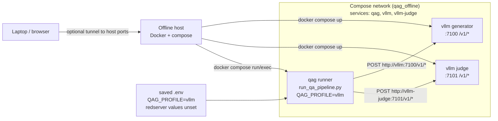
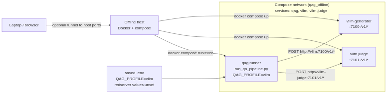
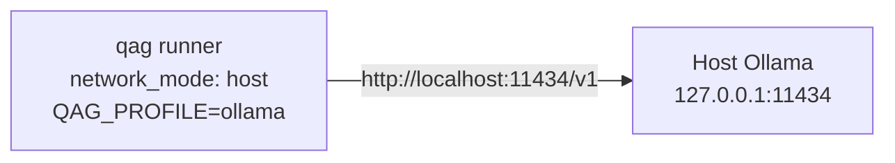
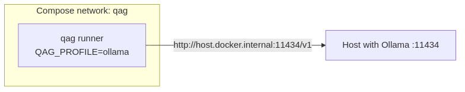
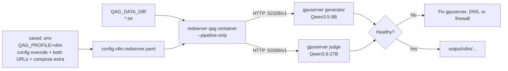

# QAG network diagram (detailed)

This document describes how QAG communicates across host + containers,
with ports, URLs, and caller/callee paths.

Primary local profile in this doc: `vllm`. Diagram A is local vLLM;
Diagram C is redserver with external vLLM on gpuserver.

## Causal network view (local vLLM)

Failures usually appear in this order:

- vLLM generator/judge not healthy on host ports.
- Runner cannot resolve `vllm` / `vllm-judge` inside compose network.
- Served model name mismatch (request model != vLLM `--served-model-name`).
- API key mismatch (`Authorization: Bearer`).

Quick diagnosis path:
host health check -> runner internal URL check -> model names -> logs.

## High-level components (local vLLM)

- Host machine: Docker Engine + published ports `7100` (generator), `7101` (judge).
- Runner container (`qag`): executes `python /workspace/run_qa_pipeline.py`.
- Generator service (`vllm`): OpenAI-compatible API at `http://vllm:7100/v1`.
- Judge service (`vllm-judge`): OpenAI-compatible API at `http://vllm-judge:7101/v1`.

## Diagram A - vLLM default layout

```mermaid
flowchart LR
  Laptop["Laptop / browser"]
  Host["Offline host\nDocker + compose"]
  Env["saved .env\nQAG_PROFILE=vllm\nredserver values unset"]

  subgraph Net["Compose network (qag_offline)\nservices: qag, vllm, vllm-judge"]
    Runner["qag runner\nrun_qa_pipeline.py\nQAG_PROFILE=vllm"]
    Gen["vllm generator\n:7100 /v1/*"]
    Judge["vllm judge\n:7101 /v1/*"]
  end

  Host -->|"docker compose up"| Gen
  Host -->|"docker compose up"| Judge
  Host -->|"docker compose run/exec"| Runner
  Env --> Runner
  Runner -->|"POST http://vllm:7100/v1/*"| Gen
  Runner -->|"POST http://vllm-judge:7101/v1/*"| Judge
  Laptop -->|"optional tunnel to host ports"| Host
```

### vLLM ports and URLs

| Where | Target | URL | Notes |
|---|---|---|---|
| Host | Generator health | `http://localhost:7100/health` | Default stack publishes fixed port 7100 |
| Host | Judge health | `http://localhost:7101/health` | Default stack publishes fixed port 7101 |
| Inside runner | Generator | `http://vllm:7100/v1/*` | Internal DNS |
| Inside runner | Judge | `http://vllm-judge:7101/v1/*` | Internal DNS |

Model names in config must match served model names from vLLM startup.

---

## Diagram B - Ollama alternative profile

Use when `QAG_PROFILE=ollama`.

The runner uses **`network_mode: host`** (see `docker-compose.yml`), so it
shares the host loopback. `localhost:11434` inside the container reaches host
Ollama even when Ollama binds `127.0.0.1` only.

```mermaid
flowchart LR
  Host["Host Ollama\n127.0.0.1:11434"]
  Runner["qag runner\nnetwork_mode: host\nQAG_PROFILE=ollama"]
  Runner -->|"http://localhost:11434/v1"| Host
```

Key Ollama URLs:

- Host: `http://127.0.0.1:${OLLAMA_HOST_PORT:-11434}/api/tags`
- Runner (host network): `http://localhost:${OLLAMA_HOST_PORT:-11434}/v1/*`
- Config: `config/config.ollama.yaml` (`llm.base_url` / `judge.base_url`)

---

## Diagram C - Redserver external vLLM

Use when redserver runs the QAG orchestrator and gpuserver already serves both
models. `QAG_PROFILE=vllm` alone is not enough: `.env` must also select the
redserver YAML and external compose file.

```mermaid
flowchart LR
  DATA["QAG_DATA_DIR\n*.txt"] --> RUNNER["redserver qag container\n--pipeline-only"]
  ENV["saved .env\nQAG_PROFILE=vllm\nconfig override + both URLs + compose extra"] --> CFG["config.vllm.redserver.yaml"]
  CFG --> RUNNER
  RUNNER -->|"HTTP :52328/v1"| GEN["gpuserver generator\nQwen3.5-9B"]
  RUNNER -->|"HTTP :53366/v1"| JUDGE["gpuserver judge\nQwen3.6-27B"]
  GEN --> READY{Healthy?}
  JUDGE --> READY
  READY -->|No| FIX["Fix gpuserver, DNS, or firewall"]
  READY -->|Yes| OUT["output/vllm/..."]
```

Redserver URLs:

- Generator: `http://gpuserver:52328/v1`
- Judge: `http://gpuserver:53366/v1`
- Health: `curl -sf http://gpuserver:52328/health` and port `53366`
- Models: `curl -s http://gpuserver:52328/v1/models` and port `53366`

Do not use `--vllm-up`; run `bash run.sh --pipeline-only`. Also do not use
`bash run.sh --status` for gpuserver health because it currently probes local
ports `7100` and `7101`.

---

## Quick troubleshooting map

### Local vLLM (`QAG_PROFILE=vllm`)

- A health check still targets gpuserver: save `.env` and unset stale
  redserver variables exported in the current shell.
- Generator/judge health fails: check service/container status and port mapping.
- Runner cannot call `vllm`/`vllm-judge`: verify compose network + service names.
- 401 or model errors: check API keys and served model names.

### Redserver external vLLM

- Endpoint health fails: fix gpuserver service, DNS, routing, or firewall.
- Runner cannot resolve `gpuserver`: configure `GPUSERVER_IP` and
  `extra_hosts` in `docker-compose.vllm-redserver.yml`.
- Model error: match `config.vllm.redserver.yaml` names to `/v1/models`.
- Local `:7100` / `:7101` appears unhealthy: expected; do not use local
  `--status` as the redserver health check.

### Ollama alternative (`QAG_PROFILE=ollama`)

- Host `/api/tags` fails: Ollama not running or wrong `OLLAMA_HOST_PORT`.
- Runner cannot reach Ollama: confirm `network_mode: host` in
  `docker-compose.yml` and that Ollama listens on `localhost:11434`.

## Output observability note

- `*_analysis.json` includes per-document metrics and QA details.
- `run_summary.json` includes run-level metrics and split ratios.
- `bash run.sh --minimise` writes:
  - `*_analysis_minimal.json`
  - `*_analysis_minimal_good_pairs.json`
  - `*_analysis_minimal_bad_pairs.json`
  - `lora_sft.jsonl` (+ eval split and dataset info)
  - `lora_dpo.jsonl` only when same-question answer retry DPO was captured
- `bash run.sh --finetune-lora [RUN_DIR]` trains a host LoRA adapter (Option A;
  base model read-only; stop vLLM first). Output defaults to
  `/data/models/Qwen3.5-9B-qag-lora`.

## Source files

- vLLM compose: `docker-compose.vllm-stack.yml`
- Redserver external compose: `docker-compose.vllm-redserver.yml`
- Redserver config: `config/config.vllm.redserver.yaml`
- Redserver diagram source: `docs/redserver_vllm_external.dot`
- Ollama compose: `docker-compose.yml`
- Runner entry: `run.sh` -> `run_qa_pipeline.py`
