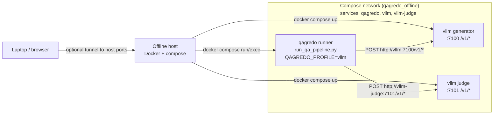
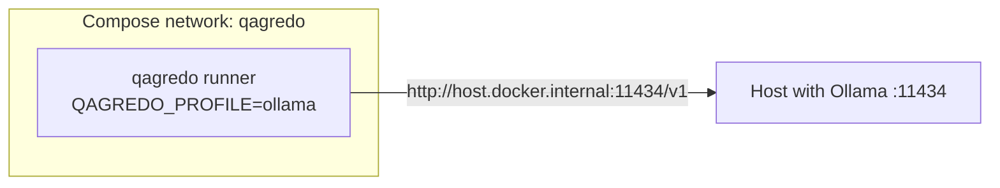

# QAGRedo network diagram (detailed)

This document describes how QAGRedo communicates across host + containers,
with ports, URLs, and caller/callee paths.

Default profile in this doc: `vllm`.

## Causal network view (vLLM default)

Failures usually appear in this order:

- vLLM generator/judge not healthy on host ports.
- Runner cannot resolve `vllm` / `vllm-judge` inside compose network.
- Served model name mismatch (request model != vLLM `--served-model-name`).
- API key mismatch (`Authorization: Bearer`).

Quick diagnosis path:
host health check -> runner internal URL check -> model names -> logs.

## High-level components (vLLM default)

- Host machine: Docker Engine + published ports `7100` (generator), `7101` (judge).
- Runner container (`qagredo`): executes `python /workspace/run_qa_pipeline.py`.
- Generator service (`vllm`): OpenAI-compatible API at `http://vllm:7100/v1`.
- Judge service (`vllm-judge`): OpenAI-compatible API at `http://vllm-judge:7101/v1`.

## Diagram A - vLLM default layout

```mermaid
flowchart LR
  Laptop["Laptop / browser"]
  Host["Offline host\nDocker + compose"]

  subgraph Net["Compose network (qagredo_offline)\nservices: qagredo, vllm, vllm-judge"]
    Runner["qagredo runner\nrun_qa_pipeline.py\nQAGREDO_PROFILE=vllm"]
    Gen["vllm generator\n:7100 /v1/*"]
    Judge["vllm judge\n:7101 /v1/*"]
  end

  Host -->|"docker compose up"| Gen
  Host -->|"docker compose up"| Judge
  Host -->|"docker compose run/exec"| Runner
  Runner -->|"POST http://vllm:7100/v1/*"| Gen
  Runner -->|"POST http://vllm-judge:7101/v1/*"| Judge
  Laptop -->|"optional tunnel to host ports"| Host
```

### vLLM ports and URLs

| Where | Target | URL | Notes |
|---|---|---|---|
| Host | Generator health | `http://localhost:${VLLM_HOST_PORT:-7100}/health` | vLLM health |
| Host | Judge health | `http://localhost:${VLLM_JUDGE_HOST_PORT:-7101}/health` | vLLM judge health |
| Inside runner | Generator | `http://vllm:7100/v1/*` | Internal DNS |
| Inside runner | Judge | `http://vllm-judge:7101/v1/*` | Internal DNS |

Model names in config must match served model names from vLLM startup.

---

## Diagram B - Ollama alternative profile

Use when `QAGREDO_PROFILE=ollama`.

```mermaid
flowchart LR
  Host["Host with Ollama :11434"]
  subgraph Net["Compose network: qagredo"]
    Runner["qagredo runner\nQAGREDO_PROFILE=ollama"]
  end
  Runner -->|"http://host.docker.internal:11434/v1"| Host
```

Key Ollama URLs:

- Host: `http://127.0.0.1:${OLLAMA_HOST_PORT:-11434}/api/tags`
- Runner: `http://host.docker.internal:${OLLAMA_HOST_PORT:-11434}/v1/*`

---

## Quick troubleshooting map

### vLLM default (`QAGREDO_PROFILE=vllm`)

- Generator/judge health fails: check service/container status and port mapping.
- Runner cannot call `vllm`/`vllm-judge`: verify compose network + service names.
- 401 or model errors: check API keys and served model names.

### Ollama alternative (`QAGREDO_PROFILE=ollama`)

- Host `/api/tags` fails: Ollama not running or wrong `OLLAMA_HOST_PORT`.
- Runner cannot reach host Ollama: verify `host.docker.internal` / `extra_hosts`.

## Output observability note

- `*_analysis.json` includes per-document metrics and QA details.
- `run_summary.json` includes run-level metrics and split ratios.
- `bash run.sh --minimise` writes:
  - `*_analysis_minimal.json`
  - `*_analysis_minimal_good_pairs.json`
  - `*_analysis_minimal_bad_pairs.json`

## Source files

- vLLM compose: `docker-compose.vllm-stack.yml`
- Ollama compose: `docker-compose.yml`
- Runner entry: `run.sh` -> `run_qa_pipeline.py`
