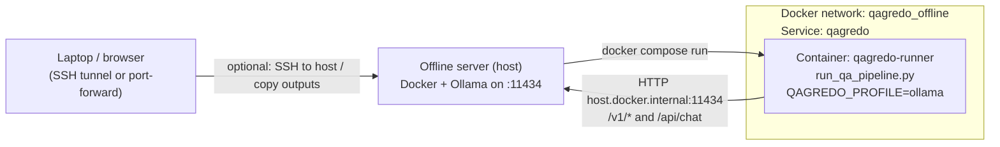
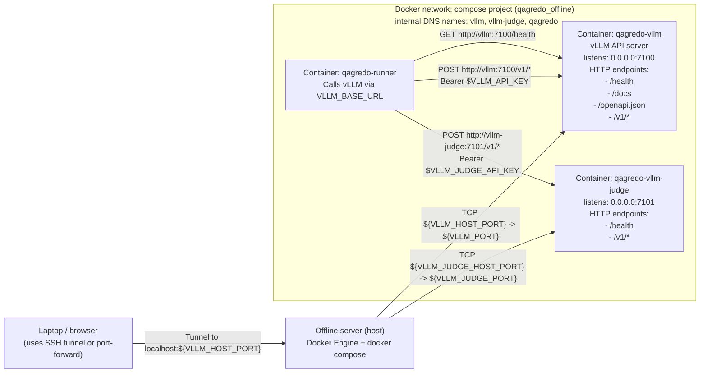

# QAGRedo network diagram (detailed)

This document describes **how QAGRedo communicates across host + containers**, with **ports**, **URLs**, and **who talks to whom**. See also **`docs/HANDOVER.md`** for profile selection.

**Default today:** **Ollama on the host** + **one Docker service** (`qagredo-runner`) in `docker-compose.yml`. See **`diagrams/network_docker_compose_ollama.png`** (source: **`diagrams/network_docker_compose_ollama.dot`**).

**Legacy:** two **vLLM** containers — **`docker-compose.vllm-stack.yml`** + GPU override files; older PNG **`diagrams/network_docker_compose.png`** matches that layout only.

Port and model values come from **`.env`** and the active profile config file:
**`config/config.ollama.yaml`**, **`config/config.kubeflow.yaml`**, or **`config/config.vllm.yaml`**.

## Causal network view (Ollama default)

Failures usually show up in this order:

- **Ollama not listening** on the host (`11434` / `OLLAMA_HOST_PORT`) → `run.sh` wait loop fails; pipeline cannot reach models.
- **Runner cannot resolve `host.docker.internal`** → fix `extra_hosts: host-gateway` (already in `docker-compose.yml` on Linux).
- **Wrong model tags** → HTTP succeeds but Ollama returns errors (model not found).
- **Thinking models emptying OpenAI `content`** → code uses native `/api/chat` with `think: false` when the base URL is Ollama (see `utils/question_generator.py`, `answer_generator.py`, `hallucination_checker.py`).

Diagnose: **host `curl /api/tags` → from inside runner `curl` to `host.docker.internal:11434` → model names → logs**.

## High-level components (Ollama default)

- **Host machine**: Docker Engine + **Ollama** (typically `http://127.0.0.1:11434`).
- **QAGRedo runner container (`qagredo-runner`)**: runs `python /workspace/run_qa_pipeline.py`; calls Ollama at **`http://host.docker.internal:11434`** (OpenAI-compatible **`/v1`** and native **`/api/chat`** as implemented in code).
- **Framework (inside runner)**: LangChain (prompts / parsing). LangGraph exists in the repo but the main entrypoint is the sequential loop in `run_qa_pipeline.py`.
- **Runner** is **CLI-only** in the default image: there is no extra HTTP service on the `qagredo` service (no Jupyter port).

## Diagram A — Docker runner + host Ollama (recommended default)

```mermaid
flowchart LR
  Laptop["Laptop / browser\n(SSH tunnel or port-forward)"]
  Host["Offline server (host)\nDocker + Ollama on :11434"]

  subgraph Net["Docker network: qagredo_offline\nService: qagredo\nextra_hosts: host.docker.internal"]
    Runner["Container: qagredo-runner\nrun_qa_pipeline.py\nQAGREDO_PROFILE=ollama"]
  end

  Host -->|"docker compose run"| Runner
  Runner -->|"HTTP host.docker.internal:11434\n/v1/* and /api/chat"| Host

  Laptop -->|"optional: SSH to host / copy outputs"| Host
```

### Raster / vector exports

- **PNG:** `docs/architecture/diagrams/network_docker_compose_ollama.png`
- **SVG:** `docs/architecture/diagrams/network_docker_compose_ollama.svg`
- **Graphviz source:** `docs/architecture/diagrams/network_docker_compose_ollama.dot`  
  Regenerate: `dot -Tpng network_docker_compose_ollama.dot -o network_docker_compose_ollama.png`

### What’s published vs internal (Ollama layout)

- **Ollama** listens on the **host** (not inside the compose project). Default **`11434`** (`OLLAMA_HOST_PORT`).
- **Runner** does **not** publish separate “LLM ports”; it exits the container network to the host via **`host.docker.internal`**.

### URLs (Ollama)

| Where | Target | URL | Notes |
|------|--------|-----|--------|
| **Host** | Ollama | `http://127.0.0.1:${OLLAMA_HOST_PORT:-11434}/api/tags` | `run.sh` health wait. |
| **Host** | Ollama OpenAI shim | `http://127.0.0.1:${OLLAMA_HOST_PORT:-11434}/v1/models` | Optional check. |
| **Inside runner** | Ollama | `http://host.docker.internal:${OLLAMA_HOST_PORT:-11434}/v1/...` | From `OLLAMA_DOCKER_BASE_URL` / compose defaults. |
| **Native chat** | Ollama | `http://host.docker.internal:${OLLAMA_HOST_PORT:-11434}/api/chat` | Used when URL is detected as Ollama (see `utils/ollama_urls.py`). |

### Two models, one server

- **Generator:** `OLLAMA_MODEL` / `config.llm.model` (e.g. `qwen3.5:9b`).
- **Judge:** `OLLAMA_JUDGE_MODEL` / `config.judge.model` (e.g. `llama3.1:8b`).
- Both use the **same host and port**; only the **model** string in each request differs.

### Compose environment (reference)

From `docker-compose.yml` (subset): compose enables reaching host Ollama via **`OLLAMA_*`** URLs (typically `host.docker.internal:11434`), plus `OLLAMA_MODEL` and `OLLAMA_JUDGE_MODEL`. Select **`QAGREDO_PROFILE=ollama`** in `.env`.

---

## Diagram A2 — Two vLLM containers (`docker-compose.vllm-stack.yml`)

Use this when **`QAGREDO_PROFILE=vllm`** (and the vLLM stack compose file is active). Static assets: **`diagrams/network_docker_compose.png`**, **`diagrams/network_docker_compose.dot`**.

```mermaid
flowchart LR
  Laptop["Laptop / browser\n(uses SSH tunnel or port-forward)"]
  Host["Offline server (host)\nDocker Engine + docker compose"]

  subgraph Net["Docker network: compose project (qagredo_offline)\ninternal DNS names: vllm, vllm-judge, qagredo"]
    vLLM["Container: qagredo-vllm\nvLLM API server\nlistens: 0.0.0.0:7100\nHTTP endpoints:\n- /health\n- /docs\n- /openapi.json\n- /v1/*"]
    vLLMJudge["Container: qagredo-vllm-judge\nlistens: 0.0.0.0:7101\nHTTP endpoints:\n- /health\n- /v1/*"]
    Runner["Container: qagredo-runner\nCalls vLLM via VLLM_BASE_URL"]
  end

  Host -- "TCP ${VLLM_HOST_PORT} -> ${VLLM_PORT}" --> vLLM
  Host -- "TCP ${VLLM_JUDGE_HOST_PORT} -> ${VLLM_JUDGE_PORT}" --> vLLMJudge

  Runner -- "GET http://vllm:7100/health" --> vLLM
  Runner -- "POST http://vllm:7100/v1/*\nBearer $VLLM_API_KEY" --> vLLM
  Runner -- "POST http://vllm-judge:7101/v1/*\nBearer $VLLM_JUDGE_API_KEY" --> vLLMJudge

  Laptop -- "Tunnel to localhost:${VLLM_HOST_PORT}" --> Host
```

### vLLM compose-mode ports and URLs

| Where you run the command | Target | URL | Notes |
|---|---|---|---|
| **Host** | vLLM (published) | `http://localhost:${VLLM_HOST_PORT}/health` | Health probe. |
| **Host** | vLLM-judge (published) | `http://localhost:${VLLM_JUDGE_HOST_PORT}/health` | Judge health. |
| **Inside runner** | vLLM (internal) | `http://vllm:7100/v1/*` | Generator. |
| **Inside runner** | vLLM-judge (internal) | `http://vllm-judge:7101/v1/*` | Judge. |

vLLM typically requires `Authorization: Bearer` matching the `--api-key` used to start the server. **Model** strings must match **`--served-model-name`**.

---

## “Host-only mode” (no containers) — for completeness

- **Ollama on host** + **Python on host**: set `llm.base_url` / `judge.base_url` to `http://localhost:11434/v1` and run `python run_qa_pipeline.py`.
- **Legacy:** vLLM on host + Python on host: `http://localhost:${VLLM_HOST_PORT}/v1`.

## Quick troubleshooting map (network-related)

**Ollama default**

- **`curl -sf http://127.0.0.1:11434/api/tags` fails on host:** Ollama not running or wrong port (`OLLAMA_HOST_PORT`).
- **Pipeline in Docker fails but host Ollama works:** check `host.docker.internal` from inside a throwaway container; verify `extra_hosts` in `docker-compose.yml`.
- **Model errors:** `ollama pull <tag>` for both generator and judge tags; match `OLLAMA_MODEL` / `OLLAMA_JUDGE_MODEL`.

**vLLM profile (`QAGREDO_PROFILE=vllm`)**

- **Startup:** same Docker image on two containers — `bash run.sh --vllm-up generator` (GPU 0, :7100), `bash run.sh --vllm-up judge` (GPU 1, :7101), then `bash run.sh --pipeline-only`; or one-shot `bash run.sh`. See **`docs/Siteserver_vLLM_Change_Guide.md`** Part D.
- **Host can’t `curl` vLLM health:** container down or port mapping wrong.
- **Runner DNS:** must resolve `vllm` and `vllm-judge` on the compose network.
- **`401` / wrong model:** API key or served model name mismatch.

## Output observability note

Recent pipeline instrumentation adds output metrics that help correlate network/model issues with runtime behavior:

- Per-document `*_analysis.json` can include `run_metrics` with stage timings and retry/rewrite counters (when not using minimal-only output).
- `run_summary.json` can include top-level `run_metrics` aggregates.

## Where this comes from (repo files)

- **Default compose (Ollama):** `docker-compose.yml`
- **vLLM profile:** `docker-compose.vllm-stack.yml`
- **Runner image:** `Dockerfile` — `python:3.10-bookworm` base, default `CMD` runs `run_qa_pipeline.py` (CLI).
